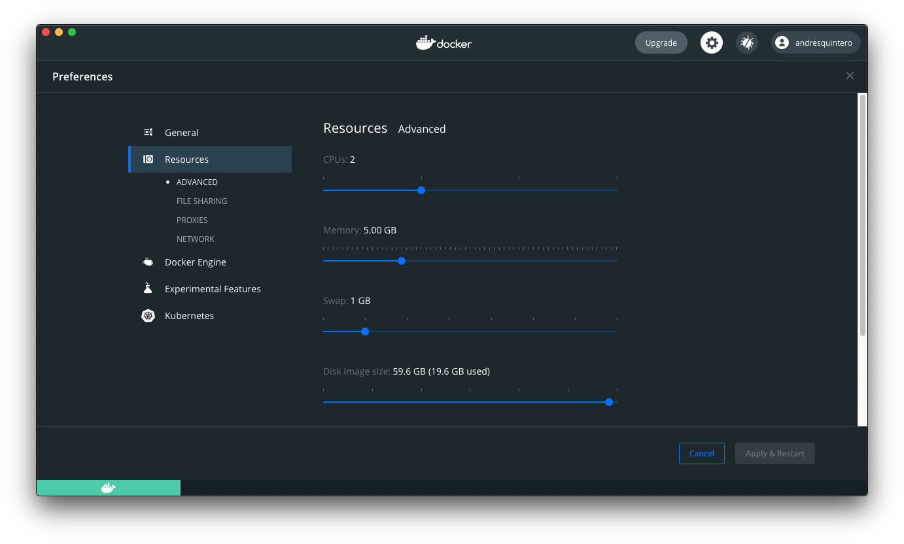

# Install Docker

The practical sessions of the tutorial will be carried out using a Docker image. Therefore, in case Docker is not installed in your computer, please follow the following steps.

Docker allows the execution of a container with pre-installed tools and pre-loaded datasets. Thus, it removes the hurdle of installing dependencies and makes it easier to reproduce full analyses by different researchers.

## Step 1 - Download and install Docker

Docker is available as a desktop application for Mac and Windows, you can find the installers here:

- [Docker Desktop for Windows](https://desktop.docker.com/win/stable/amd64/Docker%20Desktop%20Installer.exe)
- [Docker Desktop Mac with Intel chip](https://desktop.docker.com/mac/stable/amd64/Docker.dmg?utm_source=docker&utm_medium=webreferral&utm_campaign=docs-driven-download-mac-amd64)
- [Docker Desktop Mac with Appple chip](https://desktop.docker.com/mac/stable/arm64/Docker.dmg?utm_source=docker&utm_medium=webreferral&utm_campaign=docs-driven-download-mac-arm64)

A detailed installation guide can be found here:
- [Install Docker Desktop on Windows](https://docs.docker.com/desktop/windows/install/)
- [Install Docker Desktop on Mac](https://docs.docker.com/desktop/mac/install/)

If you are using a Linux system the Docker engine can also be installed by following this guide:
- [Install Docker Engine](https://docs.docker.com/engine/install/)

Install Docker: create an account on dockerhub and install docker. After installing go to Docker preferences and increase the 

## Step 2 - Docker preferences

The **Docker Settings in Windows** and the **Docker Preferences in Mac** menu allows you to configure the Docker settings. In our case the matrix decomposition steps will be faster if the container has more CPUs and Memory at its disposal.

We recommend to increase the resoures to at least **2 CPUs** and **5.00GB of memory** if your system allows it, and at least **10.GB for the Disk image size**.

*********

Next [Run Docker image hdsu/butcher-bc2](./01_run_image.md)
