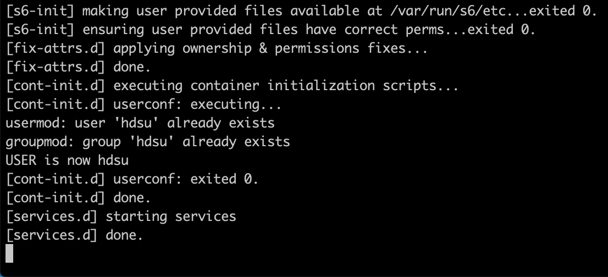
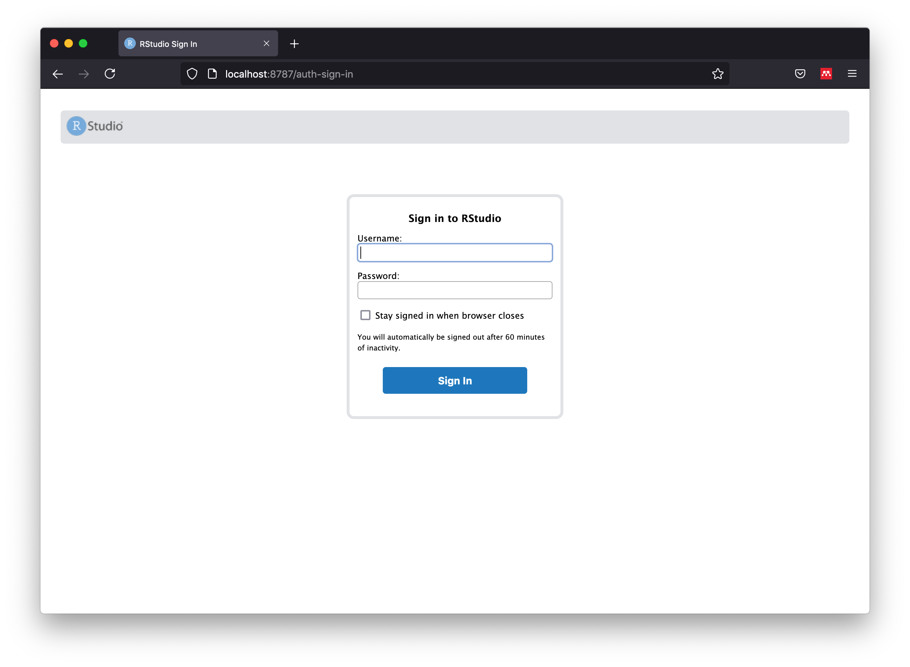

# ButcherR-[BC]<sup>2</sup> Docker image

We created a Docker image that runs RStudio, including all the package dependencies, and example datasets required to run a complete NMF workflow and infer molecular signatures. 

## Step 1 - Pull image

1. Open the Docker application in your computer
2. Open a command-line terminal (e.g., Command Promt and Powershell in windows, or Terminal in Max and Linux).
3. Pull the image by running the following command:

```
docker pull hdsu/butchr-bc2
```

### IMPORTANT NOTE! 

The image size is approximately 6Gb. Therefore, we ask you to complete this step before starting the tutorial.


## Step 2 - Running the image 

1. Once the image has been pulled from DockerHub you can run it from the command-line, using the following command:  

```
docker run --rm -p 8787:8787 -e USER=hdsu -e PASSWORD=pass hdsu/butchr-bc2
```

Output messages expected after running the previous command:




2. Open the app in a browser:
http://localhost:8787/


First screen seen after launching the image without errors: 
