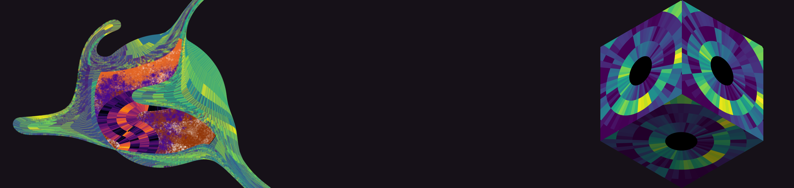

# SinCellTE 2022 Single-cell Epigenomics & Multi-omics integration

Welcome to the **SinCellTE 2022 Single-cell Epigenomics & Multi-omics integration tutorial** This tutorial is divided in two sessions:
- On the first session we will guide you through all the necessary steps to perform a complete analysis of single-cell chromatin accessiblity (scATAC-seq) data, from raw files to inferring enrichment of transcription factors.
- On the second session we will focus on different strategies to combine scATAC-seq data with scRNA-seq data, from assays where both modalities were measured from the same cell. 

******
## Tutors

* Carl Herrmann, [Health Data Science Unit](https://www.hdsu.org/) Medical Faculty Heidelberg and BioQuant (carl.herrmann@bioquant.uni-heidelberg.de)
* Andres Quintero, [Health Data Science Unit](https://www.hdsu.org/) Medical Faculty Heidelberg and BioQuant (andres.quintero@bioquant.uni-heidelberg.de)

********

<!-- ## Is this tutorial for me?

The aim of this tutorial is to learn how to use the R package ButchR to **perform signature identification in different types of genomic data using NMF**. To explore the results of an NMF analysis, we will provide a ready to use Docker image with RStudio, ButchR, and pre-loaded publicly available datasets, including bulk and single-cell RNA-seq data, as well as an interactive application. The tutorial will show how to run an NMF-based analysis from start to end.

If you are a computational biologist dealing with large scale omics datasets (e.g. RNA-seq, ATAC-seq, …) looking for solutions to reduce the dimensionality of the data to a small set of informative signatures, this tutorial will be perfect for you.

### IMPORTANT NOTE! 

 While we will start at a very basic level, we would **strongly encourage absolute beginners**, who have never ever worked with R, to complete a very simple online R intro course on DataCamp (["Introduction to R"](https://learn.datacamp.com/courses/free-introduction-to-r)), which will give you the very basic first concepts on what R is, and how to do some very simple operations with it.

In order to avoid any software compatibility and installation issues the practical sessions of the tutorial will be done using a Docker image, please follow the instruction given in [Run Docker image](#run-docker-image) to install Docker and run the Docker image for the tutorial before Monday, 13 September 2021.

******** -->

## Schedule

<!--  -->

| Activity | Time |
| -- | ----------- |
| Session 1 - scATAC-seq analysis |  |
| Introduction to single-cell epigenomics | 9:00 - 10:15 | 
| Hands-on: Analysis of scATAC-seq data | 10:45 - 12:30| 
| Lunch break | 13:00 - 14:15 | 
| Session 2 - Multi-omics integration |  |
| Introduction to multi-mics analysis | 14:30 - 15:15 |
| Hands-on: Integrative analysis of scATAC-seq/scRNA-seq data | 15:15 - 16:00| 

********
<!-- ## Slides

Here are the links to the slides

* Day 1 : [introduction](./irtg2021_intro.pdf)
* Day 1 : [R markdown](./irtg2021_rmarkdown.pdf)
* Day 1 : [Data types](./irtg2021_datatypes.pdf)
* Day 1 : [Statistical tests](./irtg2021_tests.pdf)

* Day 2 : [Introduction to single-cell analysis](https://docs.google.com/presentation/d/1DSC6gUIbO6PzrqLCt1jp-sIx1U31TvMdDGgKdhohCIY/edit?ts=60c8bafb#slide=id.gdf238a40cf_0_5) -->

## Practical sessions

### Session 1 - scATAC-seq analysis

On the "scATAC-seq analysis" session, we will guide you through the steps to perform a NMF decomposition using the R package ButchR on a publicly available RNA-seq dataset from the human hematopoietic system (Corces et al. 2016)

<!-- 0. How to use ButchR with Docker  -->
1. [Pre-processing data to use with NMF](./session2/01_preprocessing.md)
2. [Matrix decomposition with ButchR](./session2/02_run_NMF.md)
                               

<!-- 0. [Goals of Day 1](./day1/00_Objectives.md)
1. [Getting started with RStudio](./day1/01_rstudio.md)
2. [Reading in a data table](./day1/02_dataframe.md)
3. [Cleaning the dataset](./day1/03_cleanup.md)
4. [Making plots](./day1/04_plotting.md)
5. [Statistical tests](./day1/05_test.md) -->
                                                   

### Session 2 - Multi-omics integration

On the "Multi-omics integration" session we will complete an integrative analysis of single-cell chromatin accessibility and transcriptome data, using ArchR and Signac.

1. [Multiome analysis with ArchR](./session2/01_multiome_ArchR.md)
2. [Multiome analysis with Signac](./session2/02_signature_identification.md)

