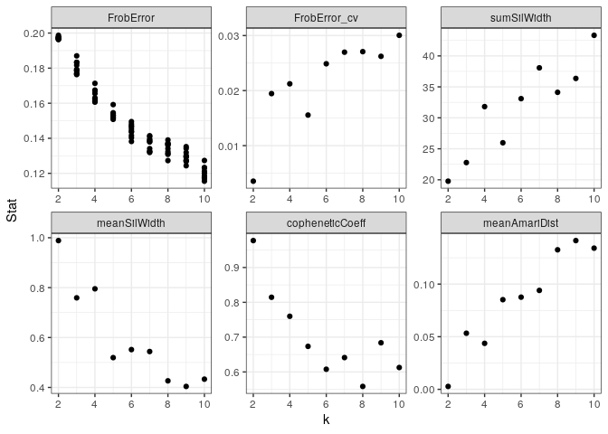

# Selection of optimal factorization rank

## TSS enrichment
## N frags

## LSI
If you were to perform a standard dimensionality reduction, like Principal Component Analysis, on this sparse insertion counts matrix and plot the top two principal components, you would not obtain the desired result because the sparsity causes high inter-cell similarity at all of the 0 positions.


A crucial step in data analysis with NMF is the determination of the
optimal factorization rank, i.e. the number of columns of the matrix *W*
or equivalently the number of rows of the matrix *H*. No consensus
method for an automatic evaluation of the optimal factorization rank has
been found to date. Instead, the decomposition is usually performed
iteratively over a range of possible factorization ranks and different
quality measures are computed for every tested factorization ranks. Many
quality measures have been proposed:

-   The `Frobenius reconstruction error`, i.e. the Frobenius norm of the
    residuals of the decomposition:
    \|\|*W* ⋅ *H* − *V*\|\|<sub>*F*</sub>

-   Criteria to assess the stability of the decomposition:

    -   The `cophenetic correlation coefficient`
    -   An `Amari type distance`
    -   `Silhouette values` over clusters of patterns extracted
        iteratively at the same factorization rank

The package `ButchR` provides a function to visualize all factorization
metrics.


## Frobenius reconstruction error

The accesor function `FrobError` returns a data frame with as many columns as the number of 
decomposed factorization ranks and as many rows as there are iterations per
factorization rank.

These residuals are helpful to select the decompostion that is closer to the original matrix.

ButchR will recommend an optimal K value if there is a local minima across the mean Frobenius error of multiple factorization ranks.

```r
FrobError(rna_norm_nmf_exp)
```

<details>
<summary><b>Click for Answer</b></summary>

```
## [1] "\nNo optimal K found, please select manualy\n"
```

<table>
 <thead>
  <tr>
   <th style="text-align:right;"> k2 </th>
   <th style="text-align:right;"> k3 </th>
   <th style="text-align:right;"> k4 </th>
   <th style="text-align:right;"> k5 </th>
   <th style="text-align:right;"> k6 </th>
   <th style="text-align:right;"> k7 </th>
   <th style="text-align:right;"> k8 </th>
   <th style="text-align:right;"> k9 </th>
   <th style="text-align:right;"> k10 </th>
  </tr>
 </thead>
<tbody>
  <tr>
   <td style="text-align:right;"> 0.1975693 </td>
   <td style="text-align:right;"> 0.1833415 </td>
   <td style="text-align:right;"> 0.1671235 </td>
   <td style="text-align:right;"> 0.1532516 </td>
   <td style="text-align:right;"> 0.1481093 </td>
   <td style="text-align:right;"> 0.1340936 </td>
   <td style="text-align:right;"> 0.1367746 </td>
   <td style="text-align:right;"> 0.1352234 </td>
   <td style="text-align:right;"> 0.1176797 </td>
  </tr>
  <tr>
   <td style="text-align:right;"> 0.1968017 </td>
   <td style="text-align:right;"> 0.1816921 </td>
   <td style="text-align:right;"> 0.1629583 </td>
   <td style="text-align:right;"> 0.1545430 </td>
   <td style="text-align:right;"> 0.1470479 </td>
   <td style="text-align:right;"> 0.1380185 </td>
   <td style="text-align:right;"> 0.1313077 </td>
   <td style="text-align:right;"> 0.1300730 </td>
   <td style="text-align:right;"> 0.1169848 </td>
  </tr>
  <tr>
   <td style="text-align:right;"> 0.1973312 </td>
   <td style="text-align:right;"> 0.1792726 </td>
   <td style="text-align:right;"> 0.1674623 </td>
   <td style="text-align:right;"> 0.1527080 </td>
   <td style="text-align:right;"> 0.1452187 </td>
   <td style="text-align:right;"> 0.1325158 </td>
   <td style="text-align:right;"> 0.1341041 </td>
   <td style="text-align:right;"> 0.1318661 </td>
   <td style="text-align:right;"> 0.1200745 </td>
  </tr>
  <tr>
   <td style="text-align:right;"> 0.1965124 </td>
   <td style="text-align:right;"> 0.1770754 </td>
   <td style="text-align:right;"> 0.1614196 </td>
   <td style="text-align:right;"> 0.1540932 </td>
   <td style="text-align:right;"> 0.1437228 </td>
   <td style="text-align:right;"> 0.1324107 </td>
   <td style="text-align:right;"> 0.1272746 </td>
   <td style="text-align:right;"> 0.1293386 </td>
   <td style="text-align:right;"> 0.1176948 </td>
  </tr>
  <tr>
   <td style="text-align:right;"> 0.1968222 </td>
   <td style="text-align:right;"> 0.1763261 </td>
   <td style="text-align:right;"> 0.1655435 </td>
   <td style="text-align:right;"> 0.1521472 </td>
   <td style="text-align:right;"> 0.1438162 </td>
   <td style="text-align:right;"> 0.1389070 </td>
   <td style="text-align:right;"> 0.1308415 </td>
   <td style="text-align:right;"> 0.1295302 </td>
   <td style="text-align:right;"> 0.1155311 </td>
  </tr>
  <tr>
   <td style="text-align:right;"> 0.1977374 </td>
   <td style="text-align:right;"> 0.1870041 </td>
   <td style="text-align:right;"> 0.1622449 </td>
   <td style="text-align:right;"> 0.1507951 </td>
   <td style="text-align:right;"> 0.1465456 </td>
   <td style="text-align:right;"> 0.1379959 </td>
   <td style="text-align:right;"> 0.1390313 </td>
   <td style="text-align:right;"> 0.1243427 </td>
   <td style="text-align:right;"> 0.1211344 </td>
  </tr>
  <tr>
   <td style="text-align:right;"> 0.1963016 </td>
   <td style="text-align:right;"> 0.1832476 </td>
   <td style="text-align:right;"> 0.1610669 </td>
   <td style="text-align:right;"> 0.1517311 </td>
   <td style="text-align:right;"> 0.1495082 </td>
   <td style="text-align:right;"> 0.1414465 </td>
   <td style="text-align:right;"> 0.1323888 </td>
   <td style="text-align:right;"> 0.1272976 </td>
   <td style="text-align:right;"> 0.1230526 </td>
  </tr>
  <tr>
   <td style="text-align:right;"> 0.1987224 </td>
   <td style="text-align:right;"> 0.1787391 </td>
   <td style="text-align:right;"> 0.1606174 </td>
   <td style="text-align:right;"> 0.1531967 </td>
   <td style="text-align:right;"> 0.1403434 </td>
   <td style="text-align:right;"> 0.1394498 </td>
   <td style="text-align:right;"> 0.1359764 </td>
   <td style="text-align:right;"> 0.1341932 </td>
   <td style="text-align:right;"> 0.1184785 </td>
  </tr>
  <tr>
   <td style="text-align:right;"> 0.1974589 </td>
   <td style="text-align:right;"> 0.1766975 </td>
   <td style="text-align:right;"> 0.1628189 </td>
   <td style="text-align:right;"> 0.1513562 </td>
   <td style="text-align:right;"> 0.1415927 </td>
   <td style="text-align:right;"> 0.1410059 </td>
   <td style="text-align:right;"> 0.1366363 </td>
   <td style="text-align:right;"> 0.1267888 </td>
   <td style="text-align:right;"> 0.1273292 </td>
  </tr>
  <tr>
   <td style="text-align:right;"> 0.1971803 </td>
   <td style="text-align:right;"> 0.1785069 </td>
   <td style="text-align:right;"> 0.1713303 </td>
   <td style="text-align:right;"> 0.1591989 </td>
   <td style="text-align:right;"> 0.1381672 </td>
   <td style="text-align:right;"> 0.1319049 </td>
   <td style="text-align:right;"> 0.1371715 </td>
   <td style="text-align:right;"> 0.1273660 </td>
   <td style="text-align:right;"> 0.1233168 </td>
  </tr>
</tbody>
</table>
</details>


## Factorization quality metrics and optimal K

Besides the `Frobenius reconstruction error`, ButchR also estimates the `cophenetic correlation coefficient`, the `Amari type distance` and `Silhouette values`.

The values of the computed factorization metrics can be accessed with
`OptKStats`:


```r
OptKStats(rna_norm_nmf_exp)
```

<details>
<summary><b>Click for Answer</b></summary>

<table>
 <thead>
  <tr>
   <th style="text-align:left;"> rank_id </th>
   <th style="text-align:right;"> k </th>
   <th style="text-align:right;"> FrobError_min </th>
   <th style="text-align:right;"> FrobError_mean </th>
   <th style="text-align:right;"> FrobError_sd </th>
   <th style="text-align:right;"> FrobError_cv </th>
   <th style="text-align:right;"> sumSilWidth </th>
   <th style="text-align:right;"> meanSilWidth </th>
   <th style="text-align:right;"> copheneticCoeff </th>
   <th style="text-align:right;"> meanAmariDist </th>
  </tr>
 </thead>
<tbody>
  <tr>
   <td style="text-align:left;"> k2 </td>
   <td style="text-align:right;"> 2 </td>
   <td style="text-align:right;"> 0.1963016 </td>
   <td style="text-align:right;"> 0.1972437 </td>
   <td style="text-align:right;"> 0.0006984 </td>
   <td style="text-align:right;"> 0.0035407 </td>
   <td style="text-align:right;"> 19.77115 </td>
   <td style="text-align:right;"> 0.9885575 </td>
   <td style="text-align:right;"> 0.9773151 </td>
   <td style="text-align:right;"> 0.0027460 </td>
  </tr>
  <tr>
   <td style="text-align:left;"> k3 </td>
   <td style="text-align:right;"> 3 </td>
   <td style="text-align:right;"> 0.1763261 </td>
   <td style="text-align:right;"> 0.1801903 </td>
   <td style="text-align:right;"> 0.0035052 </td>
   <td style="text-align:right;"> 0.0194528 </td>
   <td style="text-align:right;"> 22.77287 </td>
   <td style="text-align:right;"> 0.7590957 </td>
   <td style="text-align:right;"> 0.8144873 </td>
   <td style="text-align:right;"> 0.0533091 </td>
  </tr>
  <tr>
   <td style="text-align:left;"> k4 </td>
   <td style="text-align:right;"> 4 </td>
   <td style="text-align:right;"> 0.1606174 </td>
   <td style="text-align:right;"> 0.1642586 </td>
   <td style="text-align:right;"> 0.0034874 </td>
   <td style="text-align:right;"> 0.0212309 </td>
   <td style="text-align:right;"> 31.81031 </td>
   <td style="text-align:right;"> 0.7952578 </td>
   <td style="text-align:right;"> 0.7598790 </td>
   <td style="text-align:right;"> 0.0437001 </td>
  </tr>
  <tr>
   <td style="text-align:left;"> k5 </td>
   <td style="text-align:right;"> 5 </td>
   <td style="text-align:right;"> 0.1507951 </td>
   <td style="text-align:right;"> 0.1533021 </td>
   <td style="text-align:right;"> 0.0023846 </td>
   <td style="text-align:right;"> 0.0155550 </td>
   <td style="text-align:right;"> 25.97285 </td>
   <td style="text-align:right;"> 0.5194569 </td>
   <td style="text-align:right;"> 0.6734895 </td>
   <td style="text-align:right;"> 0.0851761 </td>
  </tr>
  <tr>
   <td style="text-align:left;"> k6 </td>
   <td style="text-align:right;"> 6 </td>
   <td style="text-align:right;"> 0.1381672 </td>
   <td style="text-align:right;"> 0.1444072 </td>
   <td style="text-align:right;"> 0.0035920 </td>
   <td style="text-align:right;"> 0.0248740 </td>
   <td style="text-align:right;"> 33.09691 </td>
   <td style="text-align:right;"> 0.5516152 </td>
   <td style="text-align:right;"> 0.6077940 </td>
   <td style="text-align:right;"> 0.0875744 </td>
  </tr>
  <tr>
   <td style="text-align:left;"> k7 </td>
   <td style="text-align:right;"> 7 </td>
   <td style="text-align:right;"> 0.1319049 </td>
   <td style="text-align:right;"> 0.1367749 </td>
   <td style="text-align:right;"> 0.0036902 </td>
   <td style="text-align:right;"> 0.0269798 </td>
   <td style="text-align:right;"> 38.07320 </td>
   <td style="text-align:right;"> 0.5439029 </td>
   <td style="text-align:right;"> 0.6412591 </td>
   <td style="text-align:right;"> 0.0939794 </td>
  </tr>
  <tr>
   <td style="text-align:left;"> k8 </td>
   <td style="text-align:right;"> 8 </td>
   <td style="text-align:right;"> 0.1272746 </td>
   <td style="text-align:right;"> 0.1341507 </td>
   <td style="text-align:right;"> 0.0036326 </td>
   <td style="text-align:right;"> 0.0270786 </td>
   <td style="text-align:right;"> 34.12018 </td>
   <td style="text-align:right;"> 0.4265023 </td>
   <td style="text-align:right;"> 0.5583952 </td>
   <td style="text-align:right;"> 0.1325817 </td>
  </tr>
  <tr>
   <td style="text-align:left;"> k9 </td>
   <td style="text-align:right;"> 9 </td>
   <td style="text-align:right;"> 0.1243427 </td>
   <td style="text-align:right;"> 0.1296020 </td>
   <td style="text-align:right;"> 0.0033991 </td>
   <td style="text-align:right;"> 0.0262273 </td>
   <td style="text-align:right;"> 36.35971 </td>
   <td style="text-align:right;"> 0.4039967 </td>
   <td style="text-align:right;"> 0.6838229 </td>
   <td style="text-align:right;"> 0.1413364 </td>
  </tr>
  <tr>
   <td style="text-align:left;"> k10 </td>
   <td style="text-align:right;"> 10 </td>
   <td style="text-align:right;"> 0.1155311 </td>
   <td style="text-align:right;"> 0.1201276 </td>
   <td style="text-align:right;"> 0.0036093 </td>
   <td style="text-align:right;"> 0.0300453 </td>
   <td style="text-align:right;"> 43.32247 </td>
   <td style="text-align:right;"> 0.4332247 </td>
   <td style="text-align:right;"> 0.6127411 </td>
   <td style="text-align:right;"> 0.1341529 </td>
  </tr>
</tbody>
</table>
</details>


Based on the results of the factorization quality metrics, an optimal number of signatures (k) must be chosen, following these guidelines:

- Minize the Frobenius error, the coefficient of variation and the mean Amari distance.  
- Maximize the sum and mean silhouette width and the cophenic coefficient.


```r
## Plot K stats
gg_plotKStats(rna_norm_nmf_exp)
```
<details>
<summary><b>Click for Answer</b></summary>


  
</details>