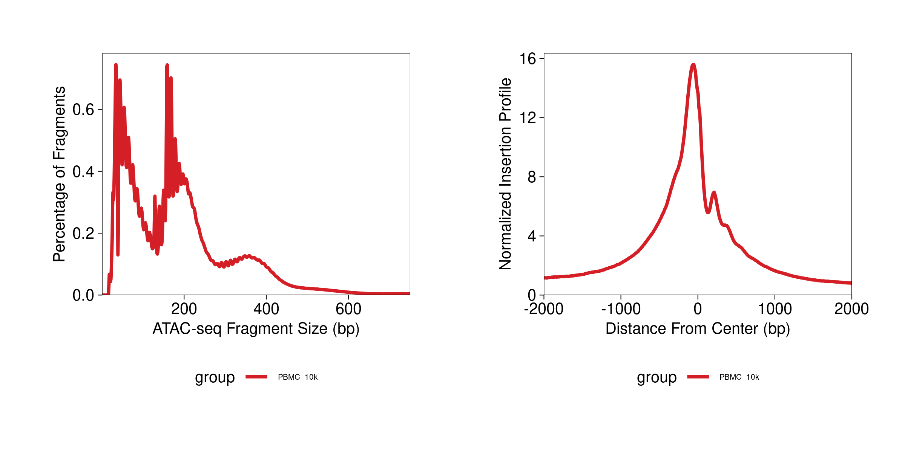
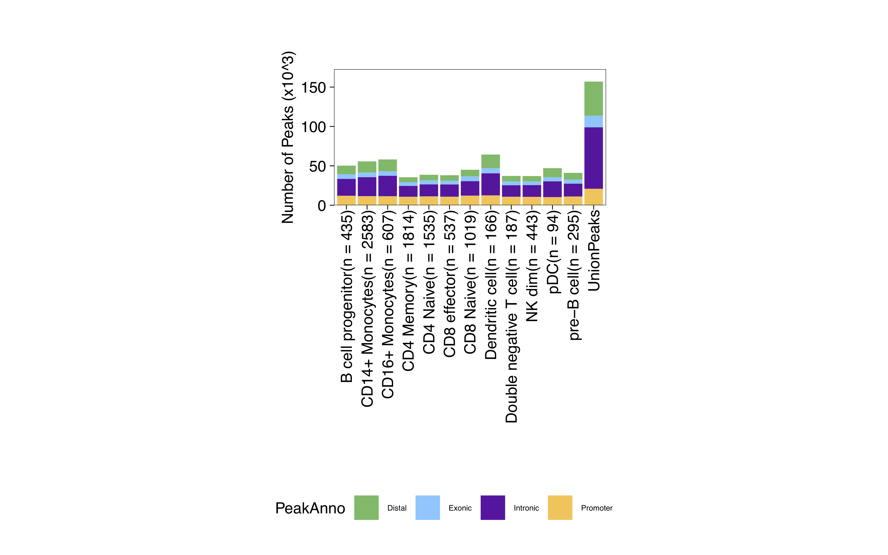
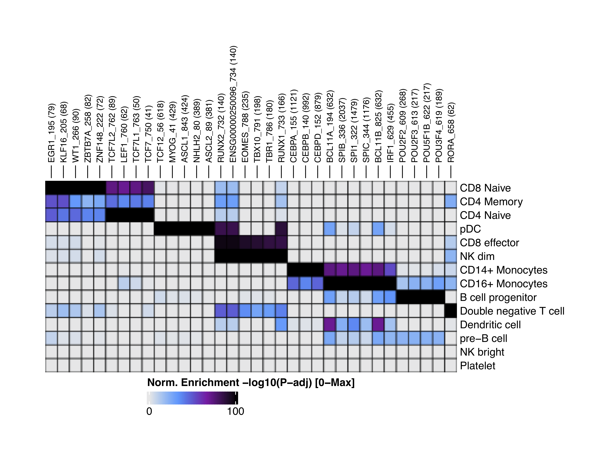
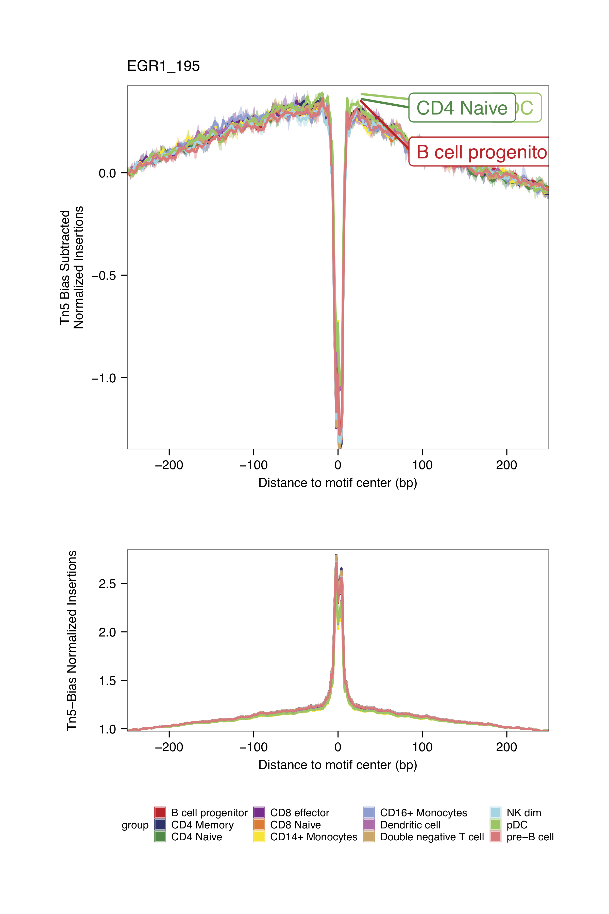
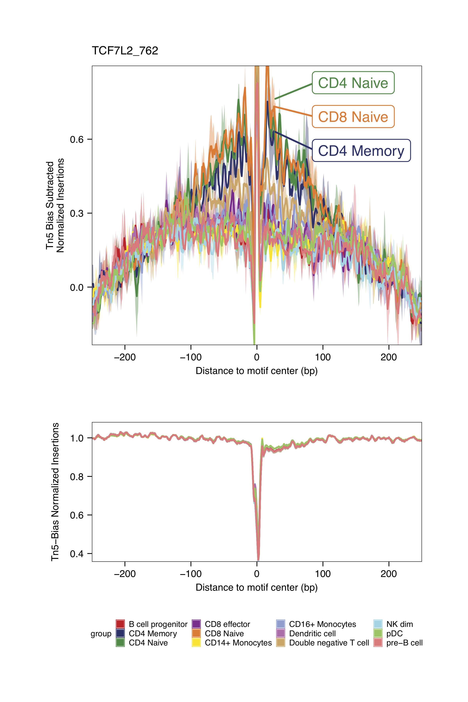
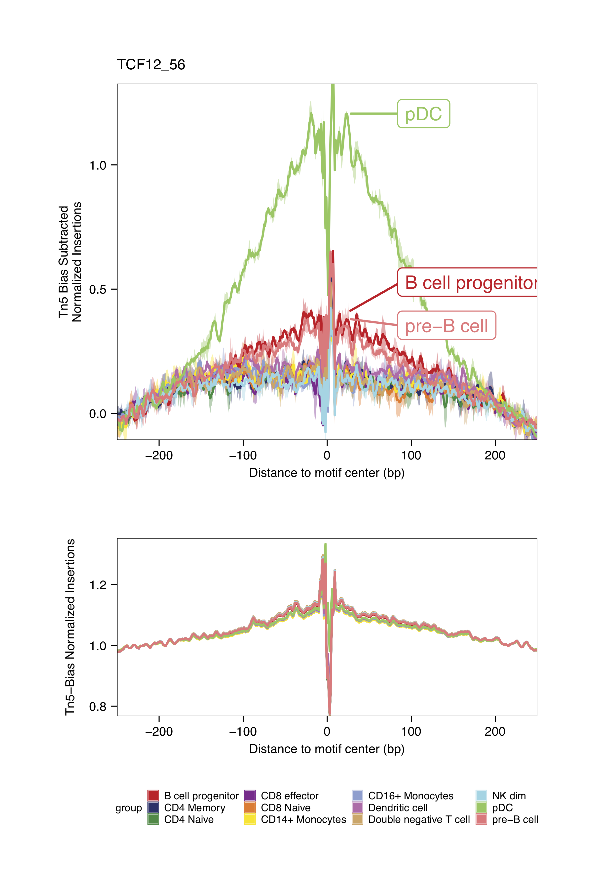
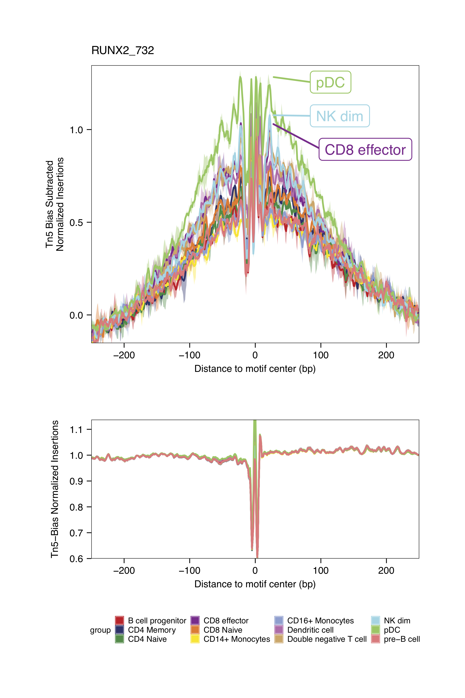

# Chromatin accessibility scATAC-seq analysis with ArchR

## Data download

In this tutorial we will use the scRNA-seq/scATAC-seq multiome example data provided by 10x Genomics for human PBMCs.

The data was downloaded using the following commands:

```
wget https://cf.10xgenomics.com/samples/cell-arc/1.0.0/pbmc_granulocyte_sorted_10k/pbmc_granulocyte_sorted_10k_filtered_feature_bc_matrix.h5
wget https://cf.10xgenomics.com/samples/cell-arc/1.0.0/pbmc_granulocyte_sorted_10k/pbmc_granulocyte_sorted_10k_atac_fragments.tsv.gz
wget https://cf.10xgenomics.com/samples/cell-arc/1.0.0/pbmc_granulocyte_sorted_10k/pbmc_granulocyte_sorted_10k_atac_fragments.tsv.gz.tbi
wget https://www.dropbox.com/s/zn6khirjafoyyxl/pbmc_10k_v3.rds
```

## Create ArchR Arrow file and quality control

The main input to create an ArchR project are Arrow files created from the raw alignments, this files can be created from the fragments files resulting from the cellranger-atac pipeline, or from a bam file.

Here we are going to create an Arrow file from the fragments file: *pbmc_granulocyte_sorted_10k_atac_fragments.tsv.gz*

```r
##––––––––––––––––––––––––––––––––––––––––––––––––––––––––––––––––––––––––––––##
##                    Load package and global settings                        ##
##––––––––––––––––––––––––––––––––––––––––––––––––––––––––––––––––––––––––––––##
## Setting default genome to Hg38.
library(ArchR)
addArchRGenome("hg38")

## Setting default number of Parallel threads to 5.
addArchRThreads(5)

##––––––––––––––––––––––––––––––––––––––––––––––––––––––––––––––––––––––––––––##
##                    Load package and global settings                        ##
##––––––––––––––––––––––––––––––––––––––––––––––––––––––––––––––––––––––––––––##
# Get fragment file
inputFiles <- "data/pbmc_granulocyte_sorted_10k_atac_fragments.tsv.gz"

# Create Arrow file
createArrowFiles(inputFiles  = inputFiles, 
                 sampleNames = "PBMC_10k", 
                 QCDir       = "data/QualityControl",
                 logFile     = createLogFile(name = "createArrows", 
                                             logDir = "data/ArchRLogs"),
                 force       = TRUE)

```

<details>
<summary><b>Click for Answer</b></summary>

```
Using GeneAnnotation set by addArchRGenome(Hg38)!
Using GeneAnnotation set by addArchRGenome(Hg38)!
ArchR logging to : data/ArchRLogs/ArchR-createArrows-130626bf3d8f6-Date-2021-12-30_Time-21-13-35.log
If there is an issue, please report to github with logFile!
2021-12-30 21:13:35 : Batch Execution w/ safelapply!, 0 mins elapsed.
2021-12-30 21:13:35 : (PBMC_10k : 1 of 1) Reading In Fragments from inputFiles (readMethod = tabix), 0.001 mins elapsed.
2021-12-30 21:13:35 : (PBMC_10k : 1 of 1) Tabix Bed To Temporary File, 0.001 mins elapsed.
2021-12-30 21:15:50 : (PBMC_10k : 1 of 1) Successful creation of Temporary File, 2.253 mins elapsed.
2021-12-30 21:15:50 : (PBMC_10k : 1 of 1) Creating ArrowFile From Temporary File, 2.253 mins elapsed.
2021-12-30 21:17:02 : (PBMC_10k : 1 of 1) Successful creation of Arrow File, 3.449 mins elapsed.
2021-12-30 21:18:08 : (PBMC_10k : 1 of 1) CellStats : Number of Cells Pass Filter = 11582 , 4.544 mins elapsed.
2021-12-30 21:18:08 : (PBMC_10k : 1 of 1) CellStats : Median Frags = 13610 , 4.544 mins elapsed.
2021-12-30 21:18:08 : (PBMC_10k : 1 of 1) CellStats : Median TSS Enrichment = 13.6245 , 4.544 mins elapsed.
2021-12-30 21:18:12 : (PBMC_10k : 1 of 1) Adding Additional Feature Counts!, 4.617 mins elapsed.
2021-12-30 21:18:34 : (PBMC_10k : 1 of 1) Removing Fragments from Filtered Cells, 4.981 mins elapsed.
2021-12-30 21:18:34 : (PBMC_10k : 1 of 1) Creating Filtered Arrow File, 4.982 mins elapsed.
2021-12-30 21:19:34 : (PBMC_10k : 1 of 1) Finished Constructing Filtered Arrow File!, 5.99 mins elapsed.
2021-12-30 21:19:35 : (PBMC_10k : 1 of 1) Adding TileMatrix!, 5.991 mins elapsed.
2021-12-30 21:22:37 : (PBMC_10k : 1 of 1) Adding GeneScoreMatrix!, 9.03 mins elapsed.
2021-12-30 21:24:23 : (PBMC_10k : 1 of 1) Finished Creating Arrow File, 10.8 mins elapsed.
ArchR logging successful to : data/ArchRLogs/ArchR-createArrows-130626bf3d8f6-Date-2021-12-30_Time-21-13-35.log
[1] "PBMC_10k.arrow"
```

</details>

By default ArchR does quality control for each sample while its creating the Arrow files.
The parameters to filter out low quality cells are:

- Minimum TSS enrichment score = 4
- Minimum fragments per cell = 1000
- Maximum fragments per cell = 100000

This parameters are optimized for human samples. Thus, it is necessary to modify them for other types of samples. However, an extra step of quality control can be done in a later step.

The quality control plots can be found in the directory specified in the _QCDir_ parameter from the _createArrowFiles()_ function used to create Arrow files.

<details>
<summary><b>Click to see QC plots</b></summary>


</details>


## Create ArchR project

An ArchR project is created from a list of previously computed Arrow files

```r
##––––––––––––––––––––––––––––––––––––––––––––––––––––––––––––––––––––––––––––##
##                          Create ArchR project                              ##
##––––––––––––––––––––––––––––––––––––––––––––––––––––––––––––––––––––––––––––##
archrproj <- ArchRProject(ArrowFiles = "PBMC_10k.arrow", 
                     outputDirectory = "results/ArchROutput")
```

<details>
<summary><b>Click for Answer</b></summary>

```
Using GeneAnnotation set by addArchRGenome(Hg38)!
Using GeneAnnotation set by addArchRGenome(Hg38)!
Validating Arrows...
Getting SampleNames...
1 
Copying ArrowFiles to Ouptut Directory! If you want to save disk space set copyArrows = FALSE
1 
Getting Cell Metadata...
1 
Merging Cell Metadata...
Initializing ArchRProject...

                                                   / |
                                                 /    \
            .                                  /      |.
            \\\                              /        |.
              \\\                          /           `|.
                \\\                      /              |.
                  \                    /                |\
                  \\#####\           /                  ||
                ==###########>      /                   ||
                 \\##==......\    /                     ||
            ______ =       =|__ /__                     ||      \\\
        ,--' ,----`-,__ ___/'  --,-`-===================##========>
       \               '        ##_______ _____ ,--,__,=##,__   ///
        ,    __==    ___,-,__,--'#'  ==='      `-'    | ##,-/
        -,____,---'       \\####\\________________,--\\_##,/
           ___      .______        ______  __    __  .______      
          /   \     |   _  \      /      ||  |  |  | |   _  \     
         /  ^  \    |  |_)  |    |  ,----'|  |__|  | |  |_)  |    
        /  /_\  \   |      /     |  |     |   __   | |      /     
       /  _____  \  |  |\  \\___ |  `----.|  |  |  | |  |\  \\___.
      /__/     \__\ | _| `._____| \______||__|  |__| | _| `._____|
    
```

</details>


## Quality control

Filtering out low quality cells and doublets:

```r
p1 <- plotFragmentSizes(ArchRProj = archrproj)
p2 <- plotTSSEnrichment(ArchRProj = archrproj)
p1 + p2

# Low quality cells
archrproj <- archrproj[archrproj$TSSEnrichment > 6 & archrproj$nFrags > 2500 ]

# Filtering doublets
archrproj <- addDoubletScores(archrproj)
archrproj <- filterDoublets(archrproj)

archrproj
```

<details>
<summary><b>Click for Answer</b></summary>



```
> archrproj <- addDoubletScores(archrproj)
ArchR logging to : ArchRLogs/ArchR-addDoubletScores-2cdba5b39f401-Date-2022-01-01_Time-16-07-37.log
If there is an issue, please report to github with logFile!
2022-01-01 16:07:38 : Batch Execution w/ safelapply!, 0 mins elapsed.
2022-01-01 16:07:38 : PBMC_10k (1 of 1) :  Computing Doublet Statistics, 0 mins elapsed.
PBMC_10k (1 of 1) : UMAP Projection R^2 = 0.99866
ArchR logging successful to : ArchRLogs/ArchR-addDoubletScores-2cdba5b39f401-Date-2022-01-01_Time-16-07-37.log
Warning message:
`guides(<scale> = FALSE)` is deprecated. Please use `guides(<scale> = "none")` instead. 
> archrproj <- filterDoublets(archrproj)
Filtering 1197 cells from ArchRProject!
	PBMC_10k : 1197 of 10944 (10.9%)
> archrproj

           ___      .______        ______  __    __  .______      
          /   \     |   _  \      /      ||  |  |  | |   _  \     
         /  ^  \    |  |_)  |    |  ,----'|  |__|  | |  |_)  |    
        /  /_\  \   |      /     |  |     |   __   | |      /     
       /  _____  \  |  |\  \\___ |  `----.|  |  |  | |  |\  \\___.
      /__/     \__\ | _| `._____| \______||__|  |__| | _| `._____|
    
class: ArchRProject 
outputDirectory: /home/bq_aquintero/projects/sincell_2022/results/scATAC_ArchR 
samples(1): PBMC_10k
sampleColData names(1): ArrowFiles
cellColData names(15): Sample TSSEnrichment ... DoubletScore DoubletEnrichment
numberOfCells(1): 9747
medianTSS(1): 13.596
medianFrags(1): 13557

```

</details>


## Reduce data dimensionality with LSI

Latent Semantic Indexing (LSI) is an approach from natural language processing that was originally designed to assess document similarity based on word counts. See for example [this post](http://andrewjohnhill.com/blog/2019/05/06/dimensionality-reduction-for-scatac-data/) for an in-depth discussion of available methods. 
	
In the context of scATAC-seq and scRNA-seq data ArchR performs LSI following these steps:
1. scATAC-seq: documents=samples, words=regions/peaks. scRNA-seq: documents=samples, words=genes. 
2. Calculate word frequency by depth normalization per single cell. 
3. Normalize word frequency by the inverse document frequency which weights features by how often they occur. 
4. Results in a word frequency-inverse document frequency (TF-IDF) matrix, which reflects how important a word (aka region/peak) is to a document (aka sample). 
5. Perform singular value decomposition (SVD) on the TF-IDF matrix.
_Modified from: https://www.archrproject.com/bookdown/dimensionality-reduction-with-archr.html_ 

```r
##––––––––––––––––––––––––––––––––––––––––––––––––––––––––––––––––––––––––––––##
##                  Dimensionality reduction with LSI - ATAC                  ##
##––––––––––––––––––––––––––––––––––––––––––––––––––––––––––––––––––––––––––––##
archrproj <- addIterativeLSI(
    ArchRProj = archrproj, 
    clusterParams = list(
      resolution = 0.2, 
      sampleCells = 5000,
      n.start = 10
    ),
    varFeatures = 10000,
    saveIterations = FALSE,
    useMatrix = "TileMatrix", 
    depthCol = "nFrags",
    name = "LSI_ATAC"
)
```

<details>
<summary><b>Click for Answer</b></summary>

```
Checking Inputs...
ArchR logging to : ArchRLogs/ArchR-addIterativeLSI-2cdba47f39cab-Date-2022-01-01_Time-16-14-30.log
If there is an issue, please report to github with logFile!
2022-01-01 16:14:30 : Computing Total Across All Features, 0.002 mins elapsed.
2022-01-01 16:14:32 : Computing Top Features, 0.026 mins elapsed.
###########
2022-01-01 16:14:33 : Running LSI (1 of 2) on Top Features, 0.055 mins elapsed.
###########
2022-01-01 16:14:33 : Creating Partial Matrix, 0.055 mins elapsed.
2022-01-01 16:15:10 : Computing LSI, 0.673 mins elapsed.
2022-01-01 16:16:59 : Identifying Clusters, 2.478 mins elapsed.
2022-01-01 16:17:16 : Identified 7 Clusters, 2.764 mins elapsed.
2022-01-01 16:17:16 : Creating Cluster Matrix on the total Group Features, 2.764 mins elapsed.
2022-01-01 16:17:28 : Computing Variable Features, 2.974 mins elapsed.
###########
2022-01-01 16:17:29 : Running LSI (2 of 2) on Variable Features, 2.977 mins elapsed.
###########
2022-01-01 16:17:29 : Creating Partial Matrix, 2.977 mins elapsed.
2022-01-01 16:17:57 : Computing LSI, 3.457 mins elapsed.
2022-01-01 16:18:48 : Finished Running IterativeLSI, 4.295 mins elapsed.
    
```
</details>

Then we use the LSI results to perform UMAP:

```r
##––––––––––––––––––––––––––––––––––––––––––––––––––––––––––––––––––––––––––––##
##                            UMAP on the LSI results                         ##
##––––––––––––––––––––––––––––––––––––––––––––––––––––––––––––––––––––––––––––##
archrproj <- addUMAP(archrproj, reducedDims = "LSI_ATAC", name = "UMAP_ATAC", minDist = 0.8, force = TRUE)

```


<details>
<summary><b>Click for Answer</b></summary>

```
16:19:12 UMAP embedding parameters a = 0.2321 b = 1.681
16:19:12 Read 9747 rows and found 30 numeric columns
16:19:12 Using Annoy for neighbor search, n_neighbors = 40
16:19:12 Building Annoy index with metric = cosine, n_trees = 50
0%   10   20   30   40   50   60   70   80   90   100%
[----|----|----|----|----|----|----|----|----|----|
**************************************************|
16:19:13 Writing NN index file to temp file /tmp/RtmpfoXwVR/file2cdba2aa1a20a
16:19:13 Searching Annoy index using 36 threads, search_k = 4000
16:19:14 Annoy recall = 100%
16:19:14 Commencing smooth kNN distance calibration using 36 threads
16:19:15 Initializing from normalized Laplacian + noise
16:19:16 Commencing optimization for 500 epochs, with 577782 positive edges
0%   10   20   30   40   50   60   70   80   90   100%
[----|----|----|----|----|----|----|----|----|----|
**************************************************|
16:19:52 Optimization finished
16:19:52 Creating temp model dir /tmp/RtmpfoXwVR/dir2cdba11a30a8c
16:19:52 Creating dir /tmp/RtmpfoXwVR/dir2cdba11a30a8c
16:19:52 Changing to /tmp/RtmpfoXwVR/dir2cdba11a30a8c
16:19:52 Creating /home/bq_aquintero/projects/sincell_2022/results/scATAC_ArchR/Embeddings/Save-Uwot-UMAP-Params-LSI_ATAC-2cdba5341cff4-Date-2022-01-01_Time-16-19-52.tar


```
</details>


And identify clusters of cells based con the combined reduced dimensions:

```r
##––––––––––––––––––––––––––––––––––––––––––––––––––––––––––––––––––––––––––––##
##                           Find clusters of cells                           ##
##––––––––––––––––––––––––––––––––––––––––––––––––––––––––––––––––––––––––––––##
archrproj <- addClusters(archrproj, reducedDims = "LSI_ATAC", name = "Clusters", resolution = 0.4, force = TRUE)
```


<details>
<summary><b>Click for Answer</b></summary>

```
ArchR logging to : ArchRLogs/ArchR-addClusters-2cdba5e121294-Date-2022-01-01_Time-16-20-29.log
If there is an issue, please report to github with logFile!
2022-01-01 16:20:30 : Running Seurats FindClusters (Stuart et al. Cell 2019), 0.001 mins elapsed.
Computing nearest neighbor graph
Computing SNN
Modularity Optimizer version 1.3.0 by Ludo Waltman and Nees Jan van Eck

Number of nodes: 9747
Number of edges: 426707

Running Louvain algorithm...
0%   10   20   30   40   50   60   70   80   90   100%
[----|----|----|----|----|----|----|----|----|----|
**************************************************|
Maximum modularity in 10 random starts: 0.9227
Number of communities: 12
Elapsed time: 0 seconds
2022-01-01 16:20:44 : Testing Biased Clusters, 0.248 mins elapsed.
2022-01-01 16:20:45 : Testing Outlier Clusters, 0.249 mins elapsed.
2022-01-01 16:20:45 : Assigning Cluster Names to 12 Clusters, 0.249 mins elapsed.
2022-01-01 16:20:45 : Finished addClusters, 0.251 mins elapsed.
    
```
</details>


Plot UMAP embeddings:

```r
plotEmbedding(archrproj, name = "Clusters", embedding = "UMAP_ATAC", size = 1.5, labelAsFactors=F, labelMeans=F)

```

<details>
<summary><b>Click for Answer</b></summary>


</details>


## Computing a gene activity matrix and marker genes

The activity of each gene can be measured from the scATAC-seq data by quantifying the chromatin accessibility associated with each gene.
ArchR computes a gene activity matrix for each sample at the time of creation of each Arrow file.

In the case of ArchR the gene activity matrix if computed by the following steps:

1. Creates a tile matrix for each chromosome (default tile size is 500bp).
2. Overlap these tiles with a user-defined gene window (default is 100 kb on either side of the gene)
3. computes the distance from each tile (start or end) to the gene body or gene start. 
4. The distance from each tile to the gene is then converted to a distance weight using a user-defined accessibility model (default is e^(-abs(distance)/5000) + e^(-1)). 
5. To help adjust for large differences in gene size, ArchR applies a separate weight for the inverse of the gene size (1 / gene size) and scales this inverse weight linearly from 1 to a user-defined hard maximum (default of 5). 
6. The corresponding distance and gene size weights are then multiplied by the number of Tn5 insertions within each tile and summed across all tiles within the gene window. 

_Modified from: https://www.archrproject.com/bookdown/calculating-gene-scores-in-archr.html_


The gene activities can be used to visualize the expression of marker genes on the scATAC-seq clusters:

```r

p <- plotEmbedding(
    ArchRProj = archrproj, 
    colorBy = "GeneScoreMatrix", 
    name = c('MS4A1', 'CD3D', 'LEF1', 'NKG7', 'TREM1', 'LYZ'),
    embedding = "UMAP_ATAC",
    quantCut = c(0.01, 0.95),
    imputeWeights = NULL
)

patchwork::wrap_plots(p) 

```

<details>
<summary><b>Click for Answer</b></summary>


</details>


## Annotating cell types with a reference dataset

ArchR includes a function to align a reference scRNA-seq dataset, and impute cell type annotations based on the reference annotation (`addGeneIntegrationMatrix`).
As a reference, we will use a pre-processed scRNA-seq dataset for human PBMCs. Provided by 10x Genomics, and [pre-processed by the Satija Lab](https://github.com/satijalab/Integration2019/blob/master/preprocessing_scripts/pbmc_10k_v3.R). 

```r
# Read reference
reference <- readRDS("data/pbmc_10k_v3.rds")

# add gene integration matrix
archrproj <- addGeneIntegrationMatrix(
    ArchRProj   = archrproj, 
    useMatrix   = "GeneScoreMatrix",
    matrixName  = "GeneIntegrationMatrix",
    reducedDims = "LSI_ATAC",
    seRNA       = reference,
    addToArrow  = FALSE,
    groupRNA    = "celltype",
    nameCell    = "predictedCell_Un",
    nameGroup   = "predictedGroup_Un",
    nameScore   = "predictedScore_Un"
)

# Plot UMAP with predicted cell types
plotEmbedding(archrproj, name = "predictedGroup_Un", embedding = "UMAP_ATAC", size = 1.5, labelAsFactors=F, labelMeans=F)

```


<details>
<summary><b>Click for Answer</b></summary>

```
ArchR logging to : ArchRLogs/ArchR-addGeneIntegrationMatrix-2cdba6d0bc070-Date-2022-01-01_Time-19-26-35.log
If there is an issue, please report to github with logFile!
2022-01-01 19:26:35 : Running Seurat's Integration Stuart* et al 2019, 0.007 mins elapsed.
2022-01-01 19:26:35 : Checking ATAC Input, 0.009 mins elapsed.
2022-01-01 19:26:35 : Checking RNA Input, 0.009 mins elapsed.
2022-01-01 19:26:39 : Found 15350 overlapping gene names from gene scores and rna matrix!, 0.074 mins elapsed.
2022-01-01 19:26:39 : Creating Integration Blocks, 0.074 mins elapsed.
2022-01-01 19:26:39 : Prepping Interation Data, 0.075 mins elapsed.
2022-01-01 19:26:40 : Computing Integration in 1 Integration Blocks!, 0 mins elapsed.
2022-01-01 19:26:40 : Block (1 of 1) : Computing Integration, 0 mins elapsed.
2022-01-01 19:26:42 : Block (1 of 1) : Identifying Variable Genes, 0.035 mins elapsed.
2022-01-01 19:26:47 : Block (1 of 1) : Getting GeneScoreMatrix, 0.113 mins elapsed.
2022-01-01 19:27:02 : Block (1 of 1) : Imputing GeneScoreMatrix, 0.362 mins elapsed.
Getting ImputeWeights
2022-01-01 19:27:57 : Block (1 of 1) : Seurat FindTransferAnchors, 1.292 mins elapsed.
2022-01-01 19:30:09 : Block (1 of 1) : Seurat TransferData Cell Group Labels, 3.48 mins elapsed.
2022-01-01 19:30:11 : Block (1 of 1) : Seurat TransferData Cell Names Labels, 3.518 mins elapsed.
2022-01-01 19:30:32 : Block (1 of 1) : Saving TransferAnchors Joint CCA, 3.865 mins elapsed.
2022-01-01 19:30:33 : Block (1 of 1) : Completed Integration, 3.891 mins elapsed.
2022-01-01 19:30:34 : Block (1 of 1) : Plotting Joint UMAP, 3.909 mins elapsed.
2022-01-01 19:31:23 : Completed Integration with RNA Matrix, 4.717 mins elapsed.
ArchR logging successful to : ArchRLogs/ArchR-addGeneIntegrationMatrix-2cdba6d0bc070-Date-2022-01-01_Time-19-26-35.log
```


</details>


## Calling peaks


First we have to define pseudo-bulk replicates to call peaks on them, ArchR merges cells within each designated cell group:

```r
##––––––––––––––––––––––––––––––––––––––––––––––––––––––––––––––––––––––––––––##
##                       Defining pseudo-bulk replicates                      ##
##––––––––––––––––––––––––––––––––––––––––––––––––––––––––––––––––––––––––––––##
archrproj <- addGroupCoverages(ArchRProj = archrproj, groupBy = "predictedGroup_Un")

```

<details>
<summary><b>Click for Answer</b></summary>

```
ArchR logging to : ArchRLogs/ArchR-addGroupCoverages-2cdba30dbb619-Date-2022-01-01_Time-19-32-02.log
If there is an issue, please report to github with logFile!
2022-01-01 19:32:03 : Creating Coverage Files!, 0.026 mins elapsed.
2022-01-01 19:32:03 : Batch Execution w/ safelapply!, 0.026 mins elapsed.
2022-01-01 19:33:04 : Adding Kmer Bias to Coverage Files!, 1.043 mins elapsed.
2022-01-01 19:34:09 : Finished Creation of Coverage Files!, 2.115 mins elapsed.
ArchR logging successful to : ArchRLogs/ArchR-addGroupCoverages-2cdba30dbb619-Date-2022-01-01_Time-19-32-02.log
    
```
</details>

Now we can call peaks using the pseudo-bulk replicates, and add the peak matrix to our ArchR project:

```r
##––––––––––––––––––––––––––––––––––––––––––––––––––––––––––––––––––––––––––––##
##             Defining pseudo-bulk replicates and calling peaks              ##
##––––––––––––––––––––––––––––––––––––––––––––––––––––––––––––––––––––––––––––##
pathToMacs2 <- "/shared/software/miniconda/envs/macs2-2.2.7.1/bin/macs2"
archrproj <- addReproduciblePeakSet(
  ArchRProj = archrproj,
  groupBy = "predictedGroup_Un",
  pathToMacs2 = pathToMacs2
)

archrproj <- addPeakMatrix(archrproj)
```

<details>
<summary><b>Click for Answer</b></summary>

```
ArchR logging to : ArchRLogs/ArchR-addReproduciblePeakSet-2cdba3250975c-Date-2022-01-01_Time-19-34-21.log
If there is an issue, please report to github with logFile!
2022-01-01 19:34:22 : Peak Calling Parameters!, 0.016 mins elapsed.
                                        Group nCells nCellsUsed nReplicates nMin nMax maxPeaks
B cell progenitor           B cell progenitor    435        435           2   40  395   150000
CD4 Memory                         CD4 Memory   1814        540           2   40  500   150000
CD4 Naive                           CD4 Naive   1535        540           2   40  500   150000
CD8 effector                     CD8 effector    537        537           2   40  497   150000
CD8 Naive                           CD8 Naive   1019        540           2   40  500   150000
CD14+ Monocytes               CD14+ Monocytes   2583        540           2   40  500   150000
CD16+ Monocytes               CD16+ Monocytes    607        540           2   40  500   150000
Dendritic cell                 Dendritic cell    166        166           2   40  126    83000
Double negative T cell Double negative T cell    187        187           2   40  147    93500
NK bright                           NK bright      7          7           2    6    7     3500
NK dim                                 NK dim    443        443           2   40  403   150000
pDC                                       pDC     94         94           2   40   54    47000
Platelet                             Platelet     25         25           2   18   20    12500
pre-B cell                         pre-B cell    295        295           2   40  255   147500
2022-01-01 19:34:22 : Batching Peak Calls!, 0.016 mins elapsed.
2022-01-01 19:34:22 : Batch Execution w/ safelapply!, 0 mins elapsed.
2022-01-01 19:36:13 : Identifying Reproducible Peaks!, 1.87 mins elapsed.
2022-01-01 19:36:23 : Creating Union Peak Set!, 2.024 mins elapsed.
Converged after 9 iterations!
Plotting Ggplot!
2022-01-01 19:36:32 : Finished Creating Union Peak Set (156943)!, 2.187 mins elapsed.


ArchR logging to : ArchRLogs/ArchR-addPeakMatrix-2cdba2f264879-Date-2022-01-01_Time-19-36-32.log
If there is an issue, please report to github with logFile!
2022-01-01 19:36:33 : Batch Execution w/ safelapply!, 0 mins elapsed.
2022-01-01 19:37:25 : Adding PBMC_10k to PeakMatrix for Chr (1 of 23)!, 0.022 mins elapsed.
2022-01-01 19:37:37 : Adding PBMC_10k to PeakMatrix for Chr (2 of 23)!, 0.235 mins elapsed.
2022-01-01 19:37:46 : Adding PBMC_10k to PeakMatrix for Chr (3 of 23)!, 0.387 mins elapsed.
2022-01-01 19:37:54 : Adding PBMC_10k to PeakMatrix for Chr (4 of 23)!, 0.512 mins elapsed.
2022-01-01 19:37:59 : Adding PBMC_10k to PeakMatrix for Chr (5 of 23)!, 0.602 mins elapsed.
2022-01-01 19:38:06 : Adding PBMC_10k to PeakMatrix for Chr (6 of 23)!, 0.71 mins elapsed.
2022-01-01 19:38:13 : Adding PBMC_10k to PeakMatrix for Chr (7 of 23)!, 0.835 mins elapsed.
2022-01-01 19:38:20 : Adding PBMC_10k to PeakMatrix for Chr (8 of 23)!, 0.94 mins elapsed.
2022-01-01 19:38:25 : Adding PBMC_10k to PeakMatrix for Chr (9 of 23)!, 1.032 mins elapsed.
2022-01-01 19:38:31 : Adding PBMC_10k to PeakMatrix for Chr (10 of 23)!, 1.13 mins elapsed.
2022-01-01 19:38:37 : Adding PBMC_10k to PeakMatrix for Chr (11 of 23)!, 1.23 mins elapsed.
2022-01-01 19:38:44 : Adding PBMC_10k to PeakMatrix for Chr (12 of 23)!, 1.349 mins elapsed.
2022-01-01 19:38:51 : Adding PBMC_10k to PeakMatrix for Chr (13 of 23)!, 1.465 mins elapsed.
2022-01-01 19:38:55 : Adding PBMC_10k to PeakMatrix for Chr (14 of 23)!, 1.533 mins elapsed.
2022-01-01 19:39:00 : Adding PBMC_10k to PeakMatrix for Chr (15 of 23)!, 1.619 mins elapsed.
2022-01-01 19:39:06 : Adding PBMC_10k to PeakMatrix for Chr (16 of 23)!, 1.706 mins elapsed.
2022-01-01 19:39:12 : Adding PBMC_10k to PeakMatrix for Chr (17 of 23)!, 1.809 mins elapsed.
2022-01-01 19:39:20 : Adding PBMC_10k to PeakMatrix for Chr (18 of 23)!, 1.942 mins elapsed.
2022-01-01 19:39:24 : Adding PBMC_10k to PeakMatrix for Chr (19 of 23)!, 2.006 mins elapsed.
2022-01-01 19:39:32 : Adding PBMC_10k to PeakMatrix for Chr (20 of 23)!, 2.142 mins elapsed.
2022-01-01 19:39:37 : Adding PBMC_10k to PeakMatrix for Chr (21 of 23)!, 2.221 mins elapsed.
2022-01-01 19:39:40 : Adding PBMC_10k to PeakMatrix for Chr (22 of 23)!, 2.28 mins elapsed.
2022-01-01 19:39:45 : Adding PBMC_10k to PeakMatrix for Chr (23 of 23)!, 2.356 mins elapsed.
ArchR logging successful to : ArchRLogs/ArchR-addPeakMatrix-2cdba2f264879-Date-2022-01-01_Time-19-36-32.log
    
```

Remember to look in the **Plots** folder of you ArchR project output directory:



</details>

## Annotating peaks and motif enrichment 

One of the biggest advantages of ArchR is that it provides a complete set of functions to perform a downstream analysis on the identified peaks.


After identifying peaks for each cell type, we can also search for marker peaks for each of these groups.
ArchR can also take into account differences in data quality between cell types by setting the bias parameter to account for TSS enrichment and the number of unique fragments per cell.


```r
markersPeaks <- getMarkerFeatures(
    ArchRProj = archrproj, 
    useMatrix = "PeakMatrix", 
    groupBy = "predictedGroup_Un",
  bias = c("TSSEnrichment", "log10(nFrags)"),
  testMethod = "wilcoxon"
)
```

The `markersPeaks` object is SummarizedExperiment that contains different assays containing marker peaks for each cell type.
The following helper functions allow us to retreive markers we are interested in:

- `getMarkers()`: The default behavior of this function is to return a list of DataFrame objects, one for each cell group.
- `getMarkers()` with option `returnGR = TRUE`: Instead of a list of DataFrame objects returns a GRangesList object with the marker peaks.

```r
markersPeaks

```

<details>
<summary><b>Click for Answer</b></summary>

```
class: SummarizedExperiment 
dim: 156943 14 
metadata(2): MatchInfo Params
assays(7): Log2FC Mean ... AUC MeanBGD
rownames(156943): 1 2 ... 156942 156943
rowData names(4): seqnames idx start end
colnames(14): B cell progenitor CD4 Memory ... Platelet pre-B cell
colData names(0):

```


</details>


Then, we will search for motifs that are enriched in peaks that are up or down in various cell types. 

The first step to do this, is to match a set of motifs to our previously identified peaks:

```r
archrproj <- addMotifAnnotations(ArchRProj = archrproj, motifSet = "cisbp", name = "Motif", force=T)

motifPositions <- getPositions(archrproj)
motifPositions
```


<details>
<summary><b>Click for Answer</b></summary>


```
ArchR logging to : ArchRLogs/ArchR-addMotifAnnotations-2cdba5becc92d-Date-2022-01-01_Time-19-41-24.log
If there is an issue, please report to github with logFile!
2022-01-01 19:41:24 : Gettting Motif Set, Species : Homo sapiens, 0.008 mins elapsed.
Using version 2 motifs!
2022-01-01 19:41:27 : Finding Motif Positions with motifmatchr!, 0.051 mins elapsed.
2022-01-01 19:44:58 : Creating Motif Overlap Matrix, 3.577 mins elapsed.
2022-01-01 19:45:01 : Finished Getting Motif Info!, 3.621 mins elapsed.
ArchR logging successful to : ArchRLogs/ArchR-addMotifAnnotations-2cdba5becc92d-Date-2022-01-01_Time-19-41-24.log

GRangesList object of length 870:
$TFAP2B_1
GRanges object with 18237 ranges and 1 metadata column:
          seqnames              ranges strand |     score
             <Rle>           <IRanges>  <Rle> | <numeric>
      [1]     chr1       925412-925423      - |   8.33885
      [2]     chr1       938095-938106      + |   8.43023
      [3]     chr1       961090-961101      + |   8.77640
      [4]     chr1       961291-961302      + |   9.88526
      [5]     chr1       961090-961101      - |   8.70388
      ...      ...                 ...    ... .       ...
  [18233]     chrX 154732833-154732844      + |   8.11530
  [18234]     chrX 154751280-154751291      - |   9.03277
  [18235]     chrX 154762826-154762837      + |   8.26625
  [18236]     chrX 155071293-155071304      + |   8.82438
  [18237]     chrX 155071293-155071304      - |   8.04768
  -------
  seqinfo: 23 sequences from an unspecified genome; no seqlengths

...
<869 more elements>


```
</details>

Next we will use our set of marker peaks to find with motifs are enriched in them:

```r
enrichMotifs <- peakAnnoEnrichment(
    seMarker = markersPeaks,
    ArchRProj = archrproj,
    peakAnnotation = "Motif",
    cutOff = "FDR <= 0.1 & Log2FC >= 0.5"
  )

enrichMotifs
```


<details>
<summary><b>Click for Answer</b></summary>


```
ArchR logging to : ArchRLogs/ArchR-peakAnnoEnrichment-2cdba3de7ecfd-Date-2022-01-01_Time-20-03-14.log
If there is an issue, please report to github with logFile!
2022-01-01 20:03:21 : Computing Enrichments 1 of 14, 0.112 mins elapsed.
2022-01-01 20:03:22 : Computing Enrichments 2 of 14, 0.13 mins elapsed.
2022-01-01 20:03:23 : Computing Enrichments 3 of 14, 0.143 mins elapsed.
2022-01-01 20:03:24 : Computing Enrichments 4 of 14, 0.154 mins elapsed.
2022-01-01 20:03:25 : Computing Enrichments 5 of 14, 0.171 mins elapsed.
2022-01-01 20:03:26 : Computing Enrichments 6 of 14, 0.185 mins elapsed.
2022-01-01 20:03:26 : Computing Enrichments 7 of 14, 0.197 mins elapsed.
2022-01-01 20:03:27 : Computing Enrichments 8 of 14, 0.212 mins elapsed.
2022-01-01 20:03:28 : Computing Enrichments 9 of 14, 0.225 mins elapsed.
2022-01-01 20:03:29 : Computing Enrichments 10 of 14, 0.235 mins elapsed.
2022-01-01 20:03:29 : Computing Enrichments 11 of 14, 0.247 mins elapsed.
2022-01-01 20:03:30 : Computing Enrichments 12 of 14, 0.26 mins elapsed.
2022-01-01 20:03:31 : Computing Enrichments 13 of 14, 0.271 mins elapsed.
2022-01-01 20:03:31 : Computing Enrichments 14 of 14, 0.283 mins elapsed.
ArchR logging successful to : ArchRLogs/ArchR-peakAnnoEnrichment-2cdba3de7ecfd-Date-2022-01-01_Time-20-03-14.log

class: SummarizedExperiment 
dim: 870 14 
metadata(0):
assays(10): mlog10Padj mlog10p ... CompareFrequency feature
rownames(870): TFAP2B_1 TFAP2D_2 ... TBX18_869 TBX22_870
rowData names(0):
colnames(14): B cell progenitor CD4 Memory ... Platelet pre-B cell
colData names(0):
```
</details>


We can visualize the enriched motifs with a heatmap:

```r

heatmapEM <- plotEnrichHeatmap(enrichMotifs, n = 5, transpose = TRUE)
## Adding Annotations..
## Preparing Main Heatmap..
ComplexHeatmap::draw(heatmapEM, heatmap_legend_side = "bot", annotation_legend_side = "bot")
plotPDF(heatmapEM, name = "Motifs-Enriched-Marker-Heatmap", width = 8, height = 6, ArchRProj = archrproj, addDOC = FALSE)

```

<details>
<summary><b>Click for Answer</b></summary>



</details>


## Footprinting

The first step to perform the footprinting is to retreive the position of the matched motifs as a GRangesList objet. Then we call the footprint with the `getFootprints()` functions, for this analysis we will focus only in a few motifs identifed before as enriched in some of the cell types.


```r

motifPositions <- getPositions(archrproj)

motifPositions

markerMotifs <- c("EGR1_195", "TCF7L2_762", "TCF12_56", "RUNX2_732")

seFoot <- getFootprints(
  ArchRProj = archrproj, 
  positions = motifPositions[markerMotifs], 
  groupBy   = "predictedGroup_Un"
)

plotFootprints(
  seFoot = seFoot,
  ArchRProj = archrproj, 
  normMethod = "Subtract",
  plotName = "Footprints-Subtract-Bias",
  addDOC = FALSE,
  smoothWindow = 5
)


```


<details>
<summary><b>Click for Answer</b></summary>

```

GRangesList object of length 870:
$TFAP2B_1
GRanges object with 18242 ranges and 1 metadata column:
          seqnames              ranges strand |     score
             <Rle>           <IRanges>  <Rle> | <numeric>
      [1]     chr1       925412-925423      - |   8.33741
      [2]     chr1       938095-938106      + |   8.42954
      [3]     chr1       940898-940909      + |   9.04966
      [4]     chr1       961090-961101      + |   8.77530
      [5]     chr1       961291-961302      + |   9.88491
      ...      ...                 ...    ... .       ...
  [18238]     chrX 154751280-154751291      - |   9.03217
  [18239]     chrX 154762826-154762837      + |   8.26523
  [18240]     chrX 155071293-155071304      + |   8.82409
  [18241]     chrX 155071293-155071304      - |   8.04580
  [18242]     chrX 155876953-155876964      - |   8.12269
  -------
  seqinfo: 23 sequences from an unspecified genome; no seqlengths

...
<869 more elements>

ArchR logging to : ArchRLogs/ArchR-getFootprints-2cdba15c075f-Date-2022-01-01_Time-20-21-41.log
If there is an issue, please report to github with logFile!
2022-01-01 20:21:42 : Computing Kmer Bias Table, 0.01 mins elapsed.
2022-01-01 20:21:55 : Finished Computing Kmer Tables, 0.223 mins elapsed.
2022-01-01 20:21:55 : Computing Footprints, 0.233 mins elapsed.
2022-01-01 20:22:06 : Computing Footprints Bias, 0.403 mins elapsed.
2022-01-01 20:22:14 : Summarizing Footprints, 0.538 mins elapsed.


```

</details>


The footprinting plots can be found on the ArchR project output directory


<details>
<summary><b>Click for Answer</b></summary>






</details>


