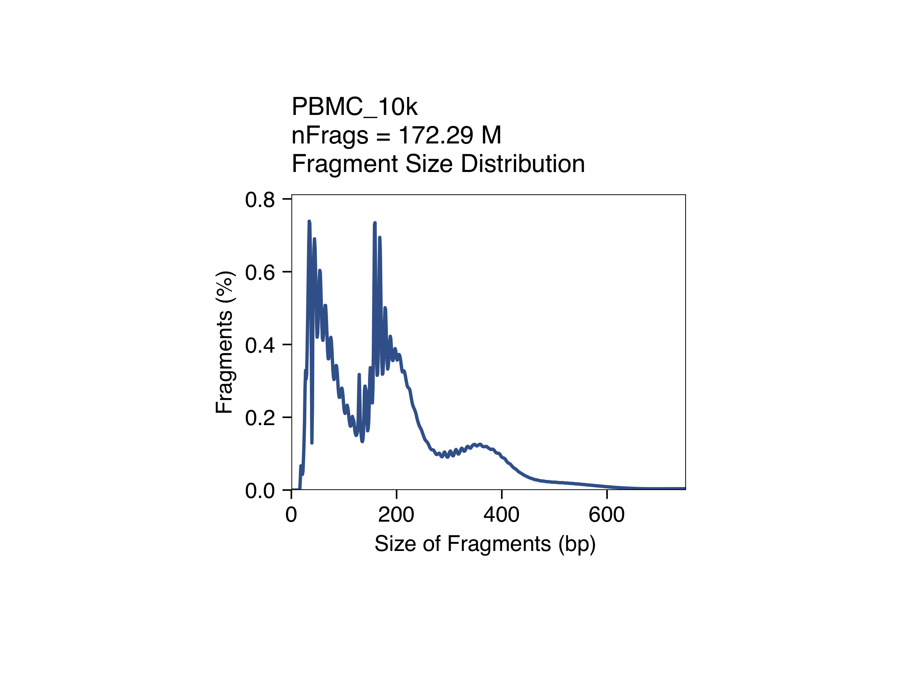
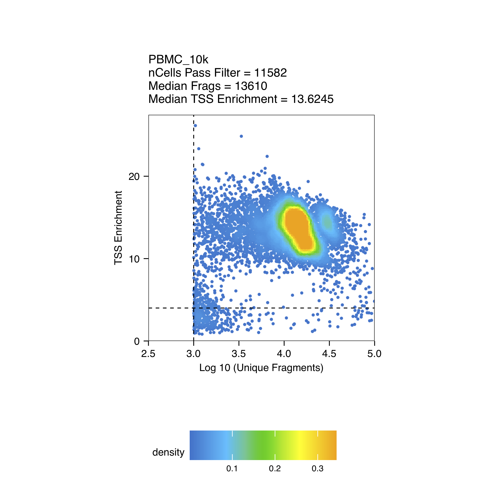
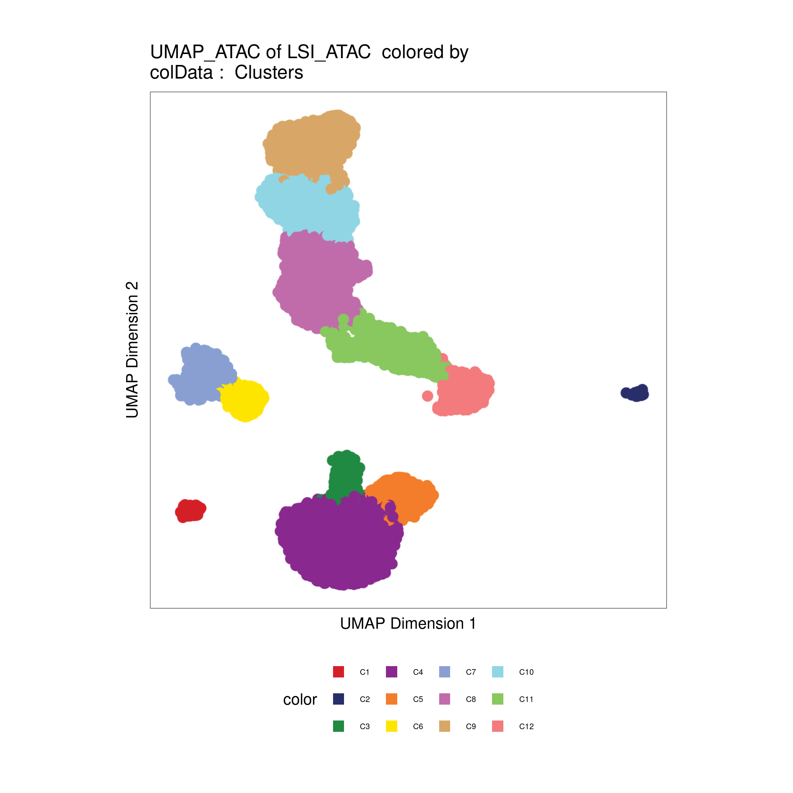
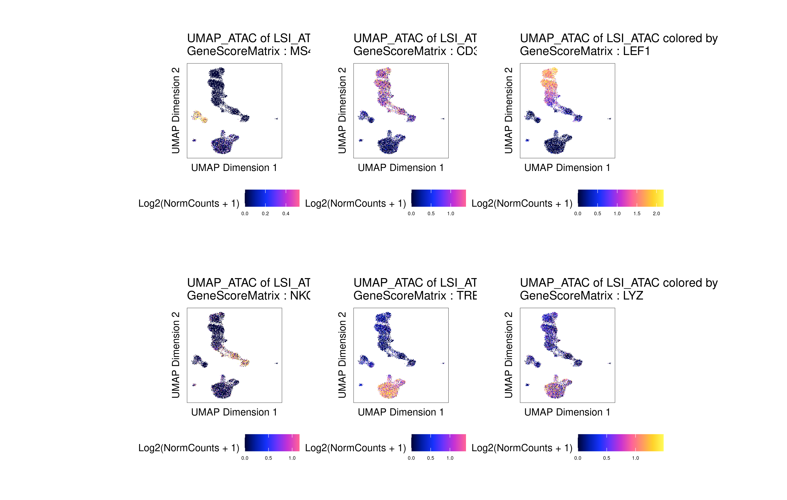
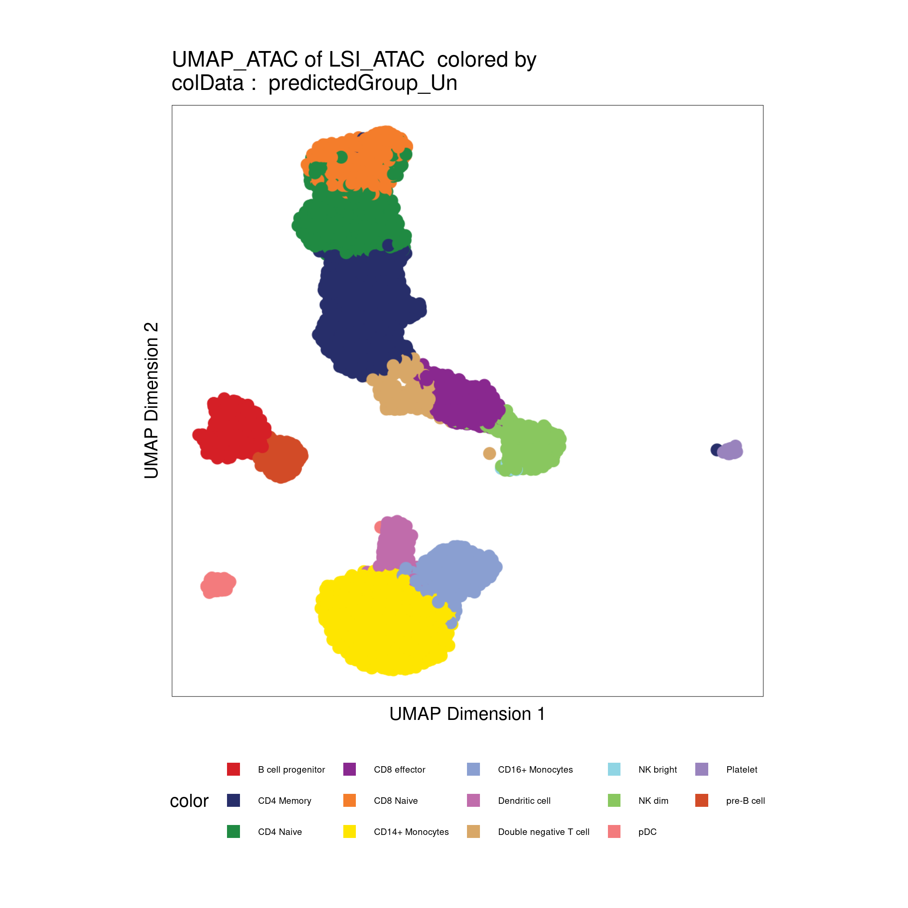

# Chromatin accessibility scATAC-seq analysis with ArchR

## Data download

In this tutorial we will use the scRNA-seq/scATAC-seq multiome example data provided by 10x Genomics for human PBMCs.

The data was downloaded using the following commands:

```
wget https://cf.10xgenomics.com/samples/cell-arc/1.0.0/pbmc_granulocyte_sorted_10k/pbmc_granulocyte_sorted_10k_filtered_feature_bc_matrix.h5
wget https://cf.10xgenomics.com/samples/cell-arc/1.0.0/pbmc_granulocyte_sorted_10k/pbmc_granulocyte_sorted_10k_atac_fragments.tsv.gz
wget https://cf.10xgenomics.com/samples/cell-arc/1.0.0/pbmc_granulocyte_sorted_10k/pbmc_granulocyte_sorted_10k_atac_fragments.tsv.gz.tbi
```

## Create ArchR Arrow file and quality control

The main input to create an ArchR project are Arrow files created from the raw alignments, this files can be created from the fragments files resulting from the cellranger-atac pipeline, or from a bam file.

Here we are going to create an arrow file from the fragments file: *pbmc_granulocyte_sorted_10k_atac_fragments.tsv.gz*

```r
##––––––––––––––––––––––––––––––––––––––––––––––––––––––––––––––––––––––––––––##
##                    Load package and global settings                        ##
##––––––––––––––––––––––––––––––––––––––––––––––––––––––––––––––––––––––––––––##
## Setting default genome to Hg38.
library(ArchR)
addArchRGenome("hg38")

## Setting default number of Parallel threads to 5.
addArchRThreads(5)

##––––––––––––––––––––––––––––––––––––––––––––––––––––––––––––––––––––––––––––##
##                    Load package and global settings                        ##
##––––––––––––––––––––––––––––––––––––––––––––––––––––––––––––––––––––––––––––##
# Get fragment file
inputFiles <- "data/pbmc_granulocyte_sorted_10k_atac_fragments.tsv.gz"

# Create Arrow file
createArrowFiles(inputFiles  = inputFiles, 
                 sampleNames = "PBMC_10k", 
                 QCDir       = "data/QualityControl",
                 logFile     = createLogFile(name = "createArrows", 
                                             logDir = "data/ArchRLogs"),
                 force       = TRUE)

```

<details>
<summary><b>Click for Answer</b></summary>

```
Using GeneAnnotation set by addArchRGenome(Hg38)!
Using GeneAnnotation set by addArchRGenome(Hg38)!
ArchR logging to : data/ArchRLogs/ArchR-createArrows-130626bf3d8f6-Date-2021-12-30_Time-21-13-35.log
If there is an issue, please report to github with logFile!
2021-12-30 21:13:35 : Batch Execution w/ safelapply!, 0 mins elapsed.
2021-12-30 21:13:35 : (PBMC_10k : 1 of 1) Reading In Fragments from inputFiles (readMethod = tabix), 0.001 mins elapsed.
2021-12-30 21:13:35 : (PBMC_10k : 1 of 1) Tabix Bed To Temporary File, 0.001 mins elapsed.
2021-12-30 21:15:50 : (PBMC_10k : 1 of 1) Successful creation of Temporary File, 2.253 mins elapsed.
2021-12-30 21:15:50 : (PBMC_10k : 1 of 1) Creating ArrowFile From Temporary File, 2.253 mins elapsed.
2021-12-30 21:17:02 : (PBMC_10k : 1 of 1) Successful creation of Arrow File, 3.449 mins elapsed.
2021-12-30 21:18:08 : (PBMC_10k : 1 of 1) CellStats : Number of Cells Pass Filter = 11582 , 4.544 mins elapsed.
2021-12-30 21:18:08 : (PBMC_10k : 1 of 1) CellStats : Median Frags = 13610 , 4.544 mins elapsed.
2021-12-30 21:18:08 : (PBMC_10k : 1 of 1) CellStats : Median TSS Enrichment = 13.6245 , 4.544 mins elapsed.
2021-12-30 21:18:12 : (PBMC_10k : 1 of 1) Adding Additional Feature Counts!, 4.617 mins elapsed.
2021-12-30 21:18:34 : (PBMC_10k : 1 of 1) Removing Fragments from Filtered Cells, 4.981 mins elapsed.
2021-12-30 21:18:34 : (PBMC_10k : 1 of 1) Creating Filtered Arrow File, 4.982 mins elapsed.
2021-12-30 21:19:34 : (PBMC_10k : 1 of 1) Finished Constructing Filtered Arrow File!, 5.99 mins elapsed.
2021-12-30 21:19:35 : (PBMC_10k : 1 of 1) Adding TileMatrix!, 5.991 mins elapsed.
2021-12-30 21:22:37 : (PBMC_10k : 1 of 1) Adding GeneScoreMatrix!, 9.03 mins elapsed.
2021-12-30 21:24:23 : (PBMC_10k : 1 of 1) Finished Creating Arrow File, 10.8 mins elapsed.
ArchR logging successful to : data/ArchRLogs/ArchR-createArrows-130626bf3d8f6-Date-2021-12-30_Time-21-13-35.log
[1] "PBMC_10k.arrow"
```

</details>

By default ArchR does quality control for each sample while its creating the Arrow files.
The parameters to filter out low quality cells are:

- Minimum TSS enrichment score = 4
- Minimum fragments per cell = 1000
- Maximum fragments per cell = 1e+05

This paremeters are optimized for human samples. Thus, it is necessary to modify them for other types of samples. However, an extra step of quality control can be done in a later step.

The quality control plots can be found in the _QCDir_ for the created Arrow files.

<details>
<summary><b>Click to see QC plots</b></summary>






</details>


## Create ArchR project

An ArchR project is created from a list of previously computed Arrow files

```r
##––––––––––––––––––––––––––––––––––––––––––––––––––––––––––––––––––––––––––––##
##                          Create ArchR project                              ##
##––––––––––––––––––––––––––––––––––––––––––––––––––––––––––––––––––––––––––––##
archrproj <- ArchRProject(ArrowFiles = "PBMC_10k.arrow", 
                     outputDirectory = "results/ArchROutput")
```

<details>
<summary><b>Click for Answer</b></summary>

```
Using GeneAnnotation set by addArchRGenome(Hg38)!
Using GeneAnnotation set by addArchRGenome(Hg38)!
Validating Arrows...
Getting SampleNames...
1 
Copying ArrowFiles to Ouptut Directory! If you want to save disk space set copyArrows = FALSE
1 
Getting Cell Metadata...
1 
Merging Cell Metadata...
Initializing ArchRProject...

                                                   / |
                                                 /    \
            .                                  /      |.
            \\\                              /        |.
              \\\                          /           `|.
                \\\                      /              |.
                  \                    /                |\
                  \\#####\           /                  ||
                ==###########>      /                   ||
                 \\##==......\    /                     ||
            ______ =       =|__ /__                     ||      \\\
        ,--' ,----`-,__ ___/'  --,-`-===================##========>
       \               '        ##_______ _____ ,--,__,=##,__   ///
        ,    __==    ___,-,__,--'#'  ==='      `-'    | ##,-/
        -,____,---'       \\####\\________________,--\\_##,/
           ___      .______        ______  __    __  .______      
          /   \     |   _  \      /      ||  |  |  | |   _  \     
         /  ^  \    |  |_)  |    |  ,----'|  |__|  | |  |_)  |    
        /  /_\  \   |      /     |  |     |   __   | |      /     
       /  _____  \  |  |\  \\___ |  `----.|  |  |  | |  |\  \\___.
      /__/     \__\ | _| `._____| \______||__|  |__| | _| `._____|
    
```

</details>


## Quality control

Filtering out low quality cells and doublets:

```r
p1 <- plotFragmentSizes(ArchRProj = archrproj)
p2 <- plotTSSEnrichment(ArchRProj = archrproj)
p1 + p2

# Low quality cells
archrproj <- archrproj[archrproj$TSSEnrichment > 6 & archrproj$nFrags > 2500 ]

# Filtering doublets
archrproj <- addDoubletScores(archrproj)
archrproj <- filterDoublets(archrproj)

archrproj
```

<details>
<summary><b>Click for Answer</b></summary>

```
> archrproj <- addDoubletScores(archrproj)
ArchR logging to : ArchRLogs/ArchR-addDoubletScores-2cdba5b39f401-Date-2022-01-01_Time-16-07-37.log
If there is an issue, please report to github with logFile!
2022-01-01 16:07:38 : Batch Execution w/ safelapply!, 0 mins elapsed.
2022-01-01 16:07:38 : PBMC_10k (1 of 1) :  Computing Doublet Statistics, 0 mins elapsed.
PBMC_10k (1 of 1) : UMAP Projection R^2 = 0.99866
ArchR logging successful to : ArchRLogs/ArchR-addDoubletScores-2cdba5b39f401-Date-2022-01-01_Time-16-07-37.log
Warning message:
`guides(<scale> = FALSE)` is deprecated. Please use `guides(<scale> = "none")` instead. 
> archrproj <- filterDoublets(archrproj)
Filtering 1197 cells from ArchRProject!
	PBMC_10k : 1197 of 10944 (10.9%)
> archrproj

           ___      .______        ______  __    __  .______      
          /   \     |   _  \      /      ||  |  |  | |   _  \     
         /  ^  \    |  |_)  |    |  ,----'|  |__|  | |  |_)  |    
        /  /_\  \   |      /     |  |     |   __   | |      /     
       /  _____  \  |  |\  \\___ |  `----.|  |  |  | |  |\  \\___.
      /__/     \__\ | _| `._____| \______||__|  |__| | _| `._____|
    
class: ArchRProject 
outputDirectory: /home/bq_aquintero/projects/sincell_2022/results/scATAC_ArchR 
samples(1): PBMC_10k
sampleColData names(1): ArrowFiles
cellColData names(15): Sample TSSEnrichment ... DoubletScore DoubletEnrichment
numberOfCells(1): 9747
medianTSS(1): 13.596
medianFrags(1): 13557

```

</details>


## Reduce data dimensionality with LSI

Latent Semantic Indexing (LSI) is an approach from natural language processing that was originally designed to assess document similarity based on word counts. In the context of scATAC-seq and scRNA-seq data ArchR performs LSI following these steps:
1. scATAC-seq: documents=samples, words=regions/peaks. scRNA-seq: documents=samples, words=genes. 
2. Calculate word frequency by depth normalization per single cell. 
3. Normalize word frequency by the inverse document frequency which weights features by how often they occur. 
4. Results in a word frequency-inverse document frequency (TF-IDF) matrix, which reflects how important a word (aka region/peak) is to a document (aka sample). 
5. Perform singular value decomposition (SVD) on the TF-IDF matrix.
_Modified from: https://www.archrproject.com/bookdown/dimensionality-reduction-with-archr.html_ 

```r
##––––––––––––––––––––––––––––––––––––––––––––––––––––––––––––––––––––––––––––##
##                  Dimensionality reduction with LSI - ATAC                  ##
##––––––––––––––––––––––––––––––––––––––––––––––––––––––––––––––––––––––––––––##
archrproj <- addIterativeLSI(
    ArchRProj = archrproj, 
    clusterParams = list(
      resolution = 0.2, 
      sampleCells = 10000,
      n.start = 10
    ),
    saveIterations = FALSE,
    useMatrix = "TileMatrix", 
    depthCol = "nFrags",
    name = "LSI_ATAC"
)
```

<details>
<summary><b>Click for Answer</b></summary>

```
Checking Inputs...
ArchR logging to : ArchRLogs/ArchR-addIterativeLSI-2cdba47f39cab-Date-2022-01-01_Time-16-14-30.log
If there is an issue, please report to github with logFile!
2022-01-01 16:14:30 : Computing Total Across All Features, 0.002 mins elapsed.
2022-01-01 16:14:32 : Computing Top Features, 0.026 mins elapsed.
###########
2022-01-01 16:14:33 : Running LSI (1 of 2) on Top Features, 0.055 mins elapsed.
###########
2022-01-01 16:14:33 : Creating Partial Matrix, 0.055 mins elapsed.
2022-01-01 16:15:10 : Computing LSI, 0.673 mins elapsed.
2022-01-01 16:16:59 : Identifying Clusters, 2.478 mins elapsed.
2022-01-01 16:17:16 : Identified 7 Clusters, 2.764 mins elapsed.
2022-01-01 16:17:16 : Creating Cluster Matrix on the total Group Features, 2.764 mins elapsed.
2022-01-01 16:17:28 : Computing Variable Features, 2.974 mins elapsed.
###########
2022-01-01 16:17:29 : Running LSI (2 of 2) on Variable Features, 2.977 mins elapsed.
###########
2022-01-01 16:17:29 : Creating Partial Matrix, 2.977 mins elapsed.
2022-01-01 16:17:57 : Computing LSI, 3.457 mins elapsed.
2022-01-01 16:18:48 : Finished Running IterativeLSI, 4.295 mins elapsed.
    
```
</details>

Then we use the LSI results to perform UMAP:

```r
##––––––––––––––––––––––––––––––––––––––––––––––––––––––––––––––––––––––––––––##
##                            UMAP on the LSI results                         ##
##––––––––––––––––––––––––––––––––––––––––––––––––––––––––––––––––––––––––––––##
archrproj <- addUMAP(archrproj, reducedDims = "LSI_ATAC", name = "UMAP_ATAC", minDist = 0.8, force = TRUE)

```


<details>
<summary><b>Click for Answer</b></summary>

```
16:19:12 UMAP embedding parameters a = 0.2321 b = 1.681
16:19:12 Read 9747 rows and found 30 numeric columns
16:19:12 Using Annoy for neighbor search, n_neighbors = 40
16:19:12 Building Annoy index with metric = cosine, n_trees = 50
0%   10   20   30   40   50   60   70   80   90   100%
[----|----|----|----|----|----|----|----|----|----|
**************************************************|
16:19:13 Writing NN index file to temp file /tmp/RtmpfoXwVR/file2cdba2aa1a20a
16:19:13 Searching Annoy index using 36 threads, search_k = 4000
16:19:14 Annoy recall = 100%
16:19:14 Commencing smooth kNN distance calibration using 36 threads
16:19:15 Initializing from normalized Laplacian + noise
16:19:16 Commencing optimization for 500 epochs, with 577782 positive edges
0%   10   20   30   40   50   60   70   80   90   100%
[----|----|----|----|----|----|----|----|----|----|
**************************************************|
16:19:52 Optimization finished
16:19:52 Creating temp model dir /tmp/RtmpfoXwVR/dir2cdba11a30a8c
16:19:52 Creating dir /tmp/RtmpfoXwVR/dir2cdba11a30a8c
16:19:52 Changing to /tmp/RtmpfoXwVR/dir2cdba11a30a8c
16:19:52 Creating /home/bq_aquintero/projects/sincell_2022/results/scATAC_ArchR/Embeddings/Save-Uwot-UMAP-Params-LSI_ATAC-2cdba5341cff4-Date-2022-01-01_Time-16-19-52.tar


```
</details>


And identify clusters of cells based con the combined reduced dimensions:

```r
##––––––––––––––––––––––––––––––––––––––––––––––––––––––––––––––––––––––––––––##
##                           Find clusters of cells                           ##
##––––––––––––––––––––––––––––––––––––––––––––––––––––––––––––––––––––––––––––##
archrproj <- addClusters(archrproj, reducedDims = "LSI_ATAC", name = "Clusters", resolution = 0.4, force = TRUE)
```


<details>
<summary><b>Click for Answer</b></summary>

```
ArchR logging to : ArchRLogs/ArchR-addClusters-2cdba5e121294-Date-2022-01-01_Time-16-20-29.log
If there is an issue, please report to github with logFile!
2022-01-01 16:20:30 : Running Seurats FindClusters (Stuart et al. Cell 2019), 0.001 mins elapsed.
Computing nearest neighbor graph
Computing SNN
Modularity Optimizer version 1.3.0 by Ludo Waltman and Nees Jan van Eck

Number of nodes: 9747
Number of edges: 426707

Running Louvain algorithm...
0%   10   20   30   40   50   60   70   80   90   100%
[----|----|----|----|----|----|----|----|----|----|
**************************************************|
Maximum modularity in 10 random starts: 0.9227
Number of communities: 12
Elapsed time: 0 seconds
2022-01-01 16:20:44 : Testing Biased Clusters, 0.248 mins elapsed.
2022-01-01 16:20:45 : Testing Outlier Clusters, 0.249 mins elapsed.
2022-01-01 16:20:45 : Assigning Cluster Names to 12 Clusters, 0.249 mins elapsed.
2022-01-01 16:20:45 : Finished addClusters, 0.251 mins elapsed.
    
```
</details>


Plot UMAP embeddings:

```r
plotEmbedding(archrproj, name = "Clusters", embedding = "UMAP_ATAC", size = 1.5, labelAsFactors=F, labelMeans=F)

```

<details>
<summary><b>Click for Answer</b></summary>



</details>


## Computing a gene activity matrix and marker genes

The activity of each gene can be measured from the scATAC-seq data by quantifying the chromatin accessibility associated with each gene.
ArchR computes a gene activity matrix for each sample at the time of creation of each Arrow file.

In the case of ArchR the gene activity matrix if computed by the following steps:

1. Creates a tile matrix  for each chromosome.
2. Overlap these tiles with a user-defined gene window (default is 100 kb on either side of the gene)
3. computes the distance from each tile (start or end) to the gene body or gene start. 
4. The distance from each tile to the gene is then converted to a distance weight using a user-defined accessibility model (default is e(-abs(distance)/5000) + e-1). 
5. To help adjust for large differences in gene size, ArchR applies a separate weight for the inverse of the gene size (1 / gene size) and scales this inverse weight linearly from 1 to a user-defined hard maximum (default of 5). 
6. The corresponding distance and gene size weights are then multiplied by the number of Tn5 insertions within each tile and summed across all tiles within the gene window. 

_Modified from: https://www.archrproject.com/bookdown/calculating-gene-scores-in-archr.html_


The gene activities can be used to visualize the expression of marker genes on the scATAC-seq clusters:

```r

p <- plotEmbedding(
    ArchRProj = archrproj, 
    colorBy = "GeneScoreMatrix", 
    name = c('MS4A1', 'CD3D', 'LEF1', 'NKG7', 'TREM1', 'LYZ'),
    embedding = "UMAP_ATAC",
    quantCut = c(0.01, 0.95),
    imputeWeights = NULL
)

patchwork::wrap_plots(p) 

```

<details>
<summary><b>Click for Answer</b></summary>



</details>


## Annotating cell types with a reference dataset

ArchR includes a function to align a reference scRNA-seq dataset, and impute cell type annotations based on the reference annotation (`addGeneIntegrationMatrix`).
As a reference, we will use a pre-processed scRNA-seq dataset for human PBMCs. Provided by 10x Genomics, and [pre-processed by the Satija Lab](https://github.com/satijalab/Integration2019/blob/master/preprocessing_scripts/pbmc_10k_v3.R). 

```r
# Read reference
reference <- readRDS("data/pbmc_10k_v3.rds")

# add gene integration matrix
archrproj2 <- addGeneIntegrationMatrix(
    ArchRProj   = archrproj, 
    useMatrix   = "GeneScoreMatrix",
    matrixName  = "GeneIntegrationMatrix",
    reducedDims = "LSI_ATAC",
    seRNA       = reference,
    addToArrow  = FALSE,
    groupRNA    = "celltype",
    nameCell    = "predictedCell_Un",
    nameGroup   = "predictedGroup_Un",
    nameScore   = "predictedScore_Un"
)

# Plot UMAP with predicted cell types
plotEmbedding(archrproj2, name = "predictedGroup_Un", embedding = "UMAP_ATAC", size = 1.5, labelAsFactors=F, labelMeans=F)

```


<details>
<summary><b>Click for Answer</b></summary>

```
ArchR logging to : ArchRLogs/ArchR-addGeneIntegrationMatrix-2cdba1242ff97-Date-2022-01-01_Time-18-32-58.log
If there is an issue, please report to github with logFile!
2022-01-01 18:32:59 : Running Seurat's Integration Stuart* et al 2019, 0.005 mins elapsed.
2022-01-01 18:32:59 : Checking ATAC Input, 0.009 mins elapsed.
2022-01-01 18:32:59 : Checking RNA Input, 0.009 mins elapsed.
2022-01-01 18:33:02 : Found 15350 overlapping gene names from gene scores and rna matrix!, 0.061 mins elapsed.
2022-01-01 18:33:02 : Creating Integration Blocks, 0.061 mins elapsed.
2022-01-01 18:33:02 : Prepping Interation Data, 0.062 mins elapsed.
2022-01-01 18:33:02 : Computing Integration in 1 Integration Blocks!, 0 mins elapsed.
2022-01-01 18:33:02 : Block (1 of 1) : Computing Integration, 0 mins elapsed.
2022-01-01 18:33:05 : Block (1 of 1) : Identifying Variable Genes, 0.05 mins elapsed.
2022-01-01 18:33:10 : Block (1 of 1) : Getting GeneScoreMatrix, 0.135 mins elapsed.
2022-01-01 18:33:26 : Block (1 of 1) : Imputing GeneScoreMatrix, 0.389 mins elapsed.
Getting ImputeWeights
2022-01-01 18:34:21 : Block (1 of 1) : Seurat FindTransferAnchors, 1.306 mins elapsed.
2022-01-01 18:36:40 : Block (1 of 1) : Seurat TransferData Cell Group Labels, 3.637 mins elapsed.
2022-01-01 18:36:43 : Block (1 of 1) : Seurat TransferData Cell Names Labels, 3.676 mins elapsed.
2022-01-01 18:37:03 : Block (1 of 1) : Saving TransferAnchors Joint CCA, 4.018 mins elapsed.
2022-01-01 18:37:05 : Block (1 of 1) : Completed Integration, 4.04 mins elapsed.
2022-01-01 18:37:06 : Block (1 of 1) : Plotting Joint UMAP, 4.054 mins elapsed.
2022-01-01 18:37:52 : Completed Integration with RNA Matrix, 4.833 mins elapsed.
ArchR logging successful to : ArchRLogs/ArchR-addGeneIntegrationMatrix-2cdba1242ff97-Date-2022-01-01_Time-18-32-58.log
```



</details>


## Finding peak to gene links


First we have to define pseudo-bulk replicates to call peaks on them, ArchR merges cells within each designated cell group:

```r
##––––––––––––––––––––––––––––––––––––––––––––––––––––––––––––––––––––––––––––##
##                       Defining pseudo-bulk replicates                      ##
##––––––––––––––––––––––––––––––––––––––––––––––––––––––––––––––––––––––––––––##
archrproj <- addGroupCoverages(ArchRProj = archrproj, groupBy = "Clusters")

```

<details>
<summary><b>Click for Answer</b></summary>

```
ArchR logging to : ArchRLogs/ArchR-addGroupCoverages-49f5a5791d776-Date-2021-12-31_Time-09-56-18.log
If there is an issue, please report to github with logFile!
2021-12-31 09:56:20 : Creating Coverage Files!, 0.024 mins elapsed.
2021-12-31 09:56:20 : Batch Execution w/ safelapply!, 0.024 mins elapsed.
2021-12-31 09:57:21 : Adding Kmer Bias to Coverage Files!, 1.044 mins elapsed.
2021-12-31 09:58:13 : Finished Creation of Coverage Files!, 1.918 mins elapsed.
ArchR logging successful to : ArchRLogs/ArchR-addGroupCoverages-49f5a5791d776-Date-2021-12-31_Time-09-56-18.log
    
```
</details>

Now we can call peaks using the pseudo-bulk replicates, and add the peak matrix to our ArchR project:

```r
##––––––––––––––––––––––––––––––––––––––––––––––––––––––––––––––––––––––––––––##
##                       Defining pseudo-bulk replicates                      ##
##––––––––––––––––––––––––––––––––––––––––––––––––––––––––––––––––––––––––––––##
pathToMacs2 <- "/shared/software/miniconda/envs/macs2-2.2.7.1/bin/macs2"
archrproj <- addReproduciblePeakSet(
  ArchRProj = archrproj,
  groupBy = "Clusters",
  pathToMacs2 = pathToMacs2
)

archrproj <- addPeakMatrix(archrproj)
```

<details>
<summary><b>Click for Answer</b></summary>

```
ArchR logging to : ArchRLogs/ArchR-addReproduciblePeakSet-49f5a7b4fc37-Date-2021-12-31_Time-09-58-23.log
If there is an issue, please report to github with logFile!
2021-12-31 09:58:24 : Peak Calling Parameters!, 0.01 mins elapsed.
    Group nCells nCellsUsed nReplicates nMin nMax maxPeaks
C1     C1     94         94           2   40   54    47000
C2     C2     24         24           2   16   20    12000
C3     C3    181        181           2   40  141    90500
C4     C4   2661        540           2   40  500   150000
C5     C5    493        493           2   40  453   150000
C6     C6    314        314           2   40  274   150000
C7     C7    414        414           2   40  374   150000
C8     C8    780        540           2   40  500   150000
C9     C9    462        462           2   40  422   150000
C10   C10   1362        540           2   40  500   150000
C11   C11   1001        540           2   40  500   150000
C12   C12    390        390           2   40  350   150000
C13   C13   1447        540           2   40  500   150000
C14   C14     79         66           2   40   40    33000
2021-12-31 09:58:24 : Batching Peak Calls!, 0.011 mins elapsed.
2021-12-31 09:58:24 : Batch Execution w/ safelapply!, 0 mins elapsed.
2021-12-31 10:00:22 : Identifying Reproducible Peaks!, 1.971 mins elapsed.
2021-12-31 10:00:31 : Creating Union Peak Set!, 2.127 mins elapsed.
Converged after 8 iterations!
Plotting Ggplot!
2021-12-31 10:00:39 : Finished Creating Union Peak Set (165098)!, 2.27 mins elapsed.


ArchR logging to : ArchRLogs/ArchR-addPeakMatrix-49f5a40beb98f-Date-2021-12-31_Time-10-34-59.log
If there is an issue, please report to github with logFile!
2021-12-31 10:34:59 : Batch Execution w/ safelapply!, 0 mins elapsed.
2021-12-31 10:35:00 : Adding PBMC_10k to PeakMatrix for Chr (1 of 23)!, 0.009 mins elapsed.
2021-12-31 10:35:15 : Adding PBMC_10k to PeakMatrix for Chr (2 of 23)!, 0.265 mins elapsed.
2021-12-31 10:35:29 : Adding PBMC_10k to PeakMatrix for Chr (3 of 23)!, 0.488 mins elapsed.
2021-12-31 10:35:38 : Adding PBMC_10k to PeakMatrix for Chr (4 of 23)!, 0.642 mins elapsed.
2021-12-31 10:35:44 : Adding PBMC_10k to PeakMatrix for Chr (5 of 23)!, 0.753 mins elapsed.
2021-12-31 10:35:51 : Adding PBMC_10k to PeakMatrix for Chr (6 of 23)!, 0.868 mins elapsed.
2021-12-31 10:36:00 : Adding PBMC_10k to PeakMatrix for Chr (7 of 23)!, 1.012 mins elapsed.
2021-12-31 10:36:07 : Adding PBMC_10k to PeakMatrix for Chr (8 of 23)!, 1.13 mins elapsed.
2021-12-31 10:36:13 : Adding PBMC_10k to PeakMatrix for Chr (9 of 23)!, 1.227 mins elapsed.
2021-12-31 10:36:19 : Adding PBMC_10k to PeakMatrix for Chr (10 of 23)!, 1.328 mins elapsed.
2021-12-31 10:36:25 : Adding PBMC_10k to PeakMatrix for Chr (11 of 23)!, 1.428 mins elapsed.
2021-12-31 10:36:32 : Adding PBMC_10k to PeakMatrix for Chr (12 of 23)!, 1.548 mins elapsed.
2021-12-31 10:36:39 : Adding PBMC_10k to PeakMatrix for Chr (13 of 23)!, 1.666 mins elapsed.
2021-12-31 10:36:43 : Adding PBMC_10k to PeakMatrix for Chr (14 of 23)!, 1.735 mins elapsed.
2021-12-31 10:36:49 : Adding PBMC_10k to PeakMatrix for Chr (15 of 23)!, 1.822 mins elapsed.
2021-12-31 10:36:53 : Adding PBMC_10k to PeakMatrix for Chr (16 of 23)!, 1.901 mins elapsed.
2021-12-31 10:37:00 : Adding PBMC_10k to PeakMatrix for Chr (17 of 23)!, 2.004 mins elapsed.
2021-12-31 10:37:08 : Adding PBMC_10k to PeakMatrix for Chr (18 of 23)!, 2.139 mins elapsed.
2021-12-31 10:37:12 : Adding PBMC_10k to PeakMatrix for Chr (19 of 23)!, 2.206 mins elapsed.
2021-12-31 10:37:22 : Adding PBMC_10k to PeakMatrix for Chr (20 of 23)!, 2.373 mins elapsed.
2021-12-31 10:37:27 : Adding PBMC_10k to PeakMatrix for Chr (21 of 23)!, 2.454 mins elapsed.
2021-12-31 10:37:30 : Adding PBMC_10k to PeakMatrix for Chr (22 of 23)!, 2.508 mins elapsed.
2021-12-31 10:37:35 : Adding PBMC_10k to PeakMatrix for Chr (23 of 23)!, 2.593 mins elapsed.
ArchR logging successful to : ArchRLogs/ArchR-addPeakMatrix-49f5a40beb98f-Date-2021-12-31_Time-10-34-59.log
    
```

Remember to look in the **Plots** folder of you ArchR project output directory:


</details>


After computing the peak matrix, we can search for correlations between peak accessibility and gene expression:

```r
##––––––––––––––––––––––––––––––––––––––––––––––––––––––––––––––––––––––––––––##
##                             Peak-to-gene links                             ##
##––––––––––––––––––––––––––––––––––––––––––––––––––––––––––––––––––––––––––––##
archrproj <- addPeak2GeneLinks(
    ArchRProj = archrproj,
    reducedDims = "LSI_Combined",
    useMatrix = "GeneExpressionMatrix",
)

plotPeak2GeneHeatmap(ArchRProj = archrproj, groupBy = "Clusters")


```

<details>
<summary><b>Click for Answer</b></summary>

```
ArchR logging to : ArchRLogs/ArchR-addPeak2GeneLinks-49f5a217963d-Date-2021-12-31_Time-10-39-09.log
If there is an issue, please report to github with logFile!
2021-12-31 10:39:10 : Getting Available Matrices, 0.006 mins elapsed.
No predictionScore found. Continuing without predictionScore!
2021-12-31 10:39:10 : Filtered Low Prediction Score Cells (0 of 11361, 0), 0.001 mins elapsed.
2021-12-31 10:39:10 : Computing KNN, 0.004 mins elapsed.
2021-12-31 10:39:10 : Identifying Non-Overlapping KNN pairs, 0.005 mins elapsed.
2021-12-31 10:39:12 : Identified 489 Groupings!, 0.041 mins elapsed.
2021-12-31 10:39:12 : Getting Group RNA Matrix, 0.042 mins elapsed.
2021-12-31 10:39:27 : Getting Group ATAC Matrix, 0.291 mins elapsed.
2021-12-31 10:40:07 : Normalizing Group Matrices, 0.958 mins elapsed.
2021-12-31 10:40:15 : Finding Peak Gene Pairings, 1.095 mins elapsed.
2021-12-31 10:40:16 : Computing Correlations, 1.111 mins elapsed.
2021-12-31 10:40:27 : Completed Peak2Gene Correlations!, 1.287 mins elapsed.
ArchR logging successful to : ArchRLogs/ArchR-addPeak2GeneLinks-49f5a217963d-Date-2021-12-31_Time-10-39-09.log


ArchR logging to : ArchRLogs/ArchR-plotPeak2GeneHeatmap-49f5a542e003b-Date-2021-12-31_Time-10-43-30.log
If there is an issue, please report to github with logFile!
2021-12-31 10:43:39 : Determining KNN Groups!, 0.152 mins elapsed.
2021-12-31 10:43:47 : Ordering Peak2Gene Links!, 0.287 mins elapsed.
2021-12-31 10:44:33 : Constructing ATAC Heatmap!, 1.056 mins elapsed.
Adding Annotations..
Preparing Main Heatmap..
2021-12-31 10:44:34 : Constructing RNA Heatmap!, 1.07 mins elapsed.
Adding Annotations..
Preparing Main Heatmap..
ArchR logging successful to : ArchRLogs/ArchR-plotPeak2GeneHeatmap-49f5a542e003b-Date-2021-12-31_Time-10-43-30.log
    
```

Heatmaps of linked ATAC and Gene regions:


</details>


