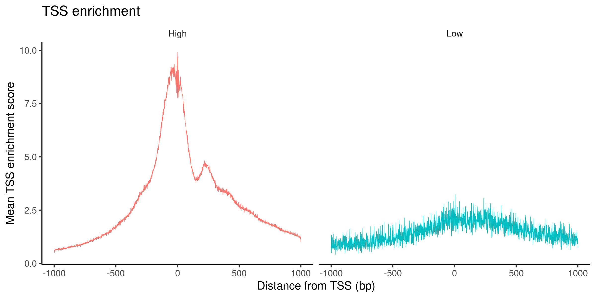
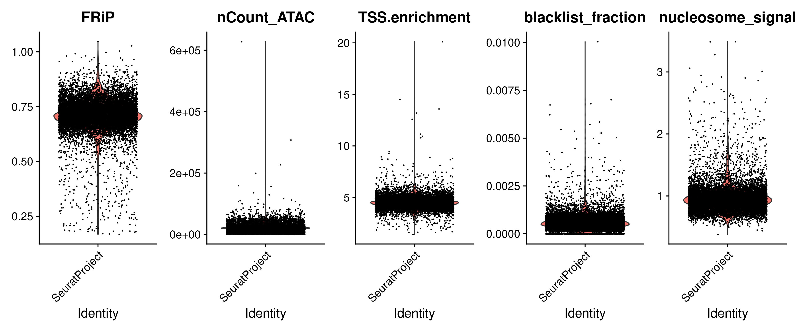
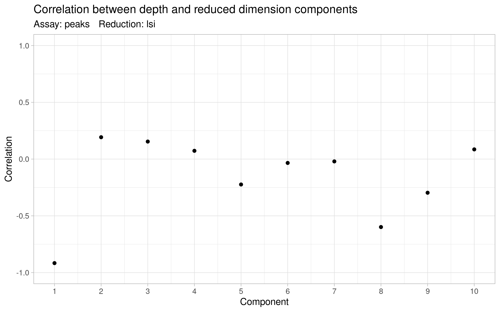
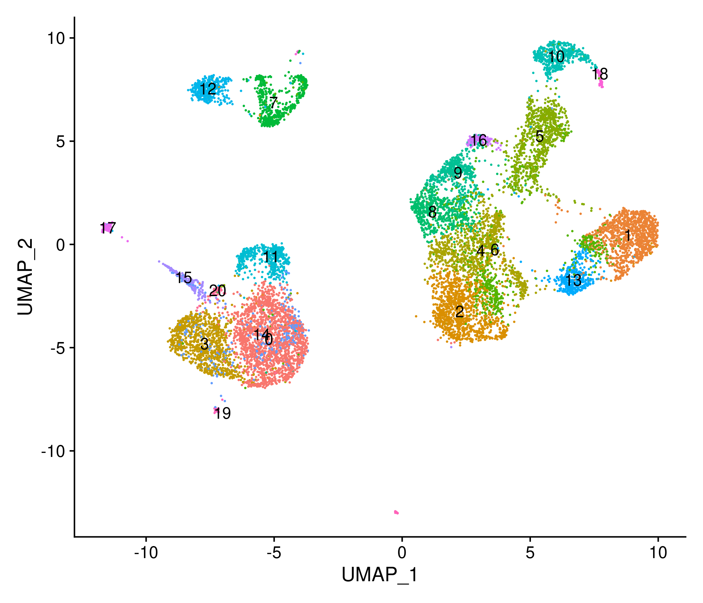
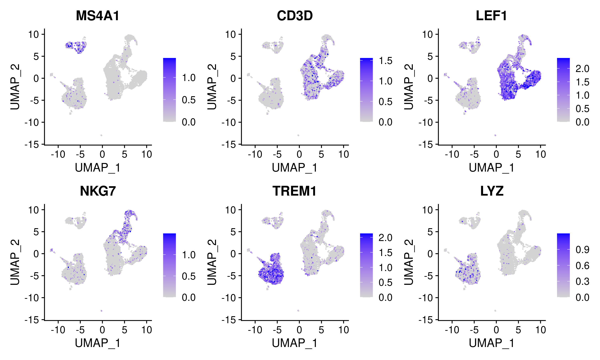

# Chromatin accessibility scATAC-seq analysis with Signac

## Data download

In this tutorial we will use the scRNA-seq/scATAC-seq multiome example data provided by 10x Genomics for human PBMCs. However, we will focus only on the scATAC-seq data, in the second session we will see how can we use the scRNA-seq data to improve our analysis.

The data was downloaded using the following commands:

```
wget https://cf.10xgenomics.com/samples/cell-arc/1.0.0/pbmc_granulocyte_sorted_10k/pbmc_granulocyte_sorted_10k_filtered_feature_bc_matrix.h5
wget https://cf.10xgenomics.com/samples/cell-arc/1.0.0/pbmc_granulocyte_sorted_10k/pbmc_granulocyte_sorted_10k_atac_fragments.tsv.gz
wget https://cf.10xgenomics.com/samples/cell-arc/1.0.0/pbmc_granulocyte_sorted_10k/pbmc_granulocyte_sorted_10k_atac_fragments.tsv.gz.tbi
```

## Load the chromatin accessibility data


```r
##––––––––––––––––––––––––––––––––––––––––––––––––––––––––––––––––––––––––––––##
##                              Load packages                                 ##
##––––––––––––––––––––––––––––––––––––––––––––––––––––––––––––––––––––––––––––##
library(Signac)
library(Seurat)
library(EnsDb.Hsapiens.v86)
library(BSgenome.Hsapiens.UCSC.hg38)

##––––––––––––––––––––––––––––––––––––––––––––––––––––––––––––––––––––––––––––##
##                              Load data                                     ##
##––––––––––––––––––––––––––––––––––––––––––––––––––––––––––––––––––––––––––––##
# load the RNA and ATAC data
counts <- Read10X_h5("data/pbmc_granulocyte_sorted_10k_filtered_feature_bc_matrix.h5")
# If the previous line fails, please use the following:
# counts <- readRDS("data/pbmc_granulocyte_sorted_10k_filtered_feature_bc_matrix.RDS")
fragments_files <- "data/pbmc_granulocyte_sorted_10k_atac_fragments.tsv.gz"

##––––––––––––––––––––––––––––––––––––––––––––––––––––––––––––––––––––––––––––##
##                            Load annotation                                 ##
##––––––––––––––––––––––––––––––––––––––––––––––––––––––––––––––––––––––––––––##
# get gene annotations for hg38
annotation <- GetGRangesFromEnsDb(ensdb = EnsDb.Hsapiens.v86)
seqlevelsStyle(annotation) <- "UCSC"
# If the previous line fails, please use the following:
# seqlevels(annotation) <- stringr::str_replace(
#   string  = paste("chr", seqlevels(annotation),sep=""), 
#   pattern = "chrMT", replacement="chrM")


# Check annotation seqnames
unique(seqnames(annotation))

# Check counts
lapply(counts, dim)
lapply(counts, class)

```

<details>
<summary><b>Click for Answer</b></summary>

```
> unique(seqnames(annotation))
 [1] chrX  chr20 chr1  chr6  chr3  chr7  chr12 chr11 chr4  chr17 chr2  chr16 chr8  chr19 chr9  chr13 chr14 chr5  chr22 chr10
[21] chrY  chr18 chr15 chr21 chrM 
25 Levels: chrX chr20 chr1 chr6 chr3 chr7 chr12 chr11 chr4 chr17 chr2 chr16 chr8 chr19 chr9 chr13 chr14 chr5 ... chrM

> lapply(counts, dim)
$`Gene Expression`
[1] 36601 11909

$Peaks
[1] 108377  11909

> lapply(counts, class)
$`Gene Expression`
[1] "dgCMatrix"
attr(,"package")
[1] "Matrix"

$Peaks
[1] "dgCMatrix"
attr(,"package")
[1] "Matrix"


```

</details>


## Create a Signac object from the Cellranger peak counts

To create a Signac object, the first step is to create a  Chromatin Assay objec using the Cellranger peak counts, and then create a Seurat object from this.

```r
##––––––––––––––––––––––––––––––––––––––––––––––––––––––––––––––––––––––––––––##
##                              Create Signac                                 ##
##––––––––––––––––––––––––––––––––––––––––––––––––––––––––––––––––––––––––––––##
# Create a ChromatinAssay 
chrom_assay <- CreateChromatinAssay(
  counts    = counts$Peaks,
  sep       = c(":", "-"),
  fragments = fragments_files,
  min.cells = 10,
  min.features = 200
)

# Create a Seurat object from the ChromatinAssay
signacobj <- CreateSeuratObject(
  counts = chrom_assay,
  assay  = "ATAC"
)

# Add the gene information to the object, this allows downstream functions to 
# pull the gene annotation information directly from the object.
Annotation(signacobj) <- annotation


signacobj
```

<details>
<summary><b>Click for Answer</b></summary>

An object of class Seurat 
106086 features across 11830 samples within 1 assay 
Active assay: ATAC (106086 features, 0 variable features)

</details>


Signac adds extra functionality to a Seurat object, for instance a genomic ranges associated with each feature in the object can be retreived when the active assay is a ChromatinAssay.

```{r}
granges(signacobj)
```

<details>
<summary><b>Click for Answer</b></summary>

GRanges object with 106086 ranges and 0 metadata columns:
             seqnames        ranges strand
                <Rle>     <IRanges>  <Rle>
       [1]       chr1   10109-10357      *
       [2]       chr1 180730-181630      *
       [3]       chr1 191491-191736      *
       [4]       chr1 267816-268196      *
       [5]       chr1 586028-586373      *
       ...        ...           ...    ...
  [106082] KI270713.1   20444-22615      *
  [106083] KI270713.1   27118-28927      *
  [106084] KI270713.1   29485-30706      *
  [106085] KI270713.1   31511-32072      *
  [106086] KI270713.1   37129-37638      *
  -------
  seqinfo: 33 sequences from an unspecified genome; no seqlengths

</details>

## Quality control

The following are some metrics and threshold ragnes for them recommended from teh developers of Signac (the final values allays depend on the biologycal system, and experiment conditions):

"
- Nucleosome banding pattern: The histogram of DNA fragment sizes (determined from the paired-end sequencing reads) should exhibit a strong nucleosome banding pattern corresponding to the length of DNA wrapped around a single nucleosome. We calculate this per single cell, and quantify the approximate ratio of mononucleosomal to nucleosome-free fragments (stored as nucleosome_signal)

- Transcriptional start site (TSS) enrichment score. The ENCODE project has defined an ATAC-seq targeting score based on the ratio of fragments centered at the TSS to fragments in TSS-flanking regions (see https://www.encodeproject.org/data-standards/terms/). Poor ATAC-seq experiments typically will have a low TSS enrichment score. We can compute this metric for each cell with the TSSEnrichment() function, and the results are stored in metadata under the column name TSS.enrichment.

- Total number of fragments: A measure of cellular sequencing depth / complexity. Cells with very few reads may need to be excluded due to low sequencing depth. Cells with extremely high levels may represent doublets, nuclei clumps, or other artefacts.

- Fraction of fragments in peaks: Represents the fraction of all fragments that fall within ATAC-seq peaks. Cells with low values (i.e. <15-20%) often represent low-quality cells or technical artifacts that should be removed. Note that this value can be sensitive to the set of peaks used.

- Ratio reads in genomic blacklist regions The ENCODE project has provided a list of blacklist regions, representing reads which are often associated with artefactual signal. Cells with a high proportion of reads mapping to these areas (compared to reads mapping to peaks) often represent technical artifacts and should be removed. ENCODE blacklist regions for human (hg19 and GRCh38), mouse (mm10), Drosophila (dm3), and C. elegans (ce10) are included in the Signac package.

" _Taken from https://satijalab.org/signac/articles/pbmc_vignette.html_


```r
##––––––––––––––––––––––––––––––––––––––––––––––––––––––––––––––––––––––––––––##
##                                    QC                                      ##
##––––––––––––––––––––––––––––––––––––––––––––––––––––––––––––––––––––––––––––##
# compute nucleosome signal score per cell
signacobj <- NucleosomeSignal(signacobj)
# compute TSS enrichment score per cell
signacobj <- TSSEnrichment(signacobj, fast = FALSE)

# Counting fraction of reads in peaks
total_fragments <- CountFragments(fragments_files)
signacobj$fragments <- total_fragments$reads_count[match(colnames(signacobj), 
                                                         total_fragments$CB)]

signacobj <- FRiP(
  object = signacobj,
  assay  = "ATAC",
  total.fragments = "fragments"
)

# Counting fragments in genome blacklist regions
signacobj$blacklist_fraction <- FractionCountsInRegion(
  object  = signacobj, 
  assay   = "ATAC",
  regions = blacklist_hg38_unified
)


# Inspect the TSS enrichment scores by plotting the accessibility signal over all TSS sites. 
signacobj$high.tss <- ifelse(signacobj$TSS.enrichment > 2, 'High', 'Low')
TSSPlot(signacobj, group.by = 'high.tss') + NoLegend()

```

<details>
<summary><b>Click for Answer</b></summary>



</details>


We can now visualize all the QC metrics and filter out all the low quality cells:

```r
VlnPlot(
  object = signacobj,
  features = c("FRiP", "nCount_ATAC", "TSS.enrichment", "blacklist_fraction", "nucleosome_signal"),
  ncol = 5,
  pt.size = 0.1
)


# filter out low quality cells
signacobj <- subset(
  x = signacobj,
  subset = 
    nCount_ATAC < 100000 &
    nCount_ATAC > 1000 &
    FRiP > 0.15 &
    blacklist_fraction < 0.01 &
    nucleosome_signal < 2 &
    TSS.enrichment > 1
)
signacobj

```

<details>
<summary><b>Click for Answer</b></summary>




```
An object of class Seurat 
106086 features across 11498 samples within 1 assay 
Active assay: ATAC (106086 features, 0 variable features)

```

</details>


## Call peaks and add peak counts matrix

The set of peaks identified using Cellranger often merges distinct peaks that are close together. This can create a problem for certain analyses, particularly motif enrichment analysis and peak-to-gene linkage. To identify a more accurate set of peaks, we can call peaks using MACS2 with the CallPeaks() function (_Taken from: https://satijalab.org/signac/articles/pbmc_multiomic.html#linking-peaks-to-genes_).

```r
##––––––––––––––––––––––––––––––––––––––––––––––––––––––––––––––––––––––––––––##
##                    Call peaks and make feature matrix                      ##
##––––––––––––––––––––––––––––––––––––––––––––––––––––––––––––––––––––––––––––##
# Call peaks using MACS2
peaks <- CallPeaks(signacobj, macs2.path = "/shared/software/miniconda/envs/macs2-2.2.7.1/bin/macs2")

# remove peaks on nonstandard chromosomes and in genomic blacklist regions
peaks <- keepStandardChromosomes(peaks, pruning.mode = "coarse")
peaks <- subsetByOverlaps(x = peaks, ranges = blacklist_hg38_unified, invert = TRUE)

# quantify counts in each peak
macs2_counts <- FeatureMatrix(
  fragments = Fragments(signacobj),
  features  = peaks,
  cells     = colnames(signacobj)
)

# create a new assay using the MACS2 peak set and add it to the Seurat object
signacobj[["peaks"]] <- CreateChromatinAssay(
  counts     = macs2_counts,
  fragments  = fragments_files,
  annotation = annotation
)

peaks
```

<details>
<summary><b>Click for Answer</b></summary>

```
GRanges object with 131364 ranges and 6 metadata columns:
           seqnames              ranges strand |                   name     score fold_change
              <Rle>           <IRanges>  <Rle> |            <character> <integer>   <numeric>
       [1]     chr1         10032-10322      * |  SeuratProject_peak_44       142     4.99234
       [2]     chr1       180709-181030      * |  SeuratProject_peak_45       149     5.12372
       [3]     chr1       181296-181600      * |  SeuratProject_peak_46       291     7.35714
       [4]     chr1       191304-191914      * |  SeuratProject_peak_47       142     4.99234
       [5]     chr1       267874-268087      * |  SeuratProject_peak_48       134     4.86097
       ...      ...                 ...    ... .                    ...       ...         ...
  [131360]     chrX 155880631-155881911      * | SeuratProject_peak_1..       824     8.67288
  [131361]     chrX 155891339-155891781      * | SeuratProject_peak_1..       105     4.30809
  [131362]     chrX 155966929-155967163      * | SeuratProject_peak_1..       134     4.86097
  [131363]     chrX 155997247-155997787      * | SeuratProject_peak_1..       263     6.17155
  [131364]     chrX 156029849-156030260      * | SeuratProject_peak_1..       106     4.33546
           neg_log10pvalue_summit neg_log10qvalue_summit relative_summit_position
                        <numeric>              <numeric>                <integer>
       [1]                16.3379                14.2177                      126
       [2]                17.1108                14.9684                      124
       [3]                31.7325                29.1857                      137
       [4]                16.3379                14.2177                      145
       [5]                15.5761                13.4782                      134
       ...                    ...                    ...                      ...
  [131360]                87.4204                82.4206                      637
  [131361]                12.5625                10.5583                      258
  [131362]                15.5761                13.4782                      112
  [131363]                28.7770                26.3134                      342
  [131364]                12.6467                10.6377                      245
  -------
  seqinfo: 24 sequences from an unspecified genome; no seqlengths
```

</details>


## Reduce data dimensionality with LSI

Signac uses latent semantic indexing (LSI) to reduce the data dimensionality as well as ArchR, which is the combination of term frequency-inverse document frequency (TF-IDF) normalization followed by singular value decomposition (SVD).

```r
##––––––––––––––––––––––––––––––––––––––––––––––––––––––––––––––––––––––––––––##
##                             Normalize ATAC data                            ##
##––––––––––––––––––––––––––––––––––––––––––––––––––––––––––––––––––––––––––––##
DefaultAssay(signacobj) <- "peaks"
signacobj <- FindTopFeatures(signacobj, min.cutoff = 5)
signacobj <- RunTFIDF(signacobj)
signacobj <- RunSVD(signacobj)

# The first LSI component often captures sequencing depth (technical variation) 
# rather than biological variation. If this is the case, the component should 
# be removed from downstream analysis. We can assess the correlation between 
# each LSI component and sequencing depth using the DepthCor() function:

DepthCor(signacobj)

```


<details>
<summary><b>Click for Answer</b></summary>



</details>


Then we use the LSI results to perform UMAP and find clusters of cells:

```r
signacobj <- RunUMAP(object = signacobj, reduction = 'lsi', dims = 2:30)
signacobj <- FindNeighbors(object = signacobj, reduction = 'lsi', dims = 2:30)
signacobj <- FindClusters(object = signacobj, verbose = FALSE, algorithm = 3)
DimPlot(object = signacobj, label = TRUE) + NoLegend()

```


<details>
<summary><b>Click for Answer</b></summary>



</details>

## Computing a gene activity matrix

The activity of each gene can be measured from the scATAC-seq data by quantifying the chromatin accessibility associated with each gene.
In the case of Signac the gene activity matrix if computed by the following steps:

1. Extract gene coordinates and extend them to include the 2 kb upstream region (promoter region).
2. Count the number of fragments for each cell that map to each of these regions.


```r
gene_activities <- GeneActivity(signacobj)
# add the gene activity matrix to the Seurat object as a new assay and normalize it

head(signacobj@meta.data)
signacobj[['RNA']] <- CreateAssayObject(counts = gene_activities)

signacobj <- NormalizeData(
  object = signacobj,
  assay  = 'RNA',
  normalization.method = 'LogNormalize',
  scale.factor = median(signacobj$nCount_RNA)
)

```


<details>
<summary><b>Click for Answer</b></summary>


</details>


The gene activities can be used to visualize the expression of marker genes on the scATAC-seq clusters:

```r

DefaultAssay(signacobj) <- 'RNA'

FeaturePlot(
  object = signacobj,
  features = c('MS4A1', 'CD3D', 'LEF1', 'NKG7', 'TREM1', 'LYZ'),
  pt.size = 0.1,
  max.cutoff = 'q95',
  ncol = 3
)
```

<details>
<summary><b>Click for Answer</b></summary>



</details>


## Annotating cell types with a reference dataset

We can use a reference scRNA-seq dataset to annotate cells from a scATAC-seq dataset. In this example, we will use different functions from the Seurat package for this.
As a reference, we will use a pre-processed scRNA-seq dataset for human PBMCs. Provided by 10x Genomics, and [pre-processed by the Satija Lab](https://github.com/satijalab/Integration2019/blob/master/preprocessing_scripts/pbmc_10k_v3.R). 


```r
# load PBMC reference
reference <- readRDS("data/pbmc_10k_v3.rds")

# transfer cell type labels from reference to query
DefaultAssay(signacobj) <- "RNA"
transfer_anchors <- FindTransferAnchors(
  reference = reference,
  query = signacobj,
  reduction = 'cca'
)

predicted_labels <- TransferData(
  anchorset = transfer_anchors,
  refdata = reference$celltype,
  weight.reduction = signacobj[['pca']],
  dims = 1:50
)

signacobj <- AddMetaData(object = signacobj, metadata = predicted_labels)

# set the cell identities to the cell type predictions
Idents(signacobj) <- "predicted.id"

# Re-order cell types for plot
levels(signacobj) <- c("CD4 Naive", "CD4 Memory", "CD8 Naive", "CD8 effector", 
                       "Double negative T cell", "NK dim", "NK bright", 
                       "B cell progenitor", "pre-B cell", "CD14+ Monocytes", 
                       "CD16+ Monocytes", "pDC", "Dendritic cell", "Platelet")

```

After assigning identities to the cells in the Signac object, we can compute a joint UMAP representation using the gene expression and chromatin accessibility data.

Signac uses the weighted nearest neighbor methods in Seurat v4, where a joint neighbor graph is calculated which represents both the ATAC and RNA data.

```r
# build a joint neighbor graph using both assays
signacobj <- FindMultiModalNeighbors(
  object = signacobj,
  reduction.list = list("pca", "lsi"), 
  dims.list = list(1:50, 2:40),
  modality.weight.name = "RNA.weight",
  verbose = TRUE
)

# build a joint UMAP visualization
signacobj <- RunUMAP(
  object = signacobj,
  nn.name = "weighted.nn",
  assay = "RNA",
  verbose = TRUE
)

DimPlot(signacobj, label = TRUE, repel = TRUE, reduction = "umap") + NoLegend()
```

<details>
<summary><b>Click for Answer</b></summary>


</details>

## Finding peak to gene links

Signac can find the set of peaks that may regulate each gene by computing the correlation between gene expression and accessibility at nearby peaks, and correcting for bias due to GC content, overall accessibility, and peak size.

```r
##––––––––––––––––––––––––––––––––––––––––––––––––––––––––––––––––––––––––––––##
##                   Peak to gene links for LYZ and MS4A1                     ##
##––––––––––––––––––––––––––––––––––––––––––––––––––––––––––––––––––––––––––––##


DefaultAssay(signacobj) <- "peaks"

# first compute the GC content for each peak
signacobj <- RegionStats(signacobj, genome = BSgenome.Hsapiens.UCSC.hg38)

# link peaks to genes
signacobj <- LinkPeaks(
  object = signacobj,
  peak.assay = "peaks",
  expression.assay = "RNA",
  genes.use = c("LYZ", "MS4A1")
)

idents.plot <- c("CD8 Naive", "CD8 effector", 
                 "B cell progenitor", "pre-B cell", 
                 "CD14+ Monocytes", "CD16+ Monocytes")


p1 <- CoveragePlot(
  object = signacobj,
  region = "MS4A1",
  features = "MS4A1",
  expression.assay = "RNA",
  idents = idents.plot,
  extend.upstream = 500,
  extend.downstream = 10000
)

p2 <- CoveragePlot(
  object = signacobj,
  region = "LYZ",
  features = "LYZ",
  expression.assay = "RNA",
  idents = idents.plot,
  extend.upstream = 8000,
  extend.downstream = 5000
)

patchwork::wrap_plots(p1, p2, ncol = 1)
```

<details>
<summary><b>Click for Answer</b></summary>


</details>
