# Signature idenfication

After completing the matrix decomposition step and selecting a candidate optimal factorization rank, the matrix H can be visualized to explore the signatures, the signature quality can be assessed using a riverplot visualization, and the association of a signature with a biological or clinical variable can be inferred with a recovery analysis.

## H Matrix sample exposure:  

Visualize exposure of the samples to the decomposed signatures as a heatmap, for a selected factorization rank.
  
  
```r
##----------------------------------------------------------------------------##
##                        H matrix heatmap annotation                         ##
##----------------------------------------------------------------------------##
#Annotation for H matrix heatmap
corces_rna_annot_tmp <- corces_rna_annot %>% 
  mutate(Celltype = factor(Celltype, levels = c("HSC", "MPP", "LMPP",
                                                "CMP", "GMP", "MEP",
                                                "CLP", "CD4", "CD8",
                                                "NK", "Bcell", "Mono")))

type.colVector <- corces_rna_annot_tmp %>% 
  select(Celltype, color) %>% 
  arrange(Celltype) %>% 
  distinct() %>% 
  deframe()

type.colVector <- list(Celltype = type.colVector)

# Build Heatmap annotation
heat.anno <- HeatmapAnnotation(df  = corces_rna_annot_tmp[,"Celltype",drop=FALSE],
                               col = type.colVector,
                               show_annotation_name = TRUE, na_col = "white")

##----------------------------------------------------------------------------##
##              Generate H matrix heatmap, W normalized                       ##
##----------------------------------------------------------------------------##
ki <- 8
tmp.hmatrix <- HMatrix(rna_norm_nmf_exp, k = ki)
Heatmap(tmp.hmatrix,
        col = viridis(100),
        name = paste0("Exposure ", ki),
        clustering_distance_columns = 'pearson',
        show_column_dend = TRUE,
        heatmap_legend_param = 
          list(color_bar = "continuous", legend_height=unit(2, "cm")),
        top_annotation = heat.anno,
        show_column_names = FALSE,
        show_row_names = FALSE,
        cluster_rows = FALSE)
```

<details>
<summary><b>Click for Answer</b></summary>
  
### H matrix for k= 2   
  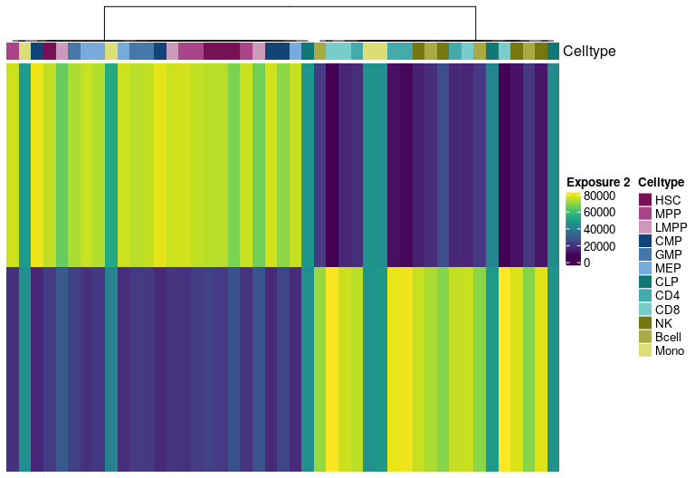
  
### H matrix for k= 3   
  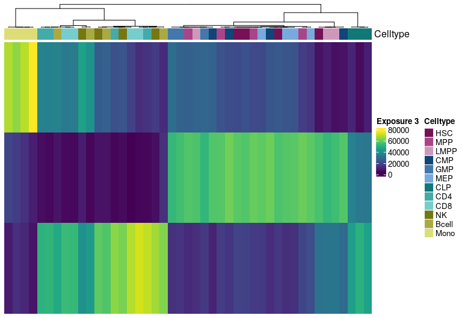
  
### H matrix for k= 4   
  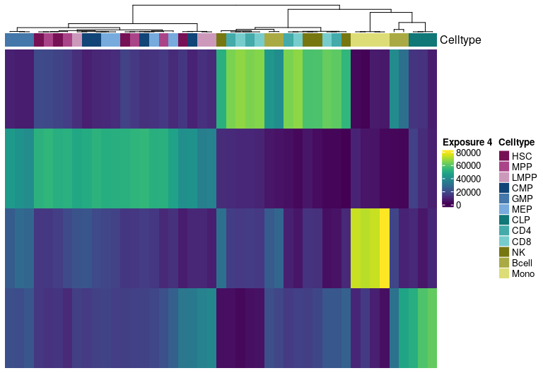
  
### H matrix for k= 5   
  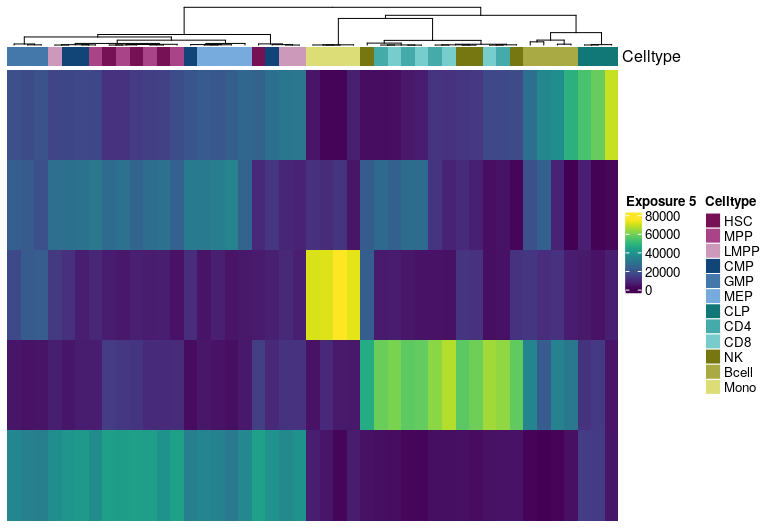
  
### H matrix for k= 6   
  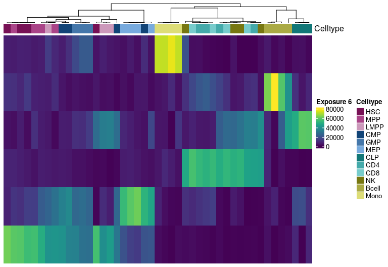
  
### H matrix for k= 7   
  
  
### H matrix for k= 8   
  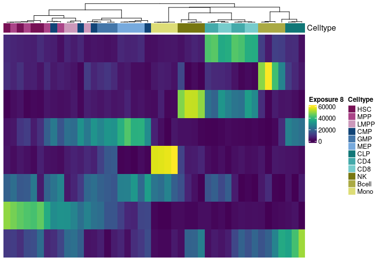
  
### H matrix for k= 9   
  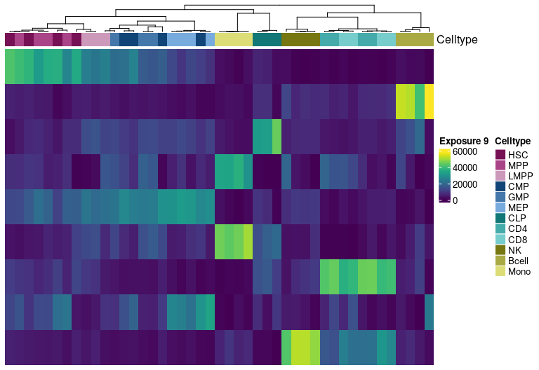
  
### H matrix for k= 10  
  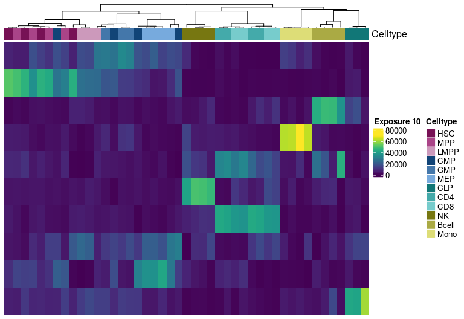
</details>
  

## Signature estability - Riverplot visualization

Riverplot representation of the extracted signatures at different factorization ranks. The nodes represent the signatures, the edge strength encodes cosine similarity between signatures linked by the edges. 


```r
river <- generateRiverplot(rna_norm_nmf_exp, ranks = 2:8)
plot(river, plot_area=1, yscale=0.6, nodewidth=0.5)
```

<details>
<summary><b>Click for Answer</b></summary>

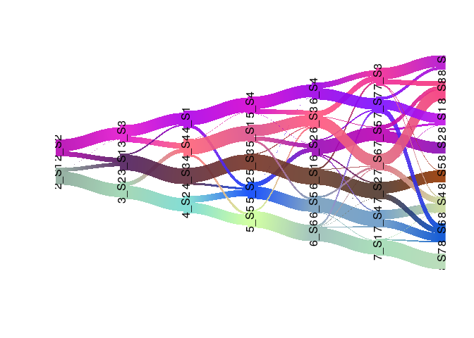
</details>


## Cluster identification - UMAP

A common practice to identify clusters of samples in single-cell and bulk omics datasets is to perform a dimensionality reduction step with PCA, followed by tSNE or UMAP. The resulting matrix H from the NMF decomposition can be used in the same fashion.

Cluster identification by running UMAP on the matrix H:


```r
##----------------------------------------------------------------------------##
##                         UMAP H matrix                                      ##
##----------------------------------------------------------------------------##
hmatrix_norm <- HMatrix(rna_norm_nmf_exp, k = 8)
umapView <- umap(t(hmatrix_norm))


umapView_df <- as.data.frame(umapView$layout)
colnames(umapView_df) <- c("UMAP1", "UMAP2")

type_colVector <- corces_rna_annot %>% 
  dplyr::select(Celltype, color) %>% 
  arrange(Celltype) %>% 
  distinct() %>% 
  deframe()


umapView_df %>% 
  rownames_to_column("sampleID") %>% 
  left_join(corces_rna_annot, by = "sampleID") %>% 
  mutate(Celltype = factor(Celltype, levels = c("HSC", "MPP", "LMPP",
                                                "CMP", "GMP", "MEP",
                                                "CLP", "CD4", "CD8",
                                                "NK", "Bcell", "Mono"))) %>% 
  ggplot(aes(x=UMAP1, y=UMAP2, color = Celltype)) + 
  geom_point(size = 1.5, alpha = 0.95) + 
  scale_color_manual(values = type_colVector) +
  theme_cowplot()
```
<details>
<summary><b>Click for Answer</b></summary>

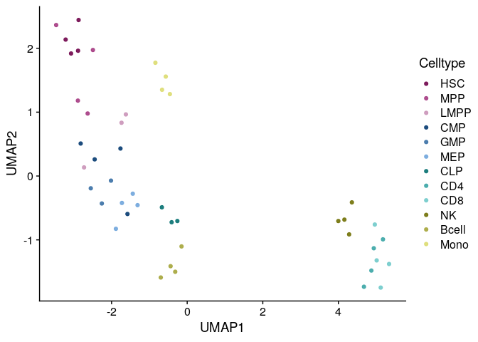
</details>

## Association of signatures to biological variables

One of the most important steps in the identification of molecular signatures, is to find the association of a candidate signature with know biological or clinical variables. In ButchR, it is possible to generate a recovery plot which intuitively shows the degree of association between all the signatures for one factorization rank and one known biological variable.

Make a recovery plot showing the association of the NMF signatures (for a selected factorization rank) to the "Celltype" variable:
  
  

```r
##----------------------------------------------------------------------------##
##                               Recovery plots                               ##
##----------------------------------------------------------------------------##
ki <- 8
tmp.hmatrix <- HMatrix(rna_norm_nmf_exp, k = ki)
ButchR::recovery_plot(tmp.hmatrix, corces_rna_annot$Celltype)
```


<details>
<summary><b>Click for Answer</b></summary>

### Recovery plots for k= 2
  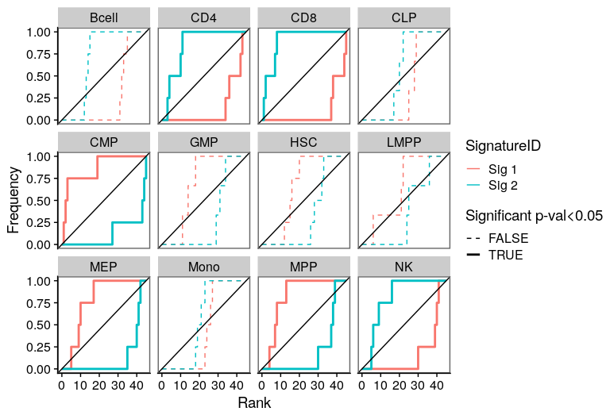
  
### Recovery plots for k= 3
  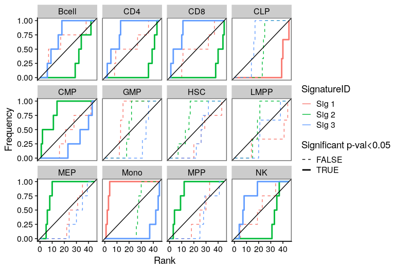
  
### Recovery plots for k= 4
  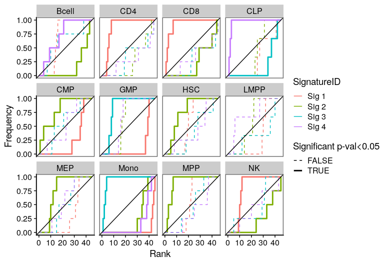
  
### Recovery plots for k= 5
  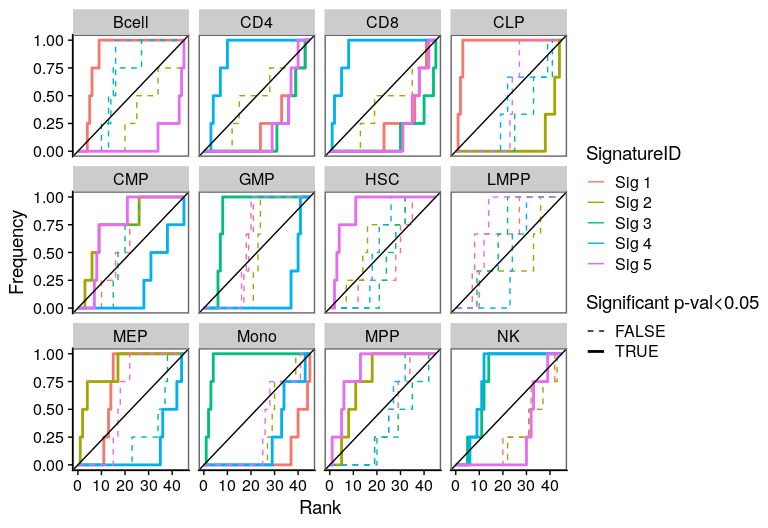
  
### Recovery plots for k= 6
  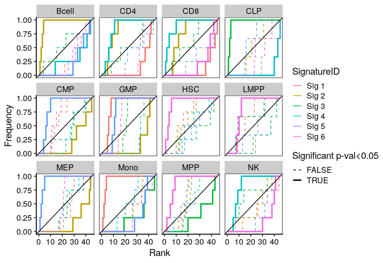
  
### Recovery plots for k= 7
  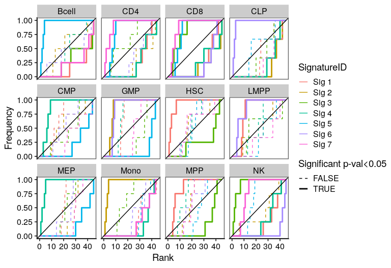
  
### Recovery plots for k= 8
  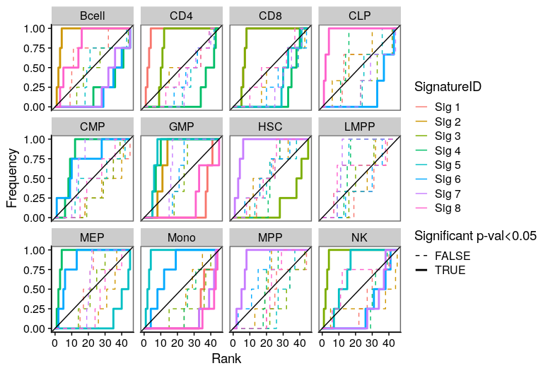
  
### Recovery plots for k= 9
  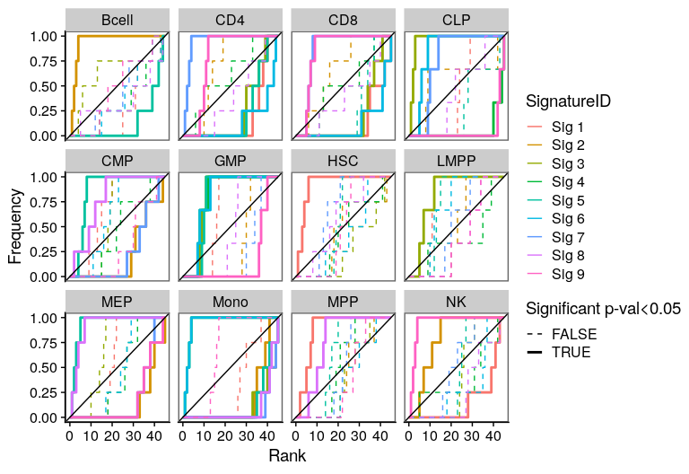
  
### Recovery plots for k= 10
  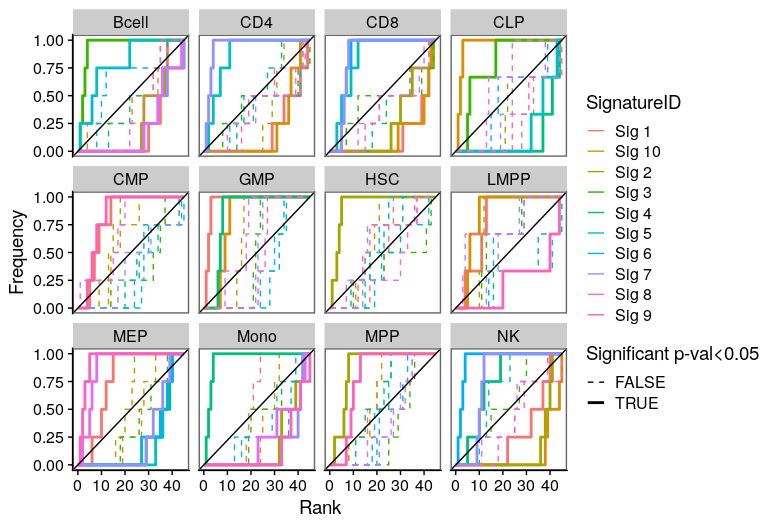

</details>

