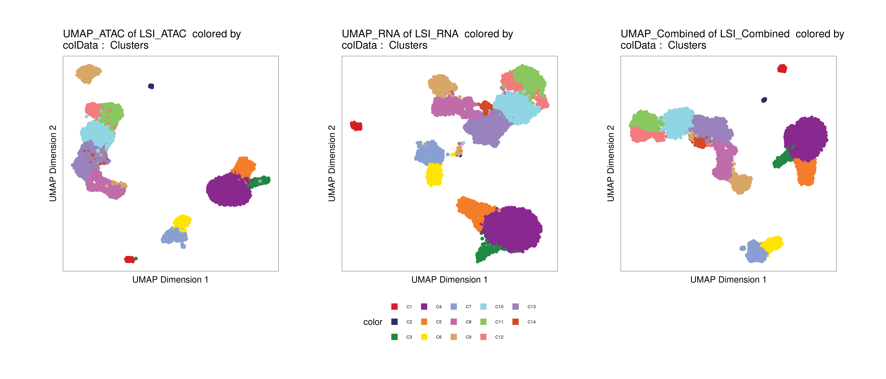

# Multiome scRNA-seq/scATAC-seq analysis with ArchR

## Data download

In this tutorial we will use the scRNA-seq/scATAC-seq multiome example data provided by 10x Genomics for human PBMCs.

The data was downloaded using the following commands:

```
wget https://cf.10xgenomics.com/samples/cell-arc/1.0.0/pbmc_granulocyte_sorted_10k/pbmc_granulocyte_sorted_10k_filtered_feature_bc_matrix.h5
wget https://cf.10xgenomics.com/samples/cell-arc/1.0.0/pbmc_granulocyte_sorted_10k/pbmc_granulocyte_sorted_10k_atac_fragments.tsv.gz
wget https://cf.10xgenomics.com/samples/cell-arc/1.0.0/pbmc_granulocyte_sorted_10k/pbmc_granulocyte_sorted_10k_atac_fragments.tsv.gz.tbi
```

## Create ArchR Arrow file

The main input to create an ArchR project are Arrow files created from the raw alignments, this files can be created from the fragments files resulting from the cellranger-atac pipeline, or from a bam file.

Here we are going to create an arrow file from the fragments file: *pbmc_granulocyte_sorted_10k_atac_fragments.tsv.gz*

```r
##––––––––––––––––––––––––––––––––––––––––––––––––––––––––––––––––––––––––––––##
##                    Load package and global settings                        ##
##––––––––––––––––––––––––––––––––––––––––––––––––––––––––––––––––––––––––––––##
## Setting default genome to Hg38.
library(ArchR)
addArchRGenome("hg38")

## Setting default number of Parallel threads to 5.
addArchRThreads(5)

##––––––––––––––––––––––––––––––––––––––––––––––––––––––––––––––––––––––––––––##
##                               Create Arrow file                            ##
##––––––––––––––––––––––––––––––––––––––––––––––––––––––––––––––––––––––––––––##
# Get fragment file
inputFiles <- list.files("data", pattern="fragments.tsv.gz$", full.names=TRUE)
names(inputFiles) <- "PBMC_10k"

# Create Arrow file
createArrowFiles(inputFiles  = inputFiles, 
                 sampleNames = "PBMC_10k", 
                 QCDir       = "data/QualityControl",
                 logFile     = createLogFile(name = "createArrows", 
                                             logDir = "data/ArchRLogs"),
                 force       = TRUE)

```

<details>
<summary><b>Click for Answer</b></summary>

```
Using GeneAnnotation set by addArchRGenome(Hg38)!
Using GeneAnnotation set by addArchRGenome(Hg38)!
ArchR logging to : data/ArchRLogs/ArchR-createArrows-130626bf3d8f6-Date-2021-12-30_Time-21-13-35.log
If there is an issue, please report to github with logFile!
2021-12-30 21:13:35 : Batch Execution w/ safelapply!, 0 mins elapsed.
2021-12-30 21:13:35 : (PBMC_10k : 1 of 1) Reading In Fragments from inputFiles (readMethod = tabix), 0.001 mins elapsed.
2021-12-30 21:13:35 : (PBMC_10k : 1 of 1) Tabix Bed To Temporary File, 0.001 mins elapsed.
2021-12-30 21:15:50 : (PBMC_10k : 1 of 1) Successful creation of Temporary File, 2.253 mins elapsed.
2021-12-30 21:15:50 : (PBMC_10k : 1 of 1) Creating ArrowFile From Temporary File, 2.253 mins elapsed.
2021-12-30 21:17:02 : (PBMC_10k : 1 of 1) Successful creation of Arrow File, 3.449 mins elapsed.
2021-12-30 21:18:08 : (PBMC_10k : 1 of 1) CellStats : Number of Cells Pass Filter = 11582 , 4.544 mins elapsed.
2021-12-30 21:18:08 : (PBMC_10k : 1 of 1) CellStats : Median Frags = 13610 , 4.544 mins elapsed.
2021-12-30 21:18:08 : (PBMC_10k : 1 of 1) CellStats : Median TSS Enrichment = 13.6245 , 4.544 mins elapsed.
2021-12-30 21:18:12 : (PBMC_10k : 1 of 1) Adding Additional Feature Counts!, 4.617 mins elapsed.
2021-12-30 21:18:34 : (PBMC_10k : 1 of 1) Removing Fragments from Filtered Cells, 4.981 mins elapsed.
2021-12-30 21:18:34 : (PBMC_10k : 1 of 1) Creating Filtered Arrow File, 4.982 mins elapsed.
2021-12-30 21:19:34 : (PBMC_10k : 1 of 1) Finished Constructing Filtered Arrow File!, 5.99 mins elapsed.
2021-12-30 21:19:35 : (PBMC_10k : 1 of 1) Adding TileMatrix!, 5.991 mins elapsed.
2021-12-30 21:22:37 : (PBMC_10k : 1 of 1) Adding GeneScoreMatrix!, 9.03 mins elapsed.
2021-12-30 21:24:23 : (PBMC_10k : 1 of 1) Finished Creating Arrow File, 10.8 mins elapsed.
ArchR logging successful to : data/ArchRLogs/ArchR-createArrows-130626bf3d8f6-Date-2021-12-30_Time-21-13-35.log
[1] "PBMC_10k.arrow"
```

</details>


## Create ArchR project

An ArchR project is created from a list of previously computed Arrow files

```r
##––––––––––––––––––––––––––––––––––––––––––––––––––––––––––––––––––––––––––––##
##                          Create ArchR project                              ##
##––––––––––––––––––––––––––––––––––––––––––––––––––––––––––––––––––––––––––––##
archrproj <- ArchRProject(ArrowFiles = "PBMC_10k.arrow", 
                     outputDirectory = "results/ArchROutput")
```

<details>
<summary><b>Click for Answer</b></summary>

```
Using GeneAnnotation set by addArchRGenome(Hg38)!
Using GeneAnnotation set by addArchRGenome(Hg38)!
Validating Arrows...
Getting SampleNames...
1 
Copying ArrowFiles to Ouptut Directory! If you want to save disk space set copyArrows = FALSE
1 
Getting Cell Metadata...
1 
Merging Cell Metadata...
Initializing ArchRProject...

                                                   / |
                                                 /    \
            .                                  /      |.
            \\\                              /        |.
              \\\                          /           `|.
                \\\                      /              |.
                  \                    /                |\
                  \\#####\           /                  ||
                ==###########>      /                   ||
                 \\##==......\    /                     ||
            ______ =       =|__ /__                     ||      \\\
        ,--' ,----`-,__ ___/'  --,-`-===================##========>
       \               '        ##_______ _____ ,--,__,=##,__   ///
        ,    __==    ___,-,__,--'#'  ==='      `-'    | ##,-/
        -,____,---'       \\####\\________________,--\\_##,/
           ___      .______        ______  __    __  .______      
          /   \     |   _  \      /      ||  |  |  | |   _  \     
         /  ^  \    |  |_)  |    |  ,----'|  |__|  | |  |_)  |    
        /  /_\  \   |      /     |  |     |   __   | |      /     
       /  _____  \  |  |\  \\___ |  `----.|  |  |  | |  |\  \\___.
      /__/     \__\ | _| `._____| \______||__|  |__| | _| `._____|
    
```

</details>


## Add gene expression to ArchR project

Once the ArchR project is created the next step is to add the gene expression data:

First we have to import the feature matrix from the 10x feature hdf5 file:

```r
##––––––––––––––––––––––––––––––––––––––––––––––––––––––––––––––––––––––––––––##
##                          Adding scRNA-seq data                             ##
##––––––––––––––––––––––––––––––––––––––––––––––––––––––––––––––––––––––––––––##
scRNA <- import10xFeatureMatrix(
    input = "data/pbmc_granulocyte_sorted_10k_filtered_feature_bc_matrix.h5",
    names = "PBMC_10k")
scRNA
```

<details>
<summary><b>Click for Answer</b></summary>

```
class: RangedSummarizedExperiment 
dim: 36578 11909 
metadata(0):
assays(1): counts
rownames(36578): MIR1302-2HG FAM138A ... AC007325.4 AC007325.2
rowData names(5): feature_type genome id interval name
colnames(11909): PBMC_10k#AAACAGCCAAGGAATC-1 PBMC_10k#AAACAGCCAATCCCTT-1 ... PBMC_10k#TTTGTTGGTTGGTTAG-1
  PBMC_10k#TTTGTTGGTTTGCAGA-1
colData names(0):
    
```

</details>


Overlap of cells between the scATAC-seq data and the scRNA-seq data:

```r
ggVennDiagram::ggVennDiagram(list(scATAC_cells = ArchR::getCellNames(archrproj),
                                  scRNA_cells  = colnames(scRNA)))
```

<details>
<summary><b>Click for Answer</b></summary>


</details>

Adding scRNA-seq data to the ArchR project:

```r
archrproj <- addGeneExpressionMatrix(input = archrproj, seRNA = scRNA, force = TRUE)
```

<details>
<summary><b>Click for Answer</b></summary>

```
ArchR logging to : ArchRLogs/ArchR-addGeneExpressionMatrix-462713e88a37d-Date-2021-12-31_Time-05-58-35.log
If there is an issue, please report to github with logFile!
2021-12-31 05:58:35 : Overlap w/ scATAC = 0.981
2021-12-31 05:58:35 : Overlap Per Sample w/ scATAC : PBMC_10k=11361
2021-12-31 05:58:38 : Batch Execution w/ safelapply!, 0 mins elapsed.
2021-12-31 05:58:40 : Adding PBMC_10k to GeneExpressionMatrix for Chr (1 of 23)!, 0.022 mins elapsed.
2021-12-31 05:58:42 : Adding PBMC_10k to GeneExpressionMatrix for Chr (2 of 23)!, 0.066 mins elapsed.
2021-12-31 05:58:45 : Adding PBMC_10k to GeneExpressionMatrix for Chr (3 of 23)!, 0.101 mins elapsed.
2021-12-31 05:58:47 : Adding PBMC_10k to GeneExpressionMatrix for Chr (4 of 23)!, 0.148 mins elapsed.
2021-12-31 05:58:49 : Adding PBMC_10k to GeneExpressionMatrix for Chr (5 of 23)!, 0.179 mins elapsed.
2021-12-31 05:58:51 : Adding PBMC_10k to GeneExpressionMatrix for Chr (6 of 23)!, 0.213 mins elapsed.
2021-12-31 05:58:54 : Adding PBMC_10k to GeneExpressionMatrix for Chr (7 of 23)!, 0.259 mins elapsed.
2021-12-31 05:58:56 : Adding PBMC_10k to GeneExpressionMatrix for Chr (8 of 23)!, 0.294 mins elapsed.
2021-12-31 05:58:58 : Adding PBMC_10k to GeneExpressionMatrix for Chr (9 of 23)!, 0.325 mins elapsed.
2021-12-31 05:59:01 : Adding PBMC_10k to GeneExpressionMatrix for Chr (10 of 23)!, 0.37 mins elapsed.
2021-12-31 05:59:03 : Adding PBMC_10k to GeneExpressionMatrix for Chr (11 of 23)!, 0.403 mins elapsed.
2021-12-31 05:59:05 : Adding PBMC_10k to GeneExpressionMatrix for Chr (12 of 23)!, 0.437 mins elapsed.
2021-12-31 05:59:07 : Adding PBMC_10k to GeneExpressionMatrix for Chr (13 of 23)!, 0.484 mins elapsed.
2021-12-31 05:59:09 : Adding PBMC_10k to GeneExpressionMatrix for Chr (14 of 23)!, 0.514 mins elapsed.
2021-12-31 05:59:11 : Adding PBMC_10k to GeneExpressionMatrix for Chr (15 of 23)!, 0.546 mins elapsed.
2021-12-31 05:59:14 : Adding PBMC_10k to GeneExpressionMatrix for Chr (16 of 23)!, 0.591 mins elapsed.
2021-12-31 05:59:16 : Adding PBMC_10k to GeneExpressionMatrix for Chr (17 of 23)!, 0.624 mins elapsed.
2021-12-31 05:59:18 : Adding PBMC_10k to GeneExpressionMatrix for Chr (18 of 23)!, 0.657 mins elapsed.
2021-12-31 05:59:20 : Adding PBMC_10k to GeneExpressionMatrix for Chr (19 of 23)!, 0.701 mins elapsed.
2021-12-31 05:59:22 : Adding PBMC_10k to GeneExpressionMatrix for Chr (20 of 23)!, 0.734 mins elapsed.
2021-12-31 05:59:24 : Adding PBMC_10k to GeneExpressionMatrix for Chr (21 of 23)!, 0.765 mins elapsed.
2021-12-31 05:59:27 : Adding PBMC_10k to GeneExpressionMatrix for Chr (22 of 23)!, 0.807 mins elapsed.
2021-12-31 05:59:29 : Adding PBMC_10k to GeneExpressionMatrix for Chr (23 of 23)!, 0.838 mins elapsed.
ArchR logging successful to : ArchRLogs/ArchR-addGeneExpressionMatrix-462713e88a37d-Date-2021-12-31_Time-05-58-35.log
```

</details>

Filtering out low quality cells and doublets:

```r
# Low quality cells
archrproj <- archrproj[archrproj$TSSEnrichment > 6 & archrproj$nFrags > 2500 & !is.na(archrproj$Gex_nUMI)]

# Filtering doublets
archrproj <- addDoubletScores(archrproj)
archrproj <- filterDoublets(archrproj)

archrproj
```

<details>
<summary><b>Click for Answer</b></summary>

```
ArchR logging to : ArchRLogs/ArchR-addDoubletScores-49f5a3d2e03a0-Date-2021-12-31_Time-06-21-52.log
If there is an issue, please report to github with logFile!
2021-12-31 06:21:52 : Batch Execution w/ safelapply!, 0 mins elapsed.
2021-12-31 06:21:52 : PBMC_10k (1 of 1) :  Computing Doublet Statistics, 0 mins elapsed.
PBMC_10k (1 of 1) : UMAP Projection R^2 = 0.9982
ArchR logging successful to : ArchRLogs/ArchR-addDoubletScores-49f5a3d2e03a0-Date-2021-12-31_Time-06-21-52.log

Filtering 1185 cells from ArchRProject!
	PBMC_10k : 1185 of 10887 (10.9%)


           ___      .______        ______  __    __  .______      
          /   \     |   _  \      /      ||  |  |  | |   _  \     
         /  ^  \    |  |_)  |    |  ,----'|  |__|  | |  |_)  |    
        /  /_\  \   |      /     |  |     |   __   | |      /     
       /  _____  \  |  |\  \\___ |  `----.|  |  |  | |  |\  \\___.
      /__/     \__\ | _| `._____| \______||__|  |__| | _| `._____|
    
class: ArchRProject 
outputDirectory: /home/bq_aquintero/projects/sincell_2022/results/ArchROutput 
samples(1): PBMC_10k
sampleColData names(1): ArrowFiles
cellColData names(19): Sample TSSEnrichment ... DoubletScore DoubletEnrichment
numberOfCells(1): 9702
medianTSS(1): 13.598
medianFrags(1): 13571
```

</details>


## Reduce data dimensionality with LSI

Latent Semantic Indexing (LSI) is an approach from natural language processing that was originally designed to assess document similarity based on word counts. In the context of scATAC-seq and scRNA-seq data ArchR performs LSI following these steps:
1. scATAC-seq: documents=samples, words=regions/peaks. scRNA-seq: documents=samples, words=genes. 
2. Calculate word frequency by depth normalization per single cell. 
3. Normalize word frequency by the inverse document frequency which weights features by how often they occur. 
4. Results in a word frequency-inverse document frequency (TF-IDF) matrix, which reflects how important a word (aka region/peak) is to a document (aka sample). 
5. Perform singular value decomposition (SVD) on the TF-IDF matrix.
_Modified from: https://www.archrproject.com/bookdown/dimensionality-reduction-with-archr.html_ 

```r
##––––––––––––––––––––––––––––––––––––––––––––––––––––––––––––––––––––––––––––##
##                  Dimensionality reduction with LSI - ATAC                  ##
##––––––––––––––––––––––––––––––––––––––––––––––––––––––––––––––––––––––––––––##
archrproj <- addIterativeLSI(
    ArchRProj = archrproj, 
    clusterParams = list(
      resolution = 0.2, 
      sampleCells = 10000,
      n.start = 10
    ),
    saveIterations = FALSE,
    useMatrix = "TileMatrix", 
    depthCol = "nFrags",
    name = "LSI_ATAC"
)
```

<details>
<summary><b>Click for Answer</b></summary>

```
Checking Inputs...
ArchR logging to : ArchRLogs/ArchR-addIterativeLSI-49f5a5aabda3c-Date-2021-12-31_Time-07-28-01.log
If there is an issue, please report to github with logFile!
2021-12-31 07:28:02 : Computing Total Across All Features, 0.002 mins elapsed.
2021-12-31 07:28:03 : Computing Top Features, 0.026 mins elapsed.
###########
2021-12-31 07:28:04 : Running LSI (1 of 2) on Top Features, 0.047 mins elapsed.
###########
2021-12-31 07:28:04 : Creating Partial Matrix, 0.047 mins elapsed.
2021-12-31 07:28:40 : Computing LSI, 0.648 mins elapsed.
2021-12-31 07:30:36 : Identifying Clusters, 2.571 mins elapsed.
2021-12-31 07:30:52 : Identified 8 Clusters, 2.84 mins elapsed.
2021-12-31 07:30:52 : Creating Cluster Matrix on the total Group Features, 2.84 mins elapsed.
2021-12-31 07:31:04 : Computing Variable Features, 3.036 mins elapsed.
###########
2021-12-31 07:31:04 : Running LSI (2 of 2) on Variable Features, 3.04 mins elapsed.
###########
2021-12-31 07:31:04 : Creating Partial Matrix, 3.04 mins elapsed.
2021-12-31 07:31:32 : Computing LSI, 3.506 mins elapsed.
2021-12-31 07:32:24 : Finished Running IterativeLSI, 4.38 mins elapsed.
    
```
</details>


```r
##––––––––––––––––––––––––––––––––––––––––––––––––––––––––––––––––––––––––––––##
##                  Dimensionality reduction with LSI - RNA                   ##
##––––––––––––––––––––––––––––––––––––––––––––––––––––––––––––––––––––––––––––##
archrproj <- addIterativeLSI(
    ArchRProj = archrproj, 
    clusterParams = list(
      resolution = 0.2, 
      sampleCells = 10000,
      n.start = 10
    ),
    saveIterations = FALSE,
    useMatrix = "GeneExpressionMatrix", 
    depthCol = "Gex_nUMI",
    varFeatures = 2500,
    firstSelection = "variable",
    binarize = FALSE,
    name = "LSI_RNA"
)

```

<details>
<summary><b>Click for Answer</b></summary>

```
Checking Inputs...
ArchR logging to : ArchRLogs/ArchR-addIterativeLSI-49f5a5c20b7f-Date-2021-12-31_Time-08-00-45.log
If there is an issue, please report to github with logFile!
2021-12-31 08:00:45 : Computing Variability Across All Features, 0.001 mins elapsed.
2021-12-31 08:00:47 : Computing Variable Features, 0.028 mins elapsed.
###########
2021-12-31 08:00:48 : Running LSI (1 of 2) on Top Features, 0.042 mins elapsed.
###########
2021-12-31 08:00:48 : Creating Partial Matrix, 0.042 mins elapsed.
2021-12-31 08:00:53 : Computing LSI, 0.127 mins elapsed.
2021-12-31 08:01:07 : Identifying Clusters, 0.354 mins elapsed.
2021-12-31 08:01:22 : Identified 9 Clusters, 0.607 mins elapsed.
2021-12-31 08:01:22 : Creating Cluster Matrix on the total Group Features, 0.607 mins elapsed.
2021-12-31 08:01:26 : Computing Variable Features, 0.678 mins elapsed.
###########
2021-12-31 08:01:26 : Running LSI (2 of 2) on Variable Features, 0.679 mins elapsed.
###########
2021-12-31 08:01:26 : Creating Partial Matrix, 0.679 mins elapsed.
2021-12-31 08:01:32 : Computing LSI, 0.779 mins elapsed.
2021-12-31 08:01:40 : Finished Running IterativeLSI, 0.919 mins elapsed.
    
```
</details>


After reducing the dimension of the scRNA-seq and scATAC-seq data individually, the reduced dimensions are normalized and combined into one set of reduced dimensions:

```r
##––––––––––––––––––––––––––––––––––––––––––––––––––––––––––––––––––––––––––––##
##                  Combining LSI results for ATAC and RNA                    ##
##––––––––––––––––––––––––––––––––––––––––––––––––––––––––––––––––––––––––––––##
archrproj <- addCombinedDims(archrproj, reducedDims = c("LSI_ATAC", "LSI_RNA"), name =  "LSI_Combined")

```

Then we use the LSI results to perform UMAP:

```r
##––––––––––––––––––––––––––––––––––––––––––––––––––––––––––––––––––––––––––––##
##                            UMAP on the LSI results                         ##
##––––––––––––––––––––––––––––––––––––––––––––––––––––––––––––––––––––––––––––##
archrproj <- addUMAP(archrproj, reducedDims = "LSI_ATAC", name = "UMAP_ATAC", minDist = 0.8, force = TRUE)
archrproj <- addUMAP(archrproj, reducedDims = "LSI_RNA", name = "UMAP_RNA", minDist = 0.8, force = TRUE)
archrproj <- addUMAP(archrproj, reducedDims = "LSI_Combined", name = "UMAP_Combined", minDist = 0.8, force = TRUE)

```


<details>
<summary><b>Click for Answer</b></summary>

```
08:28:11 UMAP embedding parameters a = 0.2321 b = 1.681
08:28:11 Read 9702 rows and found 30 numeric columns
08:28:11 Using Annoy for neighbor search, n_neighbors = 40
08:28:11 Building Annoy index with metric = cosine, n_trees = 50
0%   10   20   30   40   50   60   70   80   90   100%
[----|----|----|----|----|----|----|----|----|----|
**************************************************|
08:28:13 Writing NN index file to temp file /tmp/RtmpzEKx5H/file49f5a475c2183
08:28:13 Searching Annoy index using 36 threads, search_k = 4000
08:28:13 Annoy recall = 100%
08:28:14 Commencing smooth kNN distance calibration using 36 threads
08:28:14 Initializing from normalized Laplacian + noise
08:28:15 Commencing optimization for 500 epochs, with 575166 positive edges
0%   10   20   30   40   50   60   70   80   90   100%
[----|----|----|----|----|----|----|----|----|----|
**************************************************|
08:28:50 Optimization finished
08:28:50 Creating temp model dir /tmp/RtmpzEKx5H/dir49f5a24961fad
08:28:50 Creating dir /tmp/RtmpzEKx5H/dir49f5a24961fad
08:28:51 Changing to /tmp/RtmpzEKx5H/dir49f5a24961fad
08:28:51 Creating /home/bq_aquintero/projects/sincell_2022/results/ArchROutput/Embeddings/Save-Uwot-UMAP-Params-LSI_ATAC-49f5a130b351e-Date-2021-12-31_Time-08-28-50.tar


08:29:15 UMAP embedding parameters a = 0.2321 b = 1.681
08:29:15 Read 9702 rows and found 30 numeric columns
08:29:15 Using Annoy for neighbor search, n_neighbors = 40
08:29:15 Building Annoy index with metric = cosine, n_trees = 50
0%   10   20   30   40   50   60   70   80   90   100%
[----|----|----|----|----|----|----|----|----|----|
**************************************************|
08:29:16 Writing NN index file to temp file /tmp/RtmpzEKx5H/file49f5a3577fe0
08:29:16 Searching Annoy index using 36 threads, search_k = 4000
08:29:16 Annoy recall = 100%
08:29:17 Commencing smooth kNN distance calibration using 36 threads
08:29:17 Initializing from normalized Laplacian + noise
08:29:18 Commencing optimization for 500 epochs, with 550504 positive edges
0%   10   20   30   40   50   60   70   80   90   100%
[----|----|----|----|----|----|----|----|----|----|
**************************************************|
08:29:52 Optimization finished
08:29:52 Creating temp model dir /tmp/RtmpzEKx5H/dir49f5a76cf2e49
08:29:52 Creating dir /tmp/RtmpzEKx5H/dir49f5a76cf2e49
08:29:53 Changing to /tmp/RtmpzEKx5H/dir49f5a76cf2e49
08:29:53 Creating /home/bq_aquintero/projects/sincell_2022/results/ArchROutput/Embeddings/Save-Uwot-UMAP-Params-LSI_RNA-49f5a17205478-Date-2021-12-31_Time-08-29-52.tar


08:30:18 UMAP embedding parameters a = 0.2321 b = 1.681
08:30:18 Read 9702 rows and found 60 numeric columns
08:30:18 Using Annoy for neighbor search, n_neighbors = 40
08:30:18 Building Annoy index with metric = cosine, n_trees = 50
0%   10   20   30   40   50   60   70   80   90   100%
[----|----|----|----|----|----|----|----|----|----|
**************************************************|
08:30:19 Writing NN index file to temp file /tmp/RtmpzEKx5H/file49f5a565c73a5
08:30:19 Searching Annoy index using 36 threads, search_k = 4000
08:30:20 Annoy recall = 100%
08:30:20 Commencing smooth kNN distance calibration using 36 threads
08:30:21 Initializing from normalized Laplacian + noise
08:30:23 Commencing optimization for 500 epochs, with 569082 positive edges
0%   10   20   30   40   50   60   70   80   90   100%
[----|----|----|----|----|----|----|----|----|----|
**************************************************|
08:30:57 Optimization finished
08:30:57 Creating temp model dir /tmp/RtmpzEKx5H/dir49f5a2f861f26
08:30:57 Creating dir /tmp/RtmpzEKx5H/dir49f5a2f861f26
08:30:58 Changing to /tmp/RtmpzEKx5H/dir49f5a2f861f26
08:30:58 Creating /home/bq_aquintero/projects/sincell_2022/results/ArchROutput/Embeddings/Save-Uwot-UMAP-Params-LSI_Combined-49f5a254f5246-Date-2021-12-31_Time-08-30-57.tar
```
</details>


And identify clusters of cells based con the combined reduced dimensions:

```r
##––––––––––––––––––––––––––––––––––––––––––––––––––––––––––––––––––––––––––––##
##                           Find clusters of cells                           ##
##––––––––––––––––––––––––––––––––––––––––––––––––––––––––––––––––––––––––––––##
archrproj <- addClusters(archrproj, reducedDims = "LSI_Combined", name = "Clusters", resolution = 0.4, force = TRUE)
```


<details>
<summary><b>Click for Answer</b></summary>

```
ArchR logging to : ArchRLogs/ArchR-addClusters-49f5a6d4348e5-Date-2021-12-31_Time-08-34-42.log
If there is an issue, please report to github with logFile!
2021-12-31 08:34:42 : Running Seurats FindClusters (Stuart et al. Cell 2019), 0.002 mins elapsed.
Computing nearest neighbor graph
Computing SNN
Modularity Optimizer version 1.3.0 by Ludo Waltman and Nees Jan van Eck

Number of nodes: 9702
Number of edges: 427966

Running Louvain algorithm...
0%   10   20   30   40   50   60   70   80   90   100%
[----|----|----|----|----|----|----|----|----|----|
**************************************************|
Maximum modularity in 10 random starts: 0.9291
Number of communities: 14
Elapsed time: 1 seconds
2021-12-31 08:35:02 : Testing Biased Clusters, 0.323 mins elapsed.
2021-12-31 08:35:02 : Testing Outlier Clusters, 0.324 mins elapsed.
2021-12-31 08:35:02 : Assigning Cluster Names to 14 Clusters, 0.324 mins elapsed.
2021-12-31 08:35:02 : Finished addClusters, 0.326 mins elapsed.
    
```
</details>


Plot UMAP embeddings:

```r
p1 <- plotEmbedding(archrproj, name = "Clusters", embedding = "UMAP_ATAC", size = 1.5, labelAsFactors=F, labelMeans=F)
p2 <- plotEmbedding(archrproj, name = "Clusters", embedding = "UMAP_RNA", size = 1.5, labelAsFactors=F, labelMeans=F)
p3 <- plotEmbedding(archrproj, name = "Clusters", embedding = "UMAP_Combined", size = 1.5, labelAsFactors=F, labelMeans=F)

p1 + p2 + p3 + patchwork::plot_layout(nrow = 1, guides = "collect")
```

<details>
<summary><b>Click for Answer</b></summary>



</details>


## Finding peak to gene links

One advantage of the multiome single-cell dataset is the possibility to link regulatory regions (i.e. atac-seq peaks) to potential target genes. One approach is to look for correlations between accessibility and gene expression across all cells.

First we have to define pseudo-bulk replicates to call peaks on them, ArchR merges cells within each designated cell group:

```r
##––––––––––––––––––––––––––––––––––––––––––––––––––––––––––––––––––––––––––––##
##                       Defining pseudo-bulk replicates                      ##
##––––––––––––––––––––––––––––––––––––––––––––––––––––––––––––––––––––––––––––##
archrproj <- addGroupCoverages(ArchRProj = archrproj, groupBy = "Clusters")

```

<details>
<summary><b>Click for Answer</b></summary>

```
ArchR logging to : ArchRLogs/ArchR-addGroupCoverages-49f5a5791d776-Date-2021-12-31_Time-09-56-18.log
If there is an issue, please report to github with logFile!
2021-12-31 09:56:20 : Creating Coverage Files!, 0.024 mins elapsed.
2021-12-31 09:56:20 : Batch Execution w/ safelapply!, 0.024 mins elapsed.
2021-12-31 09:57:21 : Adding Kmer Bias to Coverage Files!, 1.044 mins elapsed.
2021-12-31 09:58:13 : Finished Creation of Coverage Files!, 1.918 mins elapsed.
ArchR logging successful to : ArchRLogs/ArchR-addGroupCoverages-49f5a5791d776-Date-2021-12-31_Time-09-56-18.log
    
```
</details>

Now we can call peaks using the pseudo-bulk replicates, and add the peak matrix to our ArchR project:

```r
##––––––––––––––––––––––––––––––––––––––––––––––––––––––––––––––––––––––––––––##
##                       Defining pseudo-bulk replicates                      ##
##––––––––––––––––––––––––––––––––––––––––––––––––––––––––––––––––––––––––––––##
pathToMacs2 <- "/shared/software/miniconda/envs/macs2-2.2.7.1/bin/macs2"
archrproj <- addReproduciblePeakSet(
  ArchRProj = archrproj,
  groupBy = "Clusters",
  pathToMacs2 = pathToMacs2
)

archrproj <- addPeakMatrix(archrproj)
```

<details>
<summary><b>Click for Answer</b></summary>

```
ArchR logging to : ArchRLogs/ArchR-addReproduciblePeakSet-49f5a7b4fc37-Date-2021-12-31_Time-09-58-23.log
If there is an issue, please report to github with logFile!
2021-12-31 09:58:24 : Peak Calling Parameters!, 0.01 mins elapsed.
    Group nCells nCellsUsed nReplicates nMin nMax maxPeaks
C1     C1     94         94           2   40   54    47000
C2     C2     24         24           2   16   20    12000
C3     C3    181        181           2   40  141    90500
C4     C4   2661        540           2   40  500   150000
C5     C5    493        493           2   40  453   150000
C6     C6    314        314           2   40  274   150000
C7     C7    414        414           2   40  374   150000
C8     C8    780        540           2   40  500   150000
C9     C9    462        462           2   40  422   150000
C10   C10   1362        540           2   40  500   150000
C11   C11   1001        540           2   40  500   150000
C12   C12    390        390           2   40  350   150000
C13   C13   1447        540           2   40  500   150000
C14   C14     79         66           2   40   40    33000
2021-12-31 09:58:24 : Batching Peak Calls!, 0.011 mins elapsed.
2021-12-31 09:58:24 : Batch Execution w/ safelapply!, 0 mins elapsed.
2021-12-31 10:00:22 : Identifying Reproducible Peaks!, 1.971 mins elapsed.
2021-12-31 10:00:31 : Creating Union Peak Set!, 2.127 mins elapsed.
Converged after 8 iterations!
Plotting Ggplot!
2021-12-31 10:00:39 : Finished Creating Union Peak Set (165098)!, 2.27 mins elapsed.


ArchR logging to : ArchRLogs/ArchR-addPeakMatrix-49f5a40beb98f-Date-2021-12-31_Time-10-34-59.log
If there is an issue, please report to github with logFile!
2021-12-31 10:34:59 : Batch Execution w/ safelapply!, 0 mins elapsed.
2021-12-31 10:35:00 : Adding PBMC_10k to PeakMatrix for Chr (1 of 23)!, 0.009 mins elapsed.
2021-12-31 10:35:15 : Adding PBMC_10k to PeakMatrix for Chr (2 of 23)!, 0.265 mins elapsed.
2021-12-31 10:35:29 : Adding PBMC_10k to PeakMatrix for Chr (3 of 23)!, 0.488 mins elapsed.
2021-12-31 10:35:38 : Adding PBMC_10k to PeakMatrix for Chr (4 of 23)!, 0.642 mins elapsed.
2021-12-31 10:35:44 : Adding PBMC_10k to PeakMatrix for Chr (5 of 23)!, 0.753 mins elapsed.
2021-12-31 10:35:51 : Adding PBMC_10k to PeakMatrix for Chr (6 of 23)!, 0.868 mins elapsed.
2021-12-31 10:36:00 : Adding PBMC_10k to PeakMatrix for Chr (7 of 23)!, 1.012 mins elapsed.
2021-12-31 10:36:07 : Adding PBMC_10k to PeakMatrix for Chr (8 of 23)!, 1.13 mins elapsed.
2021-12-31 10:36:13 : Adding PBMC_10k to PeakMatrix for Chr (9 of 23)!, 1.227 mins elapsed.
2021-12-31 10:36:19 : Adding PBMC_10k to PeakMatrix for Chr (10 of 23)!, 1.328 mins elapsed.
2021-12-31 10:36:25 : Adding PBMC_10k to PeakMatrix for Chr (11 of 23)!, 1.428 mins elapsed.
2021-12-31 10:36:32 : Adding PBMC_10k to PeakMatrix for Chr (12 of 23)!, 1.548 mins elapsed.
2021-12-31 10:36:39 : Adding PBMC_10k to PeakMatrix for Chr (13 of 23)!, 1.666 mins elapsed.
2021-12-31 10:36:43 : Adding PBMC_10k to PeakMatrix for Chr (14 of 23)!, 1.735 mins elapsed.
2021-12-31 10:36:49 : Adding PBMC_10k to PeakMatrix for Chr (15 of 23)!, 1.822 mins elapsed.
2021-12-31 10:36:53 : Adding PBMC_10k to PeakMatrix for Chr (16 of 23)!, 1.901 mins elapsed.
2021-12-31 10:37:00 : Adding PBMC_10k to PeakMatrix for Chr (17 of 23)!, 2.004 mins elapsed.
2021-12-31 10:37:08 : Adding PBMC_10k to PeakMatrix for Chr (18 of 23)!, 2.139 mins elapsed.
2021-12-31 10:37:12 : Adding PBMC_10k to PeakMatrix for Chr (19 of 23)!, 2.206 mins elapsed.
2021-12-31 10:37:22 : Adding PBMC_10k to PeakMatrix for Chr (20 of 23)!, 2.373 mins elapsed.
2021-12-31 10:37:27 : Adding PBMC_10k to PeakMatrix for Chr (21 of 23)!, 2.454 mins elapsed.
2021-12-31 10:37:30 : Adding PBMC_10k to PeakMatrix for Chr (22 of 23)!, 2.508 mins elapsed.
2021-12-31 10:37:35 : Adding PBMC_10k to PeakMatrix for Chr (23 of 23)!, 2.593 mins elapsed.
ArchR logging successful to : ArchRLogs/ArchR-addPeakMatrix-49f5a40beb98f-Date-2021-12-31_Time-10-34-59.log
    
```

Remember to look in the **Plots** folder of you ArchR project output directory:


</details>


After computing the peak matrix, we can search for correlations between peak accessibility and gene expression:

```r
##––––––––––––––––––––––––––––––––––––––––––––––––––––––––––––––––––––––––––––##
##                             Peak-to-gene links                             ##
##––––––––––––––––––––––––––––––––––––––––––––––––––––––––––––––––––––––––––––##
archrproj <- addPeak2GeneLinks(
    ArchRProj = archrproj,
    reducedDims = "LSI_Combined",
    useMatrix = "GeneExpressionMatrix",
)

plotPeak2GeneHeatmap(ArchRProj = archrproj, groupBy = "Clusters")


```

<details>
<summary><b>Click for Answer</b></summary>

```
ArchR logging to : ArchRLogs/ArchR-addPeak2GeneLinks-49f5a217963d-Date-2021-12-31_Time-10-39-09.log
If there is an issue, please report to github with logFile!
2021-12-31 10:39:10 : Getting Available Matrices, 0.006 mins elapsed.
No predictionScore found. Continuing without predictionScore!
2021-12-31 10:39:10 : Filtered Low Prediction Score Cells (0 of 11361, 0), 0.001 mins elapsed.
2021-12-31 10:39:10 : Computing KNN, 0.004 mins elapsed.
2021-12-31 10:39:10 : Identifying Non-Overlapping KNN pairs, 0.005 mins elapsed.
2021-12-31 10:39:12 : Identified 489 Groupings!, 0.041 mins elapsed.
2021-12-31 10:39:12 : Getting Group RNA Matrix, 0.042 mins elapsed.
2021-12-31 10:39:27 : Getting Group ATAC Matrix, 0.291 mins elapsed.
2021-12-31 10:40:07 : Normalizing Group Matrices, 0.958 mins elapsed.
2021-12-31 10:40:15 : Finding Peak Gene Pairings, 1.095 mins elapsed.
2021-12-31 10:40:16 : Computing Correlations, 1.111 mins elapsed.
2021-12-31 10:40:27 : Completed Peak2Gene Correlations!, 1.287 mins elapsed.
ArchR logging successful to : ArchRLogs/ArchR-addPeak2GeneLinks-49f5a217963d-Date-2021-12-31_Time-10-39-09.log


ArchR logging to : ArchRLogs/ArchR-plotPeak2GeneHeatmap-49f5a542e003b-Date-2021-12-31_Time-10-43-30.log
If there is an issue, please report to github with logFile!
2021-12-31 10:43:39 : Determining KNN Groups!, 0.152 mins elapsed.
2021-12-31 10:43:47 : Ordering Peak2Gene Links!, 0.287 mins elapsed.
2021-12-31 10:44:33 : Constructing ATAC Heatmap!, 1.056 mins elapsed.
Adding Annotations..
Preparing Main Heatmap..
2021-12-31 10:44:34 : Constructing RNA Heatmap!, 1.07 mins elapsed.
Adding Annotations..
Preparing Main Heatmap..
ArchR logging successful to : ArchRLogs/ArchR-plotPeak2GeneHeatmap-49f5a542e003b-Date-2021-12-31_Time-10-43-30.log
    
```

Heatmaps of linked ATAC and Gene regions:


</details>


## Annotating cell types with a reference dataset

ArchR includes a function to align a reference scRNA-seq dataset, and impute cell type annotations based on the reference annotation (`addGeneIntegrationMatrix`).
As a reference, we will use a pre-processed scRNA-seq dataset for human PBMCs. Provided by 10x Genomics, and [pre-processed by the Satija Lab](https://github.com/satijalab/Integration2019/blob/master/preprocessing_scripts/pbmc_10k_v3.R). 

```r
##––––––––––––––––––––––––––––––––––––––––––––––––––––––––––––––––––––––––––––##
##                            Cell type annotation                            ##
##––––––––––––––––––––––––––––––––––––––––––––––––––––––––––––––––––––––––––––##

# Read reference
reference <- readRDS("data/pbmc_10k_v3.rds")

# add gene integration matrix
archrproj2 <- addGeneIntegrationMatrix(
    ArchRProj   = archrproj, 
    useMatrix   = "GeneExpressionMatrix",
    matrixName  = "GeneIntegrationMatrix",
    reducedDims = "LSI_RNA",
    seRNA       = reference,
    addToArrow  = FALSE,
    groupRNA    = "celltype",
    nameCell    = "predictedCell_Un",
    nameGroup   = "predictedGroup_Un",
    nameScore   = "predictedScore_Un"
)


# Plot UMAP with predicted cell types
p1 <- plotEmbedding(archrproj2, name = "predictedGroup_Un", embedding = "UMAP_ATAC", size = 1.5, labelAsFactors=F, labelMeans=F)
p2 <- plotEmbedding(archrproj2, name = "predictedGroup_Un", embedding = "UMAP_RNA", size = 1.5, labelAsFactors=F, labelMeans=F)
p3 <- plotEmbedding(archrproj2, name = "predictedGroup_Un", embedding = "UMAP_Combined", size = 1.5, labelAsFactors=F, labelMeans=F)

p1 + p2 + p3 + patchwork::plot_layout(nrow = 1, guides = "collect") &
  theme(legend.position='bottom')

```


<details>
<summary><b>Click for Answer</b></summary>


</details>

Heatmaps of linked ATAC and Gene regions grouped by predicted cell types:

```r
plotPeak2GeneHeatmap(ArchRProj = archrproj2, groupBy = "predictedGroup_Un")

```

<details>
<summary><b>Click for Answer</b></summary>


</details>

