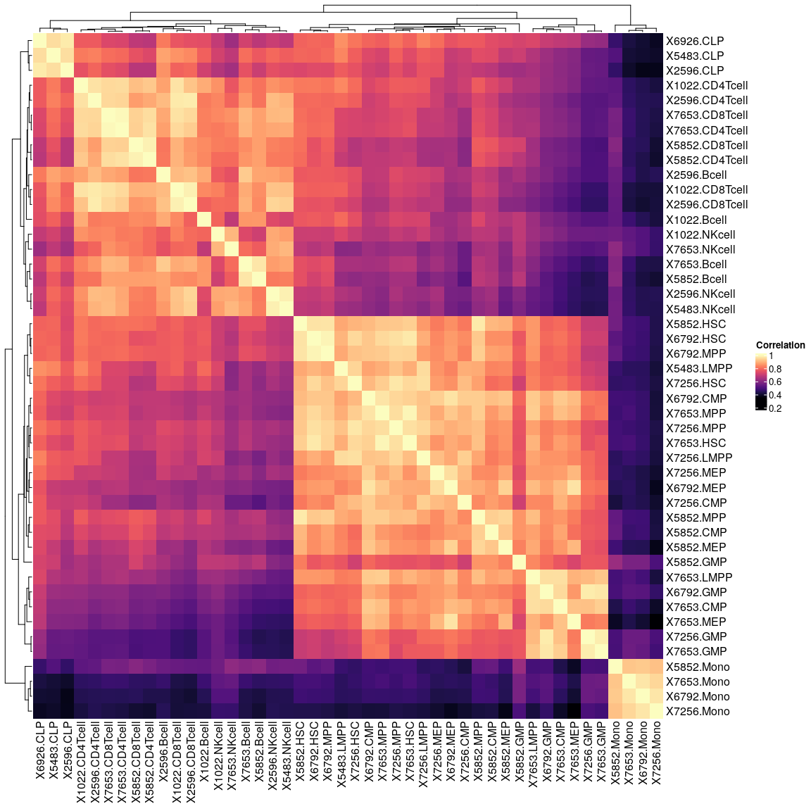

# ButchR

`ButchR` is an R package providing functions to perform 
non-negative matrix factorization and postprocessing using TensorFlow.  

https://github.com/wurst-theke/ButchR

## Citation 
Andres Quintero, Daniel Hübschmann, Nils Kurzawa, Sebastian Steinhauser, Philipp Rentzsch, Stephen Krämer, Carolin Andresen, Jeongbin Park, Roland Eils, Matthias Schlesner, Carl Herrmann, [ShinyButchR: interactive NMF-based decomposition workflow of genome-scale datasets](https://doi.org/10.1093/biomethods/bpaa022), Biology Methods and Protocols, bpaa022.


## ShinyButchR

We also provide an interactive R/Shiny app `ShinyButchR` to perform NMF and 
explore the results interactively.
The live version can be used here: 
https://hdsu-bioquant.shinyapps.io/shinyButchR/

Or a pre-build image can be pulled from Docker:
https://hub.docker.com/r/hdsu/shinybutchr

`docker run --rm  -p 3838:3838 hdsu/shinybutchr`


# Introduction

**NMF** (**nonnegative matrix factorization**) is a matrix decomposition
method. A description of the algorithm and it’s implementation can be
found e.g. in (Lee and Seung 1999). In 2003, Brunet et al. applied NMF
to gene expression data (Brunet et al. 2003). In 2010,
*[NMF](https://CRAN.R-project.org/package=NMF)*, an R package
implementing several NMF solvers was published (Gaujoux and Seoighe
2010). NMF basically solves the problem as illustrated in the following
figure (Image taken from
<a href="https://en.wikipedia.org/wiki/Non-negative_matrix_factorization" class="uri">https://en.wikipedia.org/wiki/Non-negative_matrix_factorization</a>):


Here, *V* is an input matrix with dimensions *n* × *m*. It is decomposed
into two matrices *W* of dimension *n* × *l* and *H* of dimension
*l* × *m*, which when multiplied approximate the original matrix *V*.
*l* is a free parameter in NMF, it is called the factorization rank. If
we call the columns of *W* , then *l* corresponds to the number of
signatures. The decomposition thus leads to a reduction in complexity if
*l* \< *n*, i.e. if the number of signatures is smaller than the number
of features, as indicated in the above figure.

In 2015, Mejia-Roa et al. introduced an implementation of an NMF-solver
in CUDA, which lead to significant reduction of computation times by
making use of massive parallelisation on GPUs (Mejia-Roa et al. 2015).
Other implementations of NMF-solvers on GPUs exist.

It is the pupose of the package `ButchR` described here to provide
wrapper functions in R to these NMF-solvers in TensorFlow. Massive
parallelisation not only leads to faster algorithms, but also makes the
benefits of NMF accessible to much bigger matrices. Furthermore,
functions for estimation of the optimal factorization rank and post-hoc
feature selection are provided.

# The ButchR package

The matrix decomposition results are stored in an S4 object called
`ButchR_NMF`. `ButchR` provides functions to access the best
factorzation after *n* initailization *W* and *H* matrices for a given
factorzation rank.

A crucial step in data analysis with NMF is the determination of the
optimal factorization rank, i.e. the number of columns of the matrix *W*
or equivalently the number of rows of the matrix *H*. No consensus
method for an automatic evaluation of the optimal factorization rank has
been found to date. Instead, the decomposition is usually performed
iteratively over a range of possible factorization ranks and different
quality measures are computed for every tested factorization ranks. Many
quality measures have been proposed:

-   The `Frobenius reconstruction error`, i.e. the Frobenius norm of the
    residuals of the decomposition:
    \|\|*W* ⋅ *H* − *V*\|\|<sub>*F*</sub>

-   Criteria to assess the stability of the decomposition:

    -   The `cophenetic correlation coefficient`
    -   An `Amari type distance`
    -   `Silhouette values` over clusters of patterns extracted
        iteratively at the same factorization rank

The package `ButchR` provides a function to visualize all factorization
metrics.


# NMF example - STAGE 1 preprocessing

For the tutorial we will use an RNA-seq dataset from labeled cell types of the human hematopoietic system, originally published on:

**Corces MR, Buenrostro JD, Wu B, Greenside PG, Chan SM, Koenig JL, Snyder MP, Pritchard JK, Kundaje A, Greenleaf WJ, Majeti R, Chang HY. Lineage-specific and single-cell chromatin accessibility charts human hematopoiesis and leukemia evolution.  Nat Genet 48, 1193–1203 (2016). https://doi.org/10.1038/ng.3646**
  

In this session we will download and pre-process the data. The data will be downloaded as a counts matrix from GEO.


## Preprocessing   

Download counts from GEO, select samples, and normalize data.


```r
##----------------------------------------------------------------------------##
##                             Download counts                                ##
##----------------------------------------------------------------------------##
# set ftp url to RNA-seq data
ftp_url <- file.path("ftp://ftp.ncbi.nlm.nih.gov/geo/series/GSE74nnn/GSE74246",
                     "suppl/GSE74246_RNAseq_All_Counts.txt.gz")

read_delim_gz <- function(file_url) {
  con <- gzcon(url(file_url))
  txt <- readLines(con)
  return(read.delim(textConnection(txt), row.names = 1))
}

# read in data matrix
corces_rna_counts <- read_delim_gz(ftp_url)


##----------------------------------------------------------------------------##
##                        Data loading and sample QC                          ##
##----------------------------------------------------------------------------##

corces_rna_counts[1:5,1:5]
```
<details>
<summary><b>Click for Answer</b></summary>
```
##          X5852.HSC X6792.HSC X7256.HSC X7653.HSC X5852.MPP
## A1BG            14         9         1         5        13
## A1BG-AS1         3         0         1         0        27
## A1CF             0         0         0         0         0
## A2M             78       192        36        82        66
## A2M-AS1         71        76        52        86        49
```

```r
dim(corces_rna_counts)
```

```
## [1] 25498    81
```
</details>
  

Remove leukemic and erythroblast samples:
```r
corces_rna_counts <- corces_rna_counts[,-grep("Ery|rHSC|LSC|Blast", colnames(corces_rna_counts))]
dim(corces_rna_counts)
```
<details>
<summary><b>Click for Answer</b></summary>
```
## [1] 25498    46
```
</details>


Inspect correlation matrix:
```r
cor_dm <- cor(corces_rna_counts)
Heatmap(cor_dm, col = magma(100), name = "Correlation")
```
<details>
<summary><b>Click for Answer</b></summary>

</details>


X5852.GMP is an outlier and will be removed, has much smaller library size as other GMPS:
```r
rm(cor_dm)
corces_rna_counts <- corces_rna_counts[,-grep("X5852.GMP", colnames(corces_rna_counts))]
```

Remove rows with rowSum==0:
```r
corces_rna_counts <- corces_rna_counts[!rowSums(corces_rna_counts) == 0,]
```

Normalize counts using DESeq2:
```r
##----------------------------------------------------------------------------##
##                              Normalize counts                              ##
##----------------------------------------------------------------------------##

# do DESeq2 size factor normalization
sf <- estimateSizeFactorsForMatrix(corces_rna_counts)
corces_rna_counts <- t( t(corces_rna_counts) / sf )

# do +1 log2 transformation
corces_rna_norm <- apply(corces_rna_counts + 1, 2, log2)
rm(ftp_url, sf)
```

Format annotation data frame for future reference:
```r
##----------------------------------------------------------------------------##
##                              Annotation                                    ##
##----------------------------------------------------------------------------##
# extract celltypes from colnames
col.anno <- gsub(".*\\.", "", colnames(corces_rna_norm))
col.anno[grep("NK", col.anno)] <- "NK"
col.anno[grep("CD4", col.anno)] <- "CD4"
col.anno[grep("CD8", col.anno)] <- "CD8"

# Define color vector
type.color <- setNames(c("#771155", "#AA4488", "#CC99BB", "#114477", "#4477AA", "#77AADD", 
                         "#117777", "#44AAAA", "#77CCCC", "#777711", "#AAAA44", "#DDDD77"),
                       c("HSC", "MPP", "LMPP", "CMP", "GMP", "MEP",
                         "CLP", "CD4", "CD8", "NK", "Bcell", "Mono"))

# Annotation data frame
corces_rna_annot <- data.frame(sampleID = colnames(corces_rna_norm),
                        Celltype = as.factor(col.anno),
                        color    = type.color[match(col.anno, names(type.color))],
                        row.names = colnames(corces_rna_norm),
                        stringsAsFactors = FALSE)

##----------------------------------------------------------------------------##
##                          Print dataset dimension                           ##
##----------------------------------------------------------------------------##

```

## Dimension of transcriptome dataset (RNA-seq):  

```r
dim(corces_rna_norm)
```

<details>
<summary><b>Click for Answer</b></summary>
```
## [1] 21811    45
```
</details>


*Preprocessing steps for the Corces 2016 ATAC-seq and to run iNMF can be found [here](./00_preprocessing_all.md)*