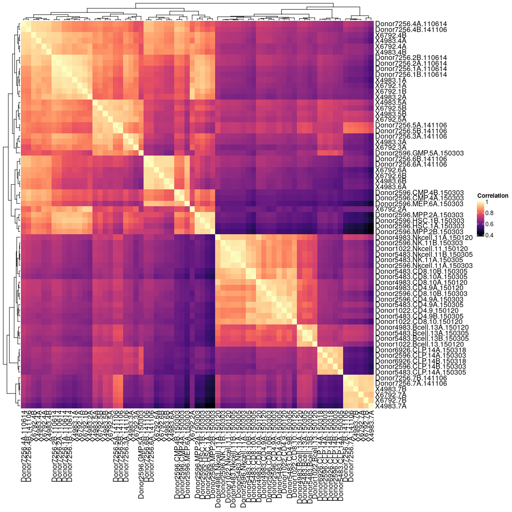

# Non-Negative Matrix factorization example - STAGE 1 preprocessing

For the tutorial we will use RNA-seq and ATAC-seq datasets from labeled cell types of the human hematopoietic system, originally published on:

**Corces MR, Buenrostro JD, Wu B, Greenside PG, Chan SM, Koenig JL, Snyder MP, Pritchard JK, Kundaje A, Greenleaf WJ, Majeti R, Chang HY. Lineage-specific and single-cell chromatin accessibility charts human hematopoiesis and leukemia evolution.  Nat Genet 48, 1193–1203 (2016). https://doi.org/10.1038/ng.3646**
  

In this session we will download and pre-process the data. The data will be downloaded as counts matrices from GEO.

## Download and process RNAseq data


```r
##––––––––––––––––––––––––––––––––––––––––––––––––––––––––––––––––––––––––––––##
##                                 Set paths                                  ##
##––––––––––––––––––––––––––––––––––––––––––––––––––––––––––––––––––––––––––––##
rna.data.path  <- "data/rnaseq/"
GSE74246.path <- file.path(rna.data.path, "GSE74246_RNAseq_All_Counts.txt.gz")
dir.create(rna.data.path, recursive = TRUE, showWarnings = FALSE)


##––––––––––––––––––––––––––––––––––––––––––––––––––––––––––––––––––––––––––––##
##                               Download counts                              ##
##––––––––––––––––––––––––––––––––––––––––––––––––––––––––––––––––––––––––––––##
# set ftp url to RNA-seq data
ftp.url <- file.path("ftp://ftp.ncbi.nlm.nih.gov/geo/series/GSE74nnn/GSE74246",
                     "/suppl/GSE74246_RNAseq_All_Counts.txt.gz")
# download data
if(!file.exists(GSE74246.path)){
  download.file(url = ftp.url, GSE74246.path)
}

##––––––––––––––––––––––––––––––––––––––––––––––––––––––––––––––––––––––––––––##
##                        Data loading and sample QC                          ##
##––––––––––––––––––––––––––––––––––––––––––––––––––––––––––––––––––––––––––––##
# read in data matrix
rna.counts <- read.delim(gzfile(GSE74246.path), row.names = 1)
rna.counts[1:5,1:5]
```

<details>
<summary><b>Click for Answer</b></summary>

```
##          X5852.HSC X6792.HSC X7256.HSC X7653.HSC X5852.MPP
## A1BG            14         9         1         5        13
## A1BG-AS1         3         0         1         0        27
## A1CF             0         0         0         0         0
## A2M             78       192        36        82        66
## A2M-AS1         71        76        52        86        49
```

```r
dim(rna.counts)
```

```
## [1] 25498    81
```

</details>


```r
# remove leukemic and erythroblast samples
rna.counts <- rna.counts[,-grep("Ery|rHSC|LSC|Blast", colnames(rna.counts))]
dim(rna.counts)
```

<details>
<summary><b>Click for Answer</b></summary>

```
## [1] 25498    46
```

</details>


```r
# inspect correlation matrix
cor.dm <- cor(rna.counts)
Heatmap(cor.dm, col = magma(100), name = "Correlation")
```

<details>
<summary><b>Click for Answer</b></summary>


</details>


```r
rm(cor.dm)

# X5852.GMP is an outlier and will be removed, 
# has much smaller library size as other GMPS
rna.counts <- rna.counts[,-grep("X5852.GMP", colnames(rna.counts))]

# remove rows with rowSum==0
rna.counts <- rna.counts[!rowSums(rna.counts) == 0,]

##––––––––––––––––––––––––––––––––––––––––––––––––––––––––––––––––––––––––––––##
##                              Normalize counts                              ##
##––––––––––––––––––––––––––––––––––––––––––––––––––––––––––––––––––––––––––––##

# do DESeq2 size factor normalization
sf <- estimateSizeFactorsForMatrix(rna.counts)
rna.counts <- t( t(rna.counts) / sf )

# do +1 log2 transformation
rna.norm.mat <- apply(rna.counts + 1, 2, log2)
rm(ftp.url, GSE74246.path, sf)

##––––––––––––––––––––––––––––––––––––––––––––––––––––––––––––––––––––––––––––##
##                              Annotation                                    ##
##––––––––––––––––––––––––––––––––––––––––––––––––––––––––––––––––––––––––––––##
# extract celltypes from colnames
col.anno <- gsub(".*\\.", "", colnames(rna.norm.mat))
col.anno[grep("NK", col.anno)] <- "NK"
col.anno[grep("CD4", col.anno)] <- "CD4"
col.anno[grep("CD8", col.anno)] <- "CD8"

# Define color vector
type.color <- setNames(c("#771155", "#AA4488", "#CC99BB", "#114477", "#4477AA", "#77AADD", 
                         "#117777", "#44AAAA", "#77CCCC", "#777711", "#AAAA44", "#DDDD77"),
                       c("HSC", "MPP", "LMPP", "CMP", "GMP", "MEP",
                         "CLP", "CD4", "CD8", "NK", "Bcell", "Mono"))

# Annotation data frame
rna.annot <- data.frame(sampleID = colnames(rna.norm.mat),
                        Celltype = as.factor(col.anno),
                        color    = type.color[match(col.anno, names(type.color))],
                        row.names = colnames(rna.norm.mat),
                        stringsAsFactors = FALSE)

##––––––––––––––––––––––––––––––––––––––––––––––––––––––––––––––––––––––––––––##
##                        Save normalized matrix                              ##
##––––––––––––––––––––––––––––––––––––––––––––––––––––––––––––––––––––––––––––##
saveRDS(rna.norm.mat, "data/rnaseq/rnaseq_normalized_counts.RDS")
saveRDS(rna.annot, "data/rnaseq/rnaseq_annotation.RDS")
```


## Process ATACseq data


```r
##––––––––––––––––––––––––––––––––––––––––––––––––––––––––––––––––––––––––––––##
##                                 Set paths                                  ##
##––––––––––––––––––––––––––––––––––––––––––––––––––––––––––––––––––––––––––––##
atac.data.path  <- file.path("data/atacseq/")
GSE74912.path <- file.path(atac.data.path, "GSE74912_ATACseq_All_Counts.txt.gz")
dir.create(atac.data.path, recursive = TRUE, showWarnings = FALSE)

##––––––––––––––––––––––––––––––––––––––––––––––––––––––––––––––––––––––––––––##
##                               Download counts                              ##
##––––––––––––––––––––––––––––––––––––––––––––––––––––––––––––––––––––––––––––##
# download data
if(!file.exists(GSE74912.path)){
  download.file(url = "ftp://ftp.ncbi.nlm.nih.gov/geo/series/GSE74nnn/GSE74912/suppl/GSE74912_ATACseq_All_Counts.txt.gz", GSE74912.path)
}

##––––––––––––––––––––––––––––––––––––––––––––––––––––––––––––––––––––––––––––##
##                        Data loading and sample QC                          ##
##––––––––––––––––––––––––––––––––––––––––––––––––––––––––––––––––––––––––––––##
# read in data matrix
atac.counts <- read.delim(gzfile(GSE74912.path), stringsAsFactors = FALSE)
atac.counts[1:5,1:5]
```

<details>
<summary><b>Click for Answer</b></summary>

```
##    Chr  Start    End X4983.1A X4983.2A
## 1 chr1  10025  10525        1        0
## 2 chr1  13252  13752        0        5
## 3 chr1  16019  16519        4        2
## 4 chr1  96376  96876        0        0
## 5 chr1 115440 115940        0        3
```

</details>

```r
# separate annotation column from data
atac.row.anno <- atac.counts[,1:3]
atac.counts <- atac.counts[,-c(1:3)]
dim(atac.counts)
```

<details>
<summary><b>Click for Answer</b></summary>

```
## [1] 590650    132
```

</details>


```r
rownames(atac.counts) <- do.call(paste, c(as.list(atac.row.anno), sep = "_"))

# remove rows with rowSums < 2000
atac.row.anno <- atac.row.anno[rowSums(atac.counts) > 2000,]
atac.counts <- atac.counts[rowSums(atac.counts) > 2000,]

# remove leukemic and erythroblast samples
atac.counts <- atac.counts[,-grep("Ery|LSC|pHSC|Leuk|CD34", colnames(atac.counts))]
dim(atac.counts)
```

<details>
<summary><b>Click for Answer</b></summary>
```
## [1] 123102     69
```

```r
sum(rowSums(atac.counts) == 0)
```

```
## [1] 0
```
</details>


```r
# compute correlation matrix
Heatmap(cor(atac.counts), col = magma(100), name = "Correlation")
```

<details>
<summary><b>Click for Answer</b></summary>

<details>

```r
# remove X6792.7A, due to low coverage
atac.counts <- atac.counts[,-grep("X6792.7A", colnames(atac.counts))]


##––––––––––––––––––––––––––––––––––––––––––––––––––––––––––––––––––––––––––––##
##                              Normalize counts                              ##
##––––––––––––––––––––––––––––––––––––––––––––––––––––––––––––––––––––––––––––##

# do DESeq2 norm
sf <- estimateSizeFactorsForMatrix(atac.counts)
atac.counts <- t(t(atac.counts)/sf)

# transform to log2
atac.norm.mat <- apply(atac.counts + 1, 2, log2)


rm(sf, GSE74912.path)

##––––––––––––––––––––––––––––––––––––––––––––––––––––––––––––––––––––––––––––##
##                              Annotation                                    ##
##––––––––––––––––––––––––––––––––––––––––––––––––––––––––––––––––––––––––––––##
# extract celltypes from colnames
col.anno <- colnames(atac.norm.mat)
col.anno[grep("CD4", col.anno)] <- "CD4"
col.anno[grep("CD8", col.anno)] <- "CD8"
col.anno[grep("NK", col.anno)] <- "NK"
col.anno[grep("Nkcell", col.anno)] <- "NK"
col.anno[grep("Bcell", col.anno)] <- "Bcell"
col.anno[grep("CLP", col.anno)] <- "CLP"
col.anno[grep("1(A|B)", col.anno)] <- "HSC"
col.anno[grep("2(A|B)", col.anno)] <- "MPP"
col.anno[grep("3(A|B)", col.anno)] <- "LMPP"
col.anno[grep("4(A|B)", col.anno)] <- "CMP"
col.anno[grep("5(A|B)", col.anno)] <- "GMP"
col.anno[grep("6(A|B)", col.anno)] <- "MEP"
col.anno[grep("7(A|B)", col.anno)] <- "Mono"
col.anno
```


<details>
<summary><b>Click for Answer</b></summary>

```
##  [1] "HSC"   "MPP"   "LMPP"  "CMP"   "CMP"   "GMP"   "GMP"   "MEP"   "MEP"  
## [10] "Mono"  "Mono"  "HSC"   "HSC"   "MPP"   "LMPP"  "CMP"   "CMP"   "GMP"  
## [19] "GMP"   "MEP"   "MEP"   "Mono"  "Bcell" "CD4"   "CD8"   "NK"    "CD4"  
## [28] "CD8"   "CLP"   "CLP"   "CMP"   "CMP"   "GMP"   "HSC"   "HSC"   "MEP"  
## [37] "MPP"   "MPP"   "NK"    "NK"    "Bcell" "CD4"   "CD8"   "NK"    "Bcell"
## [46] "CD4"   "CD4"   "CD8"   "CLP"   "NK"    "NK"    "CLP"   "HSC"   "HSC"  
## [55] "MPP"   "MPP"   "LMPP"  "CMP"   "CMP"   "GMP"   "GMP"   "MEP"   "MEP"  
## [64] "Mono"  "Mono"  "Bcell" "CLP"   "CD8"
```

</details>


```r
# Annotation data frame
atac.annot <- data.frame(sampleID = colnames(atac.norm.mat),
                        Celltype = as.factor(col.anno),
                        color    = type.color[match(col.anno, names(type.color))],
                        row.names = colnames(atac.norm.mat),
                        stringsAsFactors = FALSE)

##––––––––––––––––––––––––––––––––––––––––––––––––––––––––––––––––––––––––––––##
##                        Save normalized matrix                              ##
##––––––––––––––––––––––––––––––––––––––––––––––––––––––––––––––––––––––––––––##
saveRDS(atac.norm.mat, "data/atacseq/atacseq_normalized_counts.RDS")
saveRDS(atac.annot, "data/atacseq/atacseq_annotation.RDS")
```

# Match samples

Find samples with RNAseq and ATACseq data available


```r
##––––––––––––––––––––––––––––––––––––––––––––––––––––––––––––––––––––––––––––##
##                         Match RNAseq and ATACseq                           ##
##––––––––––––––––––––––––––––––––––––––––––––––––––––––––––––––––––––––––––––##

##––––––––––––––––––––––––––––––––––––––––––––––––––––––––––––––––––––––––––––##
##                            ATACseq annotations                             ##
##––––––––––––––––––––––––––––––––––––––––––––––––––––––––––––––––––––––––––––##

# replace numbered celltypes by character names
col.anno <- colnames(atac.counts)
col.anno[grep("CD4", col.anno)] <- "CD4"
col.anno[grep("CD8", col.anno)] <- "CD8"
col.anno[grep("NK", col.anno)] <- "NK"
col.anno[grep("Nkcell", col.anno)] <- "NK"
col.anno[grep("Bcell", col.anno)] <- "Bcell"
col.anno[grep("CLP", col.anno)] <- "CLP"
col.anno[grep("1(A|B)", col.anno)] <- "HSC"
col.anno[grep("2(A|B)", col.anno)] <- "MPP"
col.anno[grep("3(A|B)", col.anno)] <- "LMPP"
col.anno[grep("4(A|B)", col.anno)] <- "CMP"
col.anno[grep("5(A|B)", col.anno)] <- "GMP"
col.anno[grep("6(A|B)", col.anno)] <- "MEP"
col.anno[grep("7(A|B)", col.anno)] <- "Mono"
atac.anno.cellID <- col.anno
rm(col.anno)

# Paste donor ID and cell type
atac.anno <- paste0(sapply(strsplit(colnames(atac.counts), "\\."), "[[", 1), ".", atac.anno.cellID)

##––––––––––––––––––––––––––––––––––––––––––––––––––––––––––––––––––––––––––––##
##                             RNAseq annotations                             ##
##––––––––––––––––––––––––––––––––––––––––––––––––––––––––––––––––––––––––––––##
# Keep only Donor ID
rnaseqIDs <- setNames(sapply(strsplit(colnames(rna.counts), "\\."), "[[", 1), colnames(rna.counts))
rnaseqIDs <- sub("^X", "", rnaseqIDs)

##––––––––––––––––––––––––––––––––––––––––––––––––––––––––––––––––––––––––––––##
##                         Match RNAseq and ATACseq                           ##
##––––––––––––––––––––––––––––––––––––––––––––––––––––––––––––––––––––––––––––##
rna.atac.matched.samples <- lapply(setNames(1:length(rnaseqIDs), names(rnaseqIDs)), function(i) {
  # Find same donor in RNAseq and ATACseq
  atac.matched <- grep(rnaseqIDs[i], atac.anno, value = TRUE)
  if (length(atac.matched) > 0) {
    # if same donor in both omics search if same cell type
    # extract cell tupe fron RNAseq colname
    anno <- sapply(strsplit(names(rnaseqIDs)[i], "\\."), "[[", 2)
    anno <- sub("Tcell", "", anno)
    anno <- sub("cell", "", anno)
    # find in ATACseq
    anno.matched <- grep(anno, atac.matched, value = TRUE)
    if (anno == "MPP") {
      anno.matched <- grep("LMPP", anno.matched, value = TRUE, invert = TRUE)
    }
    if (length(anno.matched) > 0) {
      data.frame(rnaID  = names(rnaseqIDs)[i],
                 atacID = colnames(atac.counts)[atac.anno %in% anno.matched],
                 cellID = atac.anno.cellID[atac.anno %in% anno.matched],
                 atac.anno = anno.matched, 
                 row.names = colnames(atac.counts)[atac.anno %in% anno.matched])
    }
  }
} )
# Keep only matched sampels
sum(!sapply(rna.atac.matched.samples, is.null))
```

<details>
<summary><b>Click for Answer</b></summary>

```
## [1] 24
```

</details>


```r
rna.atac.matched.samples <- rna.atac.matched.samples[!sapply(rna.atac.matched.samples, is.null)]


##––––––––––––––––––––––––––––––––––––––––––––––––––––––––––––––––––––––––––––##
##                         Match RNAseq and ATACseq                           ##
##––––––––––––––––––––––––––––––––––––––––––––––––––––––––––––––––––––––––––––##
# Keep only one ATACseq replicate
rna.atac.annot <- do.call(rbind, rna.atac.matched.samples)
rna.atac.annot <- rna.atac.annot[!duplicated(rna.atac.annot$rnaID),]

# Subset intersect on multi views
multiview.norm.mat <- list(rna  = rna.norm.mat[, match(rna.atac.annot$rnaID, colnames(rna.norm.mat))],
                            atac = atac.norm.mat[, match(rna.atac.annot$atacID, colnames(atac.norm.mat))])
lapply(multiview.norm.mat, dim)
```

<details>
<summary><b>Click for Answer</b></summary>

```
## $rna
## [1] 21811    24
## 
## $atac
## [1] 123102     24
```


</details>


```r
##––––––––––––––––––––––––––––––––––––––––––––––––––––––––––––––––––––––––––––##
##                   Format multi view to easy access                         ##
##––––––––––––––––––––––––––––––––––––––––––––––––––––––––––––––––––––––––––––##
# Format Colnames
lapply(multiview.norm.mat, colnames)
```

<details>
<summary><b>Click for Answer</b></summary>

```
## $rna
##  [1] "X6792.HSC"      "X7256.HSC"      "X6792.MPP"      "X7256.MPP"     
##  [5] "X7256.LMPP"     "X6792.CMP"      "X7256.CMP"      "X6792.GMP"     
##  [9] "X7256.GMP"      "X6792.MEP"      "X7256.MEP"      "X6792.Mono"    
## [13] "X7256.Mono"     "X1022.CD4Tcell" "X2596.CD4Tcell" "X1022.CD8Tcell"
## [17] "X2596.CD8Tcell" "X1022.NKcell"   "X2596.NKcell"   "X5483.NKcell"  
## [21] "X1022.Bcell"    "X2596.CLP"      "X5483.CLP"      "X6926.CLP"     
## 
## $atac
##  [1] "X6792.1A"                   "Donor7256.1A.110614"       
##  [3] "X6792.2A"                   "Donor7256.2A.110614"       
##  [5] "Donor7256.3A.141106"        "X6792.4A"                  
##  [7] "Donor7256.4A.110614"        "X6792.5A"                  
##  [9] "Donor7256.5A.141106"        "X6792.6A"                  
## [11] "Donor7256.6A.141106"        "X6792.7B"                  
## [13] "Donor7256.7A.141106"        "Donor1022.CD4.9.150120"    
## [15] "Donor2596.CD4.9A.150303"    "Donor1022.CD8.10.150120"   
## [17] "Donor2596.CD8.10B.150303"   "Donor1022.Nkcell.11.150120"
## [19] "Donor2596.NK.11B.150303"    "Donor5483.NK.11A.150305"   
## [21] "Donor1022.Bcell.13.150120"  "Donor2596.CLP.14A.150303"  
## [23] "Donor5483.CLP.14A.150305"   "Donor6926.CLP.14A.150318"
```
</details>


```r
colnames(multiview.norm.mat$atac) <- colnames(multiview.norm.mat$rna)
lapply(multiview.norm.mat, colnames)
```

<details>
<summary><b>Click for Answer</b></summary>

```
## $rna
##  [1] "X6792.HSC"      "X7256.HSC"      "X6792.MPP"      "X7256.MPP"     
##  [5] "X7256.LMPP"     "X6792.CMP"      "X7256.CMP"      "X6792.GMP"     
##  [9] "X7256.GMP"      "X6792.MEP"      "X7256.MEP"      "X6792.Mono"    
## [13] "X7256.Mono"     "X1022.CD4Tcell" "X2596.CD4Tcell" "X1022.CD8Tcell"
## [17] "X2596.CD8Tcell" "X1022.NKcell"   "X2596.NKcell"   "X5483.NKcell"  
## [21] "X1022.Bcell"    "X2596.CLP"      "X5483.CLP"      "X6926.CLP"     
## 
## $atac
##  [1] "X6792.HSC"      "X7256.HSC"      "X6792.MPP"      "X7256.MPP"     
##  [5] "X7256.LMPP"     "X6792.CMP"      "X7256.CMP"      "X6792.GMP"     
##  [9] "X7256.GMP"      "X6792.MEP"      "X7256.MEP"      "X6792.Mono"    
## [13] "X7256.Mono"     "X1022.CD4Tcell" "X2596.CD4Tcell" "X1022.CD8Tcell"
## [17] "X2596.CD8Tcell" "X1022.NKcell"   "X2596.NKcell"   "X5483.NKcell"  
## [21] "X1022.Bcell"    "X2596.CLP"      "X5483.CLP"      "X6926.CLP"
```


</details>


```r
# Format annotation
rna.atac.annot$original.atacID <- rna.atac.annot$atacID
rna.atac.annot$atacID <- rna.atac.annot$rnaID
rownames(rna.atac.annot) <- rna.atac.annot$rnaID 


rna.atac.annot <- rna.atac.annot[,c(2,3,1,4,5)]
colnames(rna.atac.annot) <- c("sampleID", "Celltype", "rna.sampleID", "atac.sampleID", "original.atacID")

rna.atac.annot$color <- type.color[match(rna.atac.annot$Celltype, names(type.color))]

##––––––––––––––––––––––––––––––––––––––––––––––––––––––––––––––––––––––––––––##
##                                     Save data                              ##
##––––––––––––––––––––––––––––––––––––––––––––––––––––––––––––––––––––––––––––##
dir.create("data/multiview/", recursive = TRUE)
```


```r
# Save annotation
saveRDS(rna.atac.annot, file = "data/multiview/multiview_annotation.RDS")
write.table(rna.atac.annot, "data/multiview/multiview_annotation.csv", quote = FALSE, sep = "\t", row.names = FALSE)

# Save normalized matrices
saveRDS(multiview.norm.mat, file = "data/multiview/multiview_norm_mat_list.RDS")


```
