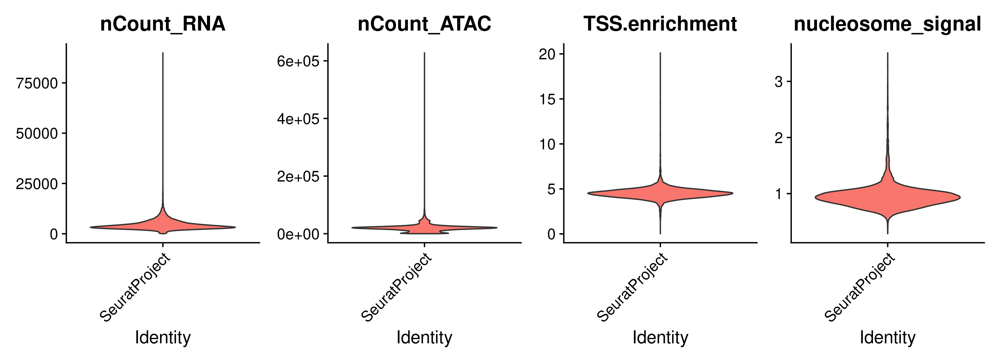
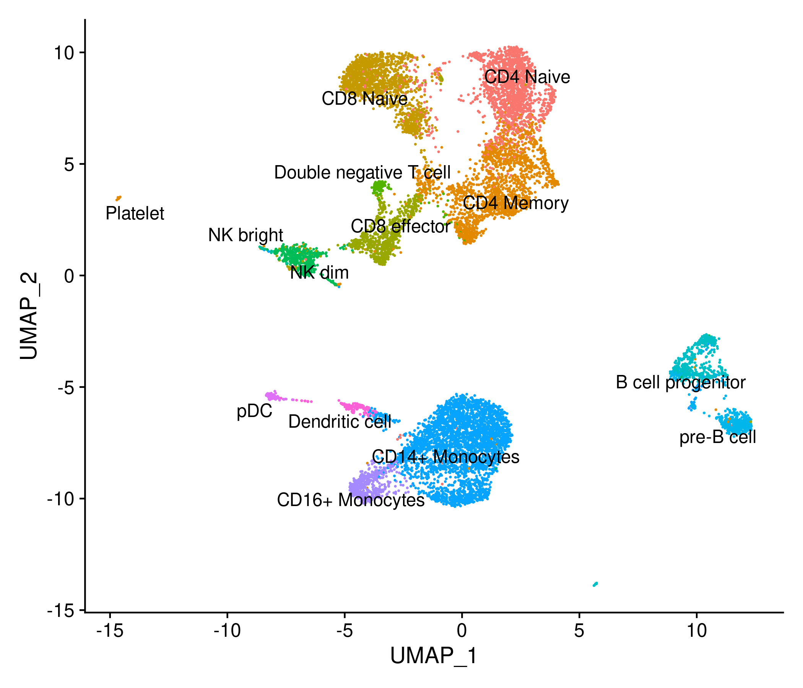
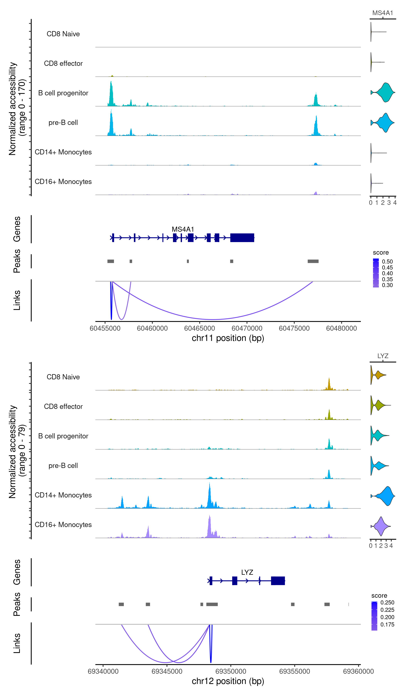

# Multiome scRNA-seq/scATAC-seq analysis with Signac

## Data download

In this tutorial we will use the scRNA-seq/scATAC-seq multiome example data provided by 10x Genomics for human PBMCs.

The data was downloaded using the following commands:

```
wget https://cf.10xgenomics.com/samples/cell-arc/1.0.0/pbmc_granulocyte_sorted_10k/pbmc_granulocyte_sorted_10k_filtered_feature_bc_matrix.h5
wget https://cf.10xgenomics.com/samples/cell-arc/1.0.0/pbmc_granulocyte_sorted_10k/pbmc_granulocyte_sorted_10k_atac_fragments.tsv.gz
wget https://cf.10xgenomics.com/samples/cell-arc/1.0.0/pbmc_granulocyte_sorted_10k/pbmc_granulocyte_sorted_10k_atac_fragments.tsv.gz.tbi
```

## Load the gene expression and chromatin accessibility data


```r
##––––––––––––––––––––––––––––––––––––––––––––––––––––––––––––––––––––––––––––##
##                              Load packages                                 ##
##––––––––––––––––––––––––––––––––––––––––––––––––––––––––––––––––––––––––––––##
library(Signac)
library(Seurat)
library(EnsDb.Hsapiens.v86)
library(BSgenome.Hsapiens.UCSC.hg38)


# Setting up working directory
work_dir <- paste0("/shared/projects/sincellte_2022/", Sys.getenv('USER'), "/Multi-Omics_Integration/results")
data_dir <- "/shared/projects/sincellte_2022/Courses/Multi-Omics_Integration/input/data/"
dir.create(work_dir, recursive = TRUE)
setwd(work_dir)


##––––––––––––––––––––––––––––––––––––––––––––––––––––––––––––––––––––––––––––##
##                              Load data                                     ##
##––––––––––––––––––––––––––––––––––––––––––––––––––––––––––––––––––––––––––––##
# load the RNA and ATAC data
counts <- Read10X_h5(paste0(data_dir, "pbmc_granulocyte_sorted_10k_filtered_feature_bc_matrix.h5"))
# If the previous line fails, please use the following:
# counts <- readRDS(paste0(data_dir, "pbmc_granulocyte_sorted_10k_filtered_feature_bc_matrix.RDS"))
fragments_files <- paste0(data_dir, "pbmc_granulocyte_sorted_10k_atac_fragments.tsv.gz")

##––––––––––––––––––––––––––––––––––––––––––––––––––––––––––––––––––––––––––––##
##                            Load annotation                                 ##
##––––––––––––––––––––––––––––––––––––––––––––––––––––––––––––––––––––––––––––##
# get gene annotations for hg38
annotation <- GetGRangesFromEnsDb(ensdb = EnsDb.Hsapiens.v86)
seqlevelsStyle(annotation) <- "UCSC"
# If the previous line fails, please use the following:
# ucsc.levels <- stringr::str_replace(string=paste("chr",seqlevels(annotation),sep=""), pattern="chrMT", replacement="chrM")
# seqlevels(annotation) <- ucsc.levels

# Check annotation seqnames
unique(seqnames(annotation))

# Check counts
lapply(counts, dim)
lapply(counts, class)

```

<details>
<summary><b>Click for Answer</b></summary>

```
> unique(seqnames(annotation))
 [1] chrX  chr20 chr1  chr6  chr3  chr7  chr12 chr11 chr4  chr17 chr2  chr16 chr8  chr19 chr9  chr13 chr14 chr5  chr22 chr10
[21] chrY  chr18 chr15 chr21 chrM 
25 Levels: chrX chr20 chr1 chr6 chr3 chr7 chr12 chr11 chr4 chr17 chr2 chr16 chr8 chr19 chr9 chr13 chr14 chr5 ... chrM

> lapply(counts, dim)
$`Gene Expression`
[1] 36601 11909

$Peaks
[1] 108377  11909

> lapply(counts, class)
$`Gene Expression`
[1] "dgCMatrix"
attr(,"package")
[1] "Matrix"

$Peaks
[1] "dgCMatrix"
attr(,"package")
[1] "Matrix"


```

</details>


## Create a Signac object from the counts

To create a Signac multiome object, the first step is to create a standard Seurat object including only the gene expression data. Once this object is created, a Chromatin Assay object is added as one of the Seurat object assays.

Once both datasets are loaded in the object, we can perform a QC analysis to remove low quality cells:

```r
##––––––––––––––––––––––––––––––––––––––––––––––––––––––––––––––––––––––––––––##
##                              Create Signac                                 ##
##––––––––––––––––––––––––––––––––––––––––––––––––––––––––––––––––––––––––––––##
# First create a Seurat object containing the gene expression data alone
signacobj <- CreateSeuratObject(
  counts = counts$`Gene Expression`,
  assay = "RNA"
)

# Then, create a ChromatinAssay and add it to the previous object
signacobj[["ATAC"]] <- CreateChromatinAssay(
  counts = counts$Peaks,
  sep = c(":", "-"),
  fragments = fragments_files,
  annotation = annotation
)

DefaultAssay(signacobj) <- "ATAC"

##––––––––––––––––––––––––––––––––––––––––––––––––––––––––––––––––––––––––––––##
##                                    QC                                      ##
##––––––––––––––––––––––––––––––––––––––––––––––––––––––––––––––––––––––––––––##
signacobj <- NucleosomeSignal(signacobj)
signacobj <- TSSEnrichment(signacobj)

VlnPlot(
  object = signacobj,
  features = c("nCount_RNA", "nCount_ATAC", "TSS.enrichment", "nucleosome_signal"),
  ncol = 4,
  pt.size = 0
)

```

<details>
<summary><b>Click for Answer</b></summary>



</details>


Low quality cells filtering:

```r
signacobj <- subset(
  x = signacobj,
  subset = nCount_ATAC < 100000 &
    nCount_RNA < 25000 &
    nCount_ATAC > 1000 &
    nCount_RNA > 1000 &
    nucleosome_signal < 2 &
    TSS.enrichment > 1
)
signacobj

```

<details>
<summary><b>Click for Answer</b></summary>

```
An object of class Seurat 
144978 features across 11331 samples within 2 assays 
Active assay: ATAC (108377 features, 0 variable features)
 1 other assay present: RNA

```

</details>


---

### **Checkpoint 1**

Key questions:

- What extra metrics can be used for cell QC in a multiome dataset in comparison to a scATAC-seq?
- Complete the QC with other metrics (hint: FRiP, ratio of reads in blacklisted regions).

---


## Call peaks and add peak counts matrix

Do not run the next chunk!!!, as calling peaks and creating the feature matrix can take a long time. Instead we will read a precomputed feature matrix.


```r
##––––––––––––––––––––––––––––––––––––––––––––––––––––––––––––––––––––––––––––##
##                    Call peaks and make feature matrix                      ##
##––––––––––––––––––––––––––––––––––––––––––––––––––––––––––––––––––––––––––––##
# Call peaks using MACS2
peaks <- CallPeaks(signacobj, macs2.path = "/shared/software/miniconda/envs/macs2-2.2.7.1/bin/macs2")

# remove peaks on nonstandard chromosomes and in genomic blacklist regions
peaks <- keepStandardChromosomes(peaks, pruning.mode = "coarse")
peaks <- subsetByOverlaps(x = peaks, ranges = blacklist_hg38_unified, invert = TRUE)

# quantify counts in each peak
macs2_counts <- FeatureMatrix(
  fragments = Fragments(signacobj),
  features = peaks,
  cells = colnames(signacobj)
)

````

Load precompute feature matrix and add to the seurat object:

```r
# Read feature matrix and peaks
peaks <- readRDS(paste0(data_dir, "signac_peaks.RDS"))
macs2_counts <- readRDS(paste0(data_dir, "signac_macs2_counts.RDS"))

signacobj <- signacobj[,colnames(signacobj) %in% colnames(macs2_counts)]
macs2_counts <- macs2_counts[,colnames(signacobj)]


# create a new assay using the MACS2 peak set and add it to the Seurat object
signacobj[["peaks"]] <- CreateChromatinAssay(
  counts = macs2_counts,
  fragments  = fragments_files,
  annotation = annotation
)

peaks
```

<details>
<summary><b>Click for Answer</b></summary>

```
GRanges object with 131364 ranges and 6 metadata columns:
           seqnames              ranges strand |                   name     score fold_change neg_log10pvalue_summit
              <Rle>           <IRanges>  <Rle> |            <character> <integer>   <numeric>              <numeric>
       [1]     chr1         10032-10322      * |  SeuratProject_peak_44       142     4.99234                16.3379
       [2]     chr1       180709-181030      * |  SeuratProject_peak_45       149     5.12372                17.1108
       [3]     chr1       181296-181600      * |  SeuratProject_peak_46       291     7.35714                31.7325
       [4]     chr1       191304-191914      * |  SeuratProject_peak_47       142     4.99234                16.3379
       [5]     chr1       267874-268087      * |  SeuratProject_peak_48       134     4.86097                15.5761
       ...      ...                 ...    ... .                    ...       ...         ...                    ...
  [131360]     chrX 155880631-155881911      * | SeuratProject_peak_1..       824     8.67288                87.4204
  [131361]     chrX 155891339-155891781      * | SeuratProject_peak_1..       105     4.30809                12.5625
  [131362]     chrX 155966929-155967163      * | SeuratProject_peak_1..       134     4.86097                15.5761
  [131363]     chrX 155997247-155997787      * | SeuratProject_peak_1..       263     6.17155                28.7770
  [131364]     chrX 156029849-156030260      * | SeuratProject_peak_1..       106     4.33546                12.6467
           neg_log10qvalue_summit relative_summit_position
                        <numeric>                <integer>
       [1]                14.2177                      126
       [2]                14.9684                      124
       [3]                29.1857                      137
       [4]                14.2177                      145
       [5]                13.4782                      134
       ...                    ...                      ...
  [131360]                82.4206                      637
  [131361]                10.5583                      258
  [131362]                13.4782                      112
  [131363]                26.3134                      342
  [131364]                10.6377                      245
  -------
  seqinfo: 24 sequences from an unspecified genome; no seqlengths
```

</details>


## Normalize data

The gene expression data is normalized and scaled, followed by dimension reduction with PCA.
The dimension of the peak matrix is reduced by performing latent semantic indexing (LSI).

```r
##––––––––––––––––––––––––––––––––––––––––––––––––––––––––––––––––––––––––––––##
##                             Normalize RNA data                             ##
##––––––––––––––––––––––––––––––––––––––––––––––––––––––––––––––––––––––––––––##
DefaultAssay(signacobj) <- "RNA"
signacobj <- NormalizeData(signacobj)
signacobj <- FindVariableFeatures(signacobj, nfeatures = 3000)
signacobj <- ScaleData(signacobj)
signacobj <- RunPCA(signacobj)

##––––––––––––––––––––––––––––––––––––––––––––––––––––––––––––––––––––––––––––##
##                             Normalize ATAC data                            ##
##––––––––––––––––––––––––––––––––––––––––––––––––––––––––––––––––––––––––––––##
DefaultAssay(signacobj) <- "peaks"
signacobj <- FindTopFeatures(signacobj, min.cutoff = "q75")
length(VariableFeatures(signacobj))
signacobj <- RunTFIDF(signacobj)
signacobj <- RunSVD(signacobj, n=20)

```

## Annotating cell types with a reference dataset

We can use a reference scRNA-seq dataset to annotate cells from a scATAC-seq dataset. In this example, we will use different functions from the Seurat package for this.
As a reference, we will use a pre-processed scRNA-seq dataset for human PBMCs. Provided by 10x Genomics, and [pre-processed by the Satija Lab](https://github.com/satijalab/Integration2019/blob/master/preprocessing_scripts/pbmc_10k_v3.R). 


```r
# load PBMC reference
reference <- readRDS(paste0(data_dir, "pbmc_10k_v3.rds"))

# transfer cell type labels from reference to query
DefaultAssay(signacobj) <- "RNA"
transfer_anchors <- FindTransferAnchors(
  reference = reference,
  query = signacobj,
  reduction = 'cca'
)

predicted_labels <- TransferData(
  anchorset = transfer_anchors,
  refdata = reference$celltype,
  weight.reduction = signacobj[['pca']],
  dims = 1:50
)

signacobj <- AddMetaData(object = signacobj, metadata = predicted_labels)

# set the cell identities to the cell type predictions
Idents(signacobj) <- "predicted.id"

# Re-order cell types for plot
levels(signacobj) <- c("CD4 Naive", "CD4 Memory", "CD8 Naive", "CD8 effector", 
                       "Double negative T cell", "NK dim", "NK bright", 
                       "B cell progenitor", "pre-B cell", "CD14+ Monocytes", 
                       "CD16+ Monocytes", "pDC", "Dendritic cell", "Platelet")

```

After assigning identities to the cells in the Signac object, we can compute a joint UMAP representation using the gene expression and chromatin accessibility data.

Signac uses the weighted nearest neighbor methods in Seurat v4, where a joint neighbor graph is calculated which represents both the ATAC and RNA data.

```r
# build a joint neighbor graph using both assays
signacobj <- FindMultiModalNeighbors(
  object = signacobj,
  reduction.list = list("pca", "lsi"), 
  dims.list = list(1:50, 2:20),
  modality.weight.name = "RNA.weight",
  verbose = TRUE
)

# build a joint UMAP visualization
signacobj <- RunUMAP(
  object = signacobj,
  nn.name = "weighted.nn",
  assay = "RNA",
  verbose = TRUE
)

DimPlot(signacobj, label = TRUE, repel = TRUE, reduction = "umap") + NoLegend()
```

<details>
<summary><b>Click for Answer</b></summary>



</details>

## Finding peak to gene links

Signac can find the set of peaks that may regulate each gene by computing the correlation between gene expression and accessibility at nearby peaks, and correcting for bias due to GC content, overall accessibility, and peak size.

```r
##––––––––––––––––––––––––––––––––––––––––––––––––––––––––––––––––––––––––––––##
##                   Peak to gene links for LYZ and MS4A1                     ##
##––––––––––––––––––––––––––––––––––––––––––––––––––––––––––––––––––––––––––––##


DefaultAssay(signacobj) <- "peaks"

# first compute the GC content for each peak
signacobj <- RegionStats(signacobj, genome = BSgenome.Hsapiens.UCSC.hg38)

# link peaks to genes
signacobj <- LinkPeaks(
  object = signacobj,
  peak.assay = "peaks",
  expression.assay = "RNA",
  genes.use = c("LYZ", "MS4A1")
)

idents.plot <- c("CD8 Naive", "CD8 effector", 
                 "B cell progenitor", "pre-B cell", 
                 "CD14+ Monocytes", "CD16+ Monocytes")


p1 <- CoveragePlot(
  object = signacobj,
  region = "MS4A1",
  features = "MS4A1",
  expression.assay = "RNA",
  idents = idents.plot,
  extend.upstream = 500,
  extend.downstream = 10000
)

p2 <- CoveragePlot(
  object = signacobj,
  region = "LYZ",
  features = "LYZ",
  expression.assay = "RNA",
  idents = idents.plot,
  extend.upstream = 8000,
  extend.downstream = 5000
)

patchwork::wrap_plots(p1, p2, ncol = 1)
```

<details>
<summary><b>Click for Answer</b></summary>



</details>
